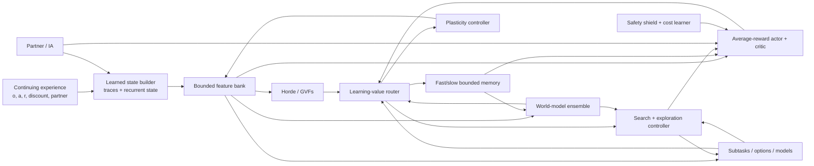

# Implementation Plan for a Continual Experiential Alberta Agent

- **Planning snapshot:** 2026-07-30
- **Companion review:**
  [CONTINUAL_AGENT_RESEARCH.md](CONTINUAL_AGENT_RESEARCH.md)

## Outcome

Build and validate a bounded, checkpointable, task-agnostic agent that learns
state, predictions, control, models, search priorities, and reusable skills
from one continuing stream. The plan deliberately separates:

- an **API implementation** from an **integrated causal path**;
- an integrated path from a **benchmark result**;
- a benchmark result from a **replicated capability claim**; and
- plasticity, retention, transfer, and safety.

No milestone may use “complete Alberta Plan” as shorthand for module presence.
The final claim requires all acceptance gates in the last section.

## Architectural target



The `LearningValueRouter` is not one universal scalar. It carries typed,
separately calibrated signals:

| Signal | Causal object | Initial use |
|---|---|---|
| Parameter utility, signed \(-wg\) | Parameter/feature | Protect, perturb, replace |
| TD error / advantage | Value or actor sample | Control learning |
| Epistemic surprise | Transition/model hypothesis | Exploration and model-memory priority |
| Aleatoric uncertainty | Environment outcome distribution | Veto noisy-TV and risky imagination |
| Learning progress | Region or model head | Prefer learnable experience |
| Delight, \(A[-\log\pi(a\mid s)]\) | Actor sample | Actor-gradient weight and optional compute gate |
| Prospective delight | Candidate exploratory action | Optional host-policy override |
| Safety cost/risk | State/action/trajectory | Shield and full-fidelity safety learning |

The user-facing question “does this gradient spark joy?” is an explicit
consumer of these channels, not a ninth channel and not their sum. It audits a
candidate parameter update against caller-attested independently measured
objective, retention, and safety gradients. The paper-specific delight channel
\(A[-\log\pi(a\mid s)]\) remains an actor-sample signal with different
semantics.

Conflating these signals would recreate exactly the failure modes found in the
literature.

## Invariants that apply to every work package

1. **One stream first.** Parallel-environment throughput can be a secondary
   lane, but every algorithm must have a single-stream result.
2. **No hidden task oracle.** Task boundaries may be logged for evaluation, not
   supplied to the learner, unless a comparator explicitly studies that
   advantage.
3. **Predict before update.** Online metrics use the action/prediction made
   before the current transition is learned.
4. **Bound the lifetime resources.** Every buffer, feature bank, option set,
   model ensemble, and per-step update count has a fixed configured maximum.
5. **Checkpoint all learning state.** Parameters alone are insufficient:
   optimizer moments, utilities, traces, recurrent state, memory indexes,
   calibrators, RNG keys, ages, and lifecycle metadata must round-trip.
6. **Separate safety learning from delight/compute gates.** Rare failures may be
   suppressed by a delightful actor gradient; the safety-cost learner and
   incident memory must see all of them.
7. **Ablate every new mechanism.** Additions enter behind explicit config
   modes, with an identical base learner and matched search budgets.
8. **Do not silently change historical semantics.** Existing UPGD-inspired and
   feature-lifecycle behavior gets stable names and migration notes.
9. **Report distributions.** Use enough seeds, confidence intervals, and
   per-seed curves; do not promote best-seed or terminal-window anecdotes.
10. **Keep the runtime boundary.** Heavy learning remains in the Alberta/robot
    Python process. elizaOS consumes an explicit bridge protocol and does not
    import research internals.

## WP0 — Establish an evidence contract

### Purpose

Make every repository claim traceable to an executable protocol and immutable
artifact before changing algorithms.

### Deliverables

- Replace the README's unqualified “all 12 steps are implemented and
  benchmarked” language with a four-level status. A concurrent working-tree
  patch already makes the top-level prose honest; retain it and add:
  `kernel`, `integrated`, `benchmarked`, `validated`.
- Retain the concurrent `RESEARCH_STATUS.md` evidence matrix as the human
  summary, while moving its levels, gates, and artifact checks into a
  machine-readable manifest.
- Add a machine-readable evidence manifest. Each claim records:
  - source commit and dirty-state policy;
  - benchmark protocol/version;
  - command and environment lock;
  - seeds and prespecified metrics;
  - raw-artifact hashes;
  - expected thresholds and whether they passed; and
  - known scope limits.
- Decide how omitted upstream experiment trees are handled:
  - vendor the required protocol drivers;
  - or fetch an exact pinned upstream archive in an explicit research lane;
  - or rewrite the small set of authoritative protocols locally.
- Keep unit/contract tests distinct from scientific evidence tests in pytest
  markers and CI.
- Record negative results and ceiling ties. A completed experiment is evidence
  even when the method loses.

### Verification

- A clean checkout can resolve every “benchmarked” claim to a command and raw
  artifact.
- Missing external data causes a visible `not-run` evidence status, never a
  passing claim.
- Re-running a smoke test cannot upgrade a scientific status.

### Exit gate

No ambiguous `complete`, `production`, or `validated` claims remain, and every
current benchmark claim either has a reproducible artifact or is downgraded.

## WP1 — Build the continual evaluation harness

### Purpose

Measure the distinct failures before selecting mechanisms to fix them.

### Core metrics

For every stream, record:

- lifetime/prequential return or loss;
- adaptation area under the curve after each detected or logged change;
- recovery time to a prespecified fraction of a fresh-agent or oracle score;
- per-task/regime final performance;
- peak-to-final forgetting;
- backward transfer and forward transfer;
- stability gap immediately after changes;
- worst-window performance, not only lifetime mean;
- wall-clock latency, forward/backward counts, memory high-water mark, and
  energy proxy where available;
- safety violations, intervention rate, and near-miss cost;
- world-model NLL/MSE, reward and termination calibration, ensemble
  disagreement calibration, and multi-step rollout error;
- dormant units, activation entropy, effective/stable rank, parameter norm,
  gradient norm, sampled NTK rank, and policy/value churn; and
- feature, prediction, option, and model creation/removal survival curves.

### Protocol rules

- Use held-out, non-learning probes for old-regime evaluation.
- Log known task/regime identity only in the evaluator.
- Measure how many observations were processed, delayed, or dropped; a slower
  method does not earn retention credit for ignoring more of the stream.
- Compare against:
  - a fresh learner per regime;
  - a frozen learner;
  - a stationary multitask/oracle-data upper reference where meaningful;
  - an identical learner with no continual mechanism; and
  - matched compute and memory budgets.
- Use at least 10 seeds for promotion experiments and 20–30 where variance or
  prior literature demands it. Three-seed frontier experiments may guide
  direction but cannot promote a default.
- Report stratified bootstrap confidence intervals and paired comparisons when
  seeds and streams are shared.
- Independently vary abrupt versus gradual change, partial observability,
  aleatoric distractors, and sequential confounding rather than collapsing them
  into one “nonstationary” condition.

### Integration

The uncommitted continual-metric utilities observed during this review can
become the calculation layer, but benchmark runners must emit their required
performance matrices and predict-before-update traces. Add invariance tests
using hand-computed matrices and end-to-end tests using a deliberately
forgetting learner.

### Exit gate

The base `PrototypeAgent` and at least two simple baselines produce one
versioned report containing all applicable performance, resource, plasticity,
and component-retention metrics.

## WP2 — Create a faithful plasticity laboratory

### Purpose

Resolve the current UPGD identity problem and select plasticity mechanisms from
controlled evidence.

### 2.1 Preserve and rename current behavior

- Freeze the current `UPGDLearner` update in regression fixtures.
- Expose it as an explicitly documented legacy/custom mode such as
  `utility_perturbed_sgd` / `nonprotecting_power`.
- Correct the source attribution and list every departure from canonical UPGD.
- Keep deserialization compatibility for historical checkpoints.

### 2.2 Add canonical UPGD

Implement a small optimizer-level JAX transform with:

- signed first-order utility \(-wg\);
- EMA and bias correction;
- numerically safe global and local normalization;
- sigmoid utility scaling;
- protecting and non-protecting updates;
- UPGD-W decoupled decay;
- optional AdaUPGD only after the SGD form passes;
- parameter masks for trunks, biases, heads, and normalization parameters; and
- explicit handling of missing, masked, and non-finite gradients.

Second-order utility is a later extension. Do not pull the old PyTorch HesScale
stack into JAX before first-order results justify it.

### 2.3 Parity tests

- scalar and two-layer hand calculations;
- fixed-noise update parity with the official PyTorch reference;
- high-utility parameters gate gradient and noise in protecting mode;
- high-utility parameters gate only noise in non-protecting mode;
- negative, zero, equal, and all-zero utility cases;
- global versus local normalization;
- \(\sigma=0\) equivalence;
- deterministic PRNG splitting under JIT and scan;
- optimizer/checkpoint serialization; and
- all-parameter versus trunk-only masks.

### 2.4 Baseline matrix

Start with inexpensive, licensed, mechanistically different comparators:

- SGD/Adam or the current native optimizer;
- L2 and L2-to-initialization;
- weight clipping;
- continual backpropagation;
- self-normalized resets;
- canonical UPGD, UPGD-W, and the local variant.

Then add spectral regularization and carefully reimplemented AdamO/CPR studies.
C-CHAIN, FOGO, and FIRE stay experimental until licensing and independent
evidence are adequate.

### 2.5 Experiments

Reproduce the UPGD distinction between:

- input permutation: mostly plasticity;
- label permutation: plasticity plus forgetting;
- stationary control: detect damage from unnecessary perturbation;
- gradual drift: test a limitation of abrupt-shift studies;
- recurrence/world-model heads: expose parameter-role differences; and
- Alberta's native prediction and average-reward control streams.

Factor the ablation:

`signed vs |wg| × protecting vs non-protecting × sigmoid vs power ×
Gaussian vs Rademacher vs zero noise × decay on/off × parameter mask`.

### Exit gate

Canonical parity passes, historical local results remain reproducible, and a
method becomes a default only if it improves preregistered lifetime metrics
without a significant retention, safety, or stationary-performance regression.

### 2.6 Current replication-diagnostic boundary (2026-07-31)

The UPGD Input-permuted MNIST runner has completed 10 matched one-million-step
development seeds. UPGD-W/AdamW mean online accuracies were
`0.7791470803916454`/`0.7190002817213534`; their paired descriptive mean
difference was `0.06014679867029188`, positive in 10/10 pairs. The canonical
artifact is
`outputs/upgd_ipmnist/results.reconciled_nonpromoting.v2.json`, bound by
the current `outputs/upgd_ipmnist/nonpromoting_receipt.v2.json` addendum; its
`nonpromoting_receipt.v1.json` predecessor is preserved byte-for-byte. The original
`results.v1.json` is preserved and fails strict validation only for its
10-vs-20-seed note; the reconciled artifact is strictly structurally valid.

This run does not close WP2. It is permanently nonpromoting because it used 10
rather than the publication's 20 seeds, made documented stream/logging/numeric
deviations, and lacks execution-time worker-source, full-import-closure,
command, environment, and dataset-byte binding. Its AdamW result is about
`+0.039` above the approximate publication figure read-off. No inferential,
SOTA, default-selection, or Alberta Plan claim follows. Closing the relevant
replication gate requires a fresh source-bound full-20-seed run, not appended
seeds, and the broader retention/safety/stationary experiments in this work
package remain open.

Future execution must use the active namespaced v3 plan/shard/merge contract,
not the legacy direct-aggregate v2 path. V3 issues one immutable plan with the
exact learner pair, exactly 20 fresh operator-reserved seed IDs, configuration, selected
hyperparameters, closed deviations, dataset digest/locator, runtime, commands,
and static transitive local import closure; workers emit one learner/seed
shard, and merge requires the exact planned Cartesian product with byte hashes.
No v3 plan has been issued and no fresh v3 seed has been consumed. The v3
schema remains permanently nonpromoting without external execution
attestation. See `UPGD_IPMNIST_V3_RUNBOOK.md` before any launch.

## WP3 — Make state construction learnable

### Purpose

Replace random temporal features with a state process that learns which history
supports prediction and control.

### 3.1 Fix the observation contract

- Define whether each public method consumes `raw_observation` or
  `agent_state`.
- Cache the state representation produced by `start()` and `update()`.
- Retain and verify the concurrent `act()` fix that runs the encoder without
  advancing recurrent state; then decide whether caching the representation is
  the cleaner public contract.
- Add a GRU-enabled first-action regression test and scan/single-step parity
  test.

### 3.2 Introduce a `StateBuilder` protocol

The minimal interface should support:

- `init(key)`;
- `start(raw_observation, last_action, last_reward)`;
- `encode(raw_observation)` for pure evaluation when valid;
- `update(raw_observation, action, reward, discount, auxiliary_errors)`;
- a fixed output dimension and resource budget; and
- full serialization.

Initial implementations:

1. identity;
2. fixed trace bank over observation, action, and reward;
3. the current echo-state GRU, honestly named;
4. a learnable GRU baseline;
5. a recurrent trace-unit or recurrent generate-and-test state builder.

### 3.3 Learning signals

Train state using a balanced set of online objectives:

- next latent/observation, reward, and termination prediction;
- multiple-timescale GVFs;
- control value and advantage;
- inverse/action-disambiguation where helpful; and
- feature utility measured by held-out prediction/control change.

Use separate heads so one rapidly changing reward does not erase
dynamics-relevant history. Continually rank and recycle state features only
after causal deletion or shadow-feature evidence.

### 3.4 Forager gate

Use Forager/Foragax to test:

- field-of-view reduction;
- hidden reward switches;
- reward/action trace baselines;
- repeated relearning;
- an unending task stream; and
- constant agent memory.

Compare frozen-state, feed-forward, traces, echo-state GRU, learned GRU, and
recurrent generate-and-test under matched parameter and compute budgets.

Treat the in-tree stationary causal-map planner as a task-specific L0
comparator. It learns a relative map, reward means, and respawn timings from
ordinary observations but uses the public 15×15 toroidal movement structure;
it is not a learned recurrent-state result and cannot satisfy this work
package's exit gate. Likewise, the completed five-seed tuning selection and the
incomplete 30-seed evaluation lane are execution status, not performance
evidence until the Alberta and matched-baseline reports and their statistical
comparison are complete.

### Exit gate

The learned state builder beats raw observation and fixed random recurrence on
prequential average reward and recovery time, retains the gain when learning is
frozen, and stays within its declared memory/latency budget.

## WP4 — Build a calibrated continual world-model lane

### Purpose

Turn the current one-step smoke model into a measured foundation for retention,
planning, surprise, and safe imagination.

### 4.1 Repair the transition API

Every real update must receive:

`state, action, reward, discount, terminated/truncated, next_observation`.

- Do not synthesize a constant discount inside `PrototypeAgent`.
- Propagate predicted discount/termination into imagined value targets.
- Add continuing and episodic/truncation contract tests.
- Keep environment reward separate from subtask cumulants.

### 4.2 Maintain two reference models

1. **Shallow online reference:** a linear/kernel Follow-the-Leader-style model
   and MPC/planning baseline inspired by the ICML 2025 result.
2. **Continual latent ensemble:** a stochastic recurrent latent model with
   small ensemble dynamics/reward/continuation heads.

The shallow model provides interpretability and a hard-to-forget baseline. The
latent model earns complexity only when it improves lifetime control or
prediction under equal resources.

### 4.3 Calibrate uncertainty

- Train ensemble members with genuinely different bootstrap/masking streams.
- Predict both mean and aleatoric variance where stochasticity matters.
- Measure epistemic disagreement against held-out error and OOD changes.
- Maintain state/action-region calibration rather than a single global error
  EMA.
- Reject dreams for non-finite values, high epistemic uncertainty, poor
  termination calibration, or unsupported rollout depth.

### 4.4 Add bounded dual replay

Use a fixed total capacity split between:

- short-term recency FIFO; and
- long-term coverage/distribution memory.

Compare reservoir, clustering/coreset, model-error coverage, ensemble-surprise,
learning-progress, and maximally-interfered retrieval. Never prioritize raw high
error without an aleatoric control. Store old action probabilities/value
targets for CLEAR/DER-style behavioral rehearsal, and record eviction
provenance and representation version.

### 4.5 Component retention probes

At every regime checkpoint, test separately:

- encoder/state representation;
- dynamics and observation prediction;
- reward discrimination/calibration;
- termination/discount prediction;
- critic/value;
- actor action margin and return.

This localizes whether forgetting is in memory, representation, value, or the
policy channel.

### 4.6 Imagination and rehearsal

Progress in this order:

1. one-step real-state-anchored Dyna;
2. policy/uncertainty-directed short rollouts;
3. multi-step returns that honor termination;
4. bounded replay of real transitions;
5. experimental graded dream self-imitation for actor retention.

Before imagined trajectories train the actor, an offline selection gauge must
measure realized success, termination correctness, top-quantile purity, and
real-environment validity. Compare dream imitation with the simpler baseline of
behavior cloning competent real episodes.

### Exit gate

The model is calibrated, memory-bounded, and better than the shallow reference
on at least one preregistered complex stream without worse lifetime control.
Imagined updates improve real return and retention under a held-out transition
audit; otherwise dreaming remains disabled.

## WP5 — Implement typed surprise, delight, and learning-value routing

### Purpose

Allocate memory, updates, exploration, and plasticity with signals appropriate
to each decision.

### 5.1 New typed result

Add a JAX-friendly structure similar to:

```python
LearningValue(
    advantage,
    action_surprisal,
    delight,
    epistemic_surprise,
    aleatoric_uncertainty,
    learning_progress,
    change_probability,
    safety_cost,
)
```

Each field has units, normalization state, calibration diagnostics, and a
documented producer. Consumers request fields explicitly; there is no default
sum.

### 5.2 Surprise path

- Epistemic signal: ensemble disagreement or approximate information gain.
- Aleatoric signal: predicted outcome variance.
- Learning progress: reduction in calibrated predictive loss over a local
  window or model version.
- Change signal: sustained calibrated residual after accounting for both
  uncertainties.

Use:

- epistemic surprise plus progress for exploration/search;
- surprise plus coverage for bounded memory writes;
- change probability to adjust adaptation rate;
- aleatoric uncertainty to suppress noisy-TV attraction; and
- raw error only for diagnostics and model training.

### 5.3 Gradient-level “spark joy” audit

For a candidate gradient \(g\), the plain-gradient mode defines
\(u_c=-\alpha g\). Callers using momentum, preconditioning, clipping, or any
other optimizer transform must instead provide the already formed candidate
update \(u_c\). Given caller-supplied gradients of an objective probe, protected
retention loss, and safety cost under an explicit independence contract that
the caller must attest:

\[
\Delta_o=\langle g_o,u_c\rangle,\quad
\Delta_r=\langle g_r,u_c\rangle,\quad
\Delta_s=\langle g_s,u_c\rangle,\quad
a_k=-\frac{\langle g_k,u_c\rangle}
{\lVert g_k\rVert\lVert u_c\rVert}.
\]

Alignment is evaluated only when the candidate update clears its configured
norm-resolution floor and the probe norm and norm product are nonzero and
representable; otherwise it is zero. The reported cosine is clipped to
\([-1,1]\), and an exact \(1.0\) threshold uses a
four-machine-epsilon float32 endpoint tolerance so reduction roundoff cannot
make collinear vectors nondeterministic. Other alignment thresholds are
compared exactly. Negative \(\Delta\) predicts a local decrease in the
corresponding minimized quantity, while higher \(a_k\) means better descent
alignment. The candidate factors first define a
non-circular tentative scale and update:

\[
s=\min\left\{
\sigma((a_o-t_o)/\tau_a),
\sigma((a_r-t_r)/\tau_a),
\sigma((a_s-t_s)/\tau_a),
\sigma((U_{\max}-\lVert u_c\rVert)/\tau_u)
\right\},\qquad \tilde u=s u_c.
\]

The implementation cannot infer independence from arrays, so a false or
missing `probe_independence_attested` caller attestation fails closed. Accept
only when all three probes and all eight named learning-value channels have
explicit valid availability, both \(u_c\) and \(\tilde u\) predict the required
strict objective decrease and remain within declared retention/safety
tolerances, candidate directions meet their alignment thresholds, and
\(\lVert u_c\rVert\) is inside the trust bound. The tentative update must also
clear the update-norm resolution floor. The returned weight and intended
applied update are \(w=\mathbf 1_{\mathrm{accept}}s\) and
\(u_{\mathrm{apply}}=w u_c\). Checking both stages prevents soft scaling from
violating a positive improvement floor or rescuing a raw harmful candidate.

This is deliberately a first-order local audit, not a guarantee of realized
improvement. Inputs, diagnostics, the decision, and the returned weighted
update are stop-gradient optimizer-control values; differentiating through the
assessment would define an unimplemented meta-objective. Missing, non-finite,
structurally mismatched, or non-scalar evidence fails closed. The eight typed
channels remain separately reported and are never aggregated into \(w\).
Numeric controls are float32; booleans, overflow, and nonzero subnormal controls
are rejected before tracing.

`apply_gradient_joy_update` is the parameter-application boundary. It performs
the assessment internally, requires exact nonempty PyTree structure, leaf
shape agreement, and real floating dtypes, casts each assessed weighted-update
leaf to the corresponding parameter dtype, derives the effective stored delta
after parameter addition, and conservatively re-audits that delta with update
semantics under the same evidence and thresholds. Its typed result deliberately
separates the formed-candidate `assessment`, `effective_assessment`, and
`applied`. The last is true only when both audits accept, parameters, cast
updates, and proposed parameters are all finite, and at least one stored
parameter value actually changes. Overflow, a pre-existing non-finite
parameter, an update wholly lost to finite-precision addition, or quantization
that changes the update's magnitude or probe verdicts therefore produces an
auditable atomic no-op. This still does not certify realized post-update
objective, retention, or safety outcomes.

### 5.4 Paper-specific Delightful Policy Gradient experiment

For stochastic actor samples:

```python
surprisal = -log_prob
delight = stop_gradient(advantage * surprisal)
weight = sigmoid(delight / temperature)
actor_loss = -mean(stop_gradient(weight * advantage) * log_prob)
```

Requirements:

- preserve an ordinary-PG mode with the identical actor/critic;
- start with actor trace \(\lambda=0\); a current-sample gate must not multiply
  an eligibility trace containing historical score gradients;
- defer continuous control until exact transformed-policy log probabilities
  replace any clipped-action Gaussian mismatch;
- report effective sample size and positive/negative gate rates;
- compute advantages with a baseline not trained through the gate;
- do not gate critic, world-model, safety-cost, or representation losses;
- stratify results by common success, rare success, common failure, rare
  failure; and
- construct an explicit heteroskedastic gambling test.

Interpret the theory narrowly. DG changes expected direction in general and
across heterogeneous contexts, but in the paper's symmetric single-context
bandit it preserves expected direction while reducing perpendicular variance.
Tabular corner-escape guarantees do not transfer automatically to shared
function approximation; the published counterexample admits a suboptimal
interior fixed point under parameter coupling.

### 5.5 Kondo compute gate

Only after DG reproduces:

- use `sigmoid((delight - price) / temperature)` or a target-rate quantile;
- always reserve a minimum random/full-update fraction;
- distinguish the paper's finite-temperature Bernoulli gate from deterministic
  top-\(k\) screening;
- count actual compiled backward work and wall clock, not only logical masks;
- compare quality per environment step, backward, FLOP proxy, and second; and
- maintain full learning for safety incidents and model-change events.

JAX batching may make per-sample skipped backwards nontrivial. The paper's
backward counts are logical selections, and its compute curve assumes a
forward/backward cost ratio rather than measuring wall clock. Separately, the
inspected released small-experiment path masks losses inside a full graph; that
source observation is not a demonstrated kernel-level saving. Use a detached
screening pass, static `top_k`, gather, forward recomputation, and
differentiation over survivors only when compiled wall-clock and memory
measurements show a real saving. Expect little value for the normal online
batch-size-one path; place Kondo first in replay/dream microbatches.

### 5.6 Delightful exploration

Keep this after calibrated epistemic planning. An optional host/override policy
may score:

`prospective delight = expected improvement × capped host-relative surprisal`.

The Pandora equivalence is exact only in the paper's revealed-value search
model. In noisy independent-arm bandits, expected improvement is a
value-of-perfect-information proxy that upper-bounds one-step knowledge
gradient; it is not the exact sequential value of information.

It must be compared to random, epsilon-greedy, ensemble disagreement,
information gain, and learning progress. Safety shielding runs after candidate
generation and before action execution.

### Exit gate

No signal is promoted unless its intended consumer improves under matched
resources. DG must improve actor learning without a safety or retention
regression. Kondo gating must reduce measured wall-clock/backward cost, not just
mask loss terms. Exploration must survive stochastic-trap and long-horizon
tests.

## WP6 — Close the continual control path

### Purpose

Provide a reliable average-reward actor/critic path for both discrete and
continuous control before attaching more architecture.

### Deliverables

- Define a canonical average-reward actor-critic with:
  - separate actor and critic parameters/optimizers;
  - stable reward centering or differential return;
  - correct eligibility/credit assignment;
  - action-probability logging;
  - continuous and discrete policies; and
  - explicit behavior/target policy semantics.
- Finish nonlinear shared-trunk trace support and independent off-policy
  correction as separate configurations.
- Never use delight as a substitute for importance sampling where a corrected
  off-policy objective is required.
- Let the world model, actor, critic, and shared trunk use different plasticity
  policies and utility states.
- Add policy churn and actor-channel recovery probes.

### Benchmark order

1. bandits and contextual bandits;
2. six-state/RiverSwim continuing controls;
3. Forager;
4. Continual MinAtar;
5. Continual World / Meta-World;
6. Procgen and DeepMind Control sequences;
7. robot simulation.

### Exit gate

Actor-critic matches or beats the discrete SARSA reference where both apply,
remains trainable over long streams, and has independently measured actor,
critic, and representation retention.

## WP7 — Close the feature → subtask → option → model → planning loop

### Purpose

Turn the extensive lifecycle modules into the causal loop required by Steps
8–11.

### 7.1 Shared bounded feature bank

- Route state-builder outputs, discovered features, and compositional
  candidates through one resource manager.
- Collect utility from Horde prediction, world-model error reduction, control
  loss/return, and planning influence.
- Estimate deletion impact with shadow candidates or periodic causal masks.
- Prevent one head with large target scale from owning the feature budget.
- Version feature semantics so replay and model memories can detect stale
  encodings.

### 7.2 Cumulant and subtask discovery

- Generate candidate cumulants from controllable events, feature changes,
  reward-relevant transitions, and prediction bottlenecks.
- Require learnability, controllability, novelty, and contribution to the
  external reward/model before promotion.
- Compare discovered candidates with random and hand-authored subtasks under
  the same option budget.

### 7.3 Option lifecycle

Track separately:

- initiation coverage;
- completion/termination reliability;
- external and pseudo-return;
- marginal improvement over primitive control;
- model prediction error;
- planning usage;
- redundancy with other options; and
- compute/memory cost.

Curation must be JAX-compatible or occur at a declared bounded maintenance
budget. Replacement should transfer only compatible knowledge and reset all
optimizer/model/trace state for genuinely new semantics.

### 7.4 Use option models

- Add a planner that actually reads learned option reward, duration/discount,
  and state-outcome predictions.
- Compare model-free extended-action Q-learning with:
  - one-step primitive planning;
  - option-model planning;
  - combined primitive/option search.
- Prioritize backups using calibrated value change, reachability, uncertainty,
  and model support.
- Integrate the option keyboard as an actual policy proposal, not only a
  callable helper.

### Exit gate

Discovered options improve lifetime reward or adaptation AUC beyond primitive
control, their learned models improve planning beyond model-free option
execution, and automated curation outperforms random replacement under the same
budget.

## WP8 — Add bounded experiential memory and real IA

### Purpose

Connect low-level grounded learning to long-lived semantic/procedural
experience and partner collaboration without breaking the runtime boundary.

### Memory tiers

1. **Working state:** recurrent activations and short traces.
2. **Episodic memory:** bounded transition/trajectory exemplars with outcome,
   uncertainty, safety, and representation-version metadata.
3. **Semantic memory:** consolidated GVFs, world facts, affordances, and
   calibrated confidence.
4. **Procedural memory:** option/skill specifications, success conditions,
   failure modes, and provenance.

Retrieval is part of the continual problem. Evaluate interference, retrieval
precision, negative transfer, stale-memory detection, and eviction—not only
write throughput.

### IA action path

- Define a typed partner message: observation, suggestion, confidence,
  rationale/provenance reference, cost, and validity horizon.
- Learn when a partner is reliable by context.
- Fuse partner proposals through an auditable constrained policy:
  - ignore;
  - query;
  - accept within the safety shield;
  - blend with an option/keyboard proposal; or
  - request clarification.
- Log the counterfactual base action and the partner-influenced action.
- Train on realized assistance value, not agreement with the partner.
- Test multiple partners with changing reliability and communication cost.

### elizaOS boundary

Expose grounded summaries and skill outcomes through the robot bridge protocol.
The elizaOS plugin/runtime may store, retrieve, explain, and propose high-level
experience. It must not import JAX learner internals or mutate online weights
without an explicit research protocol.

### Exit gate

Memory improves forward transfer without unacceptable retrieval-induced
forgetting. Partner input causes measurable, beneficial, and inspectable action
changes under reliability shifts, with a safe fallback when communication
fails.

## WP9 — Embodied validation and deployment safeguards

### Purpose

Progress from cheap falsification to physical experience without using hardware
as the first debugger.

### Benchmark ladder

| Lane | Environment | Capability tested | Promotion requirement |
|---|---|---|---|
| 0 | Hand-derived scalar/tabular tests | Equation and update correctness | Numerical parity |
| 1 | Synthetic drifting prediction streams | Plasticity, forgetting, scaling | Multi-seed preregistered win |
| 2 | Bandits, six-state, RiverSwim | Average reward, traces, delight | Baseline parity plus mechanism-specific win |
| 3 | Forager/Foragax | Partial observability, state, unending change | Learned-state and bounded-resource gates |
| 4 | MinAtar, Continual World, ContinualBench, Procgen, DMC | Retention, transfer, control breadth | No regression across task orders |
| 4b | AgarCL and sequential-confounder streams | Naturalistic non-episodic change, throughput, shortcut resistance | Improvement while processing the same experience stream |
| 5 | Robot simulation with sensor/dynamics drift | Embodiment, latency, safety | Shadow-mode and rollback gates |
| 6 | Physical robot canary | Real nonstationarity and partner loop | Human-supervised limited envelope |

### Safety architecture

- A non-learning hard envelope enforces joint, velocity, torque, workspace,
  collision, and emergency-stop constraints.
- A cost critic learns softer risk but never replaces the hard envelope.
- Maintain a known-safe fallback policy and shadow-evaluate candidate updates.
- Gate deployment on recent lower-confidence-bound performance, calibration,
  and constraint rate.
- Log every model/optimizer/lifecycle version with each physical action.
- Support atomic checkpoint rollback, but do not use rollback to hide negative
  learning results.
- Treat reward changes and partner suggestions as untrusted inputs.

### Sim-to-real protocol

- randomize observations, latency, dynamics, wear, reward delays, and sensor
  failure;
- keep a held-out change family for final evaluation;
- test continuing recovery without resetting learner state;
- count real wall-clock adaptation and unsafe interventions; and
- validate bridge disconnect/reconnect and full learner checkpoint recovery.

### Exit gate

The agent runs inside a declared real-time budget, recovers from held-out
changes without task signals or state reset, preserves prior safe skills, and
never exceeds the hard safety envelope in the promotion trials.

## Experiment registry and decision rules

Every promoted experiment should declare:

- hypothesis and causal mechanism;
- primary and guardrail metrics;
- environment/task-order distribution;
- seed count and stopping rule;
- hyperparameter search budget shared across methods;
- compute and memory budget;
- artifact paths and hashes;
- promotion threshold;
- kill criteria; and
- interpretation table for all combinations of primary/guardrail outcomes.

Examples of mandatory kill criteria:

- **Plasticity method:** stop if fresh-task learning improves but old-skill
  retention or stationary performance crosses the regression bound.
- **Replay/world model:** stop if imagined-update benefit disappears under a
  held-out real-transition audit.
- **Surprise exploration:** stop if the policy fixates on aleatoric traps.
- **DG/Kondo:** stop if rare safety failures receive less safety learning, if
  effective actor sample size collapses, or if logical masking gives no real
  compute reduction.
- **Feature/option curation:** stop if random replacement performs equally under
  the same resource budget.
- **IA:** stop if partner influence cannot be causally logged or safe fallback
  cannot be guaranteed.

## Critical path and milestone sequence

### Milestone A — Truthful baseline

Complete WP0 and WP1. Verify and commit the candidate GRU `act()` correction.
Produce the first full committed evidence report for the unmodified base
agent.

### Milestone B — Trustworthy learning substrate

Complete canonical UPGD parity and the core plasticity baseline matrix in WP2.
Promote no default yet; select mechanisms by stream and parameter role.

### Milestone C — Big-world state

Complete WP3 and pass Forager. This is the first substantive capability gate,
because a plastic but memoryless agent is not an Alberta agent.

### Milestone D — Remembering model and actor

Complete WP4's shallow reference, calibrated ensemble, bounded dual replay, and
component probes. Add dream actor rehearsal only as a controlled reproduction.

### Milestone E — Learning-value allocation

Complete WP5. Surprise/progress should first improve memory/search. DG and the
Kondo gate remain optional actor experiments until they pass gambling, safety,
and actual-compute gates.

### Milestone F — Closed control and abstraction loop

Complete WP6 and WP7. The agent must demonstrate that discovered abstractions
are modeled and used in planning, not merely stored.

### Milestone G — Experiential partnership

Complete WP8 in simulation, then WP9's robot ladder. Only at this point is a
“complete continual experiential prototype” claim eligible for review.

## Final acceptance scorecard

All rows are required for the complete-prototype claim:

| Property | Required evidence |
|---|---|
| Continuing operation | No learner resets/task IDs/boundaries across the held-out lifetime |
| Temporal/resource bounds | Fixed memory; bounded planned updates; latency distribution below the control deadline |
| Plasticity | Later-regime adaptation does not trend toward a shallow/fresh-baseline failure |
| Retention | Prespecified forgetting and worst-task lower bounds pass |
| Transfer | Positive paired forward-transfer result on held-out task families |
| State construction | Learned state beats raw/fixed recurrence in partially observable Forager and robot simulation |
| Prediction | Horde/GVF calibration and usefulness gates pass at multiple timescales |
| World model | Retention, uncertainty calibration, and real rollout-validation gates pass |
| Planning | Model-based primitive/option search beats matched model-free control |
| Exploration | Better coverage/return than random and epsilon baselines without noisy-TV fixation |
| Feature lifecycle | Automated bounded discovery/curation beats random replacement |
| Skill lifecycle | Discovered options improve control and are composed/retired without task labels |
| Delight | If enabled, DG improves actor learning and Kondo reduces measured compute with no guardrail regression |
| Experiential memory | Retrieval improves transfer and survives negative-transfer tests under fixed capacity |
| IA | Partner signals causally improve decisions under changing reliability and communication cost |
| Checkpointing | Bitwise or tolerance-defined resume parity for all learner/memory/lifecycle state |
| Safety | Zero hard-envelope violations in promotion trials; fallback and rollback drills pass |
| Reproducibility | Clean-checkout commands, raw artifacts, hashes, seeds, CIs, and negative results published |

Passing this scorecard would establish a strong prototype, not a proof of
general intelligence. The scientifically valuable outcome is a system whose
remaining failures are localized and reproducible rather than hidden behind a
large integration claim.
