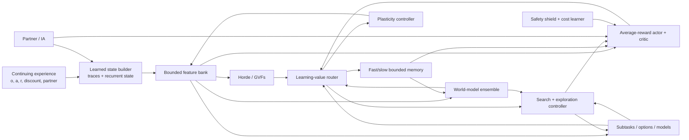

# Implementation Plan for a Continual Experiential Alberta Agent

- **Planning snapshot:** 2026-07-30
- **Status refresh:** 2026-08-03 — the dated implementation-status passages
  below reflect the current working tree
- **Companion review:**
  [CONTINUAL_AGENT_RESEARCH.md](CONTINUAL_AGENT_RESEARCH.md)

## Outcome

Build and validate a bounded, checkpointable, task-agnostic agent that learns
state, predictions, control, models, search priorities, and reusable skills
from one continuing stream. The plan deliberately separates:

- an **API implementation** from an **integrated causal path**;
- an integrated path from a **benchmark result**;
- a benchmark result from a **replicated capability claim**; and
- plasticity, retention, transfer, and safety.

No milestone may use “complete Alberta Plan” as shorthand for module presence.
The final claim requires all acceptance gates in the last section.

## Architectural target



The `LearningValueRouter` is not one universal scalar. It carries typed,
separately calibrated signals:

| Signal | Causal object | Initial use |
|---|---|---|
| Parameter utility, signed \(-wg\) | Parameter/feature | Protect, perturb, replace |
| TD error / advantage | Value or actor sample | Control learning |
| Epistemic surprise | Transition/model hypothesis | Exploration and model-memory priority |
| Aleatoric uncertainty | Environment outcome distribution | Veto noisy-TV and risky imagination |
| Learning progress | Region or model head | Prefer learnable experience |
| Paper-defined delight, \(A[-\log\pi(a\mid s)]\) | Actor sample | Actor-gradient weight and optional Kondo compute gate |
| Prospective exploration score (expected improvement times capped host-relative surprisal) | Candidate exploratory action | Optional host-policy override |
| Safety cost/risk | State/action/trajectory | Shield and full-fidelity safety learning |

The user-facing question “does this gradient spark joy?” names the Kondo
compute decision from the paper: compute actor-sample delight as exact float32
\(A[-\log\pi(a\mid s)]\) in a detached forward pass, then decide whether that
sample's actor-gradient contribution should be admitted. The answer is true iff
the actor consumer then includes that exact contribution in a backward pass it
actually executes. It is not a ninth channel and not a sum of the eight
channels.

Terminology is strict: unqualified **delight** means
\(A[-\log\pi(a\mid s)]\), and **sparks joy** means its actor-gradient
contribution actually enters an executed actor backward pass. The standalone
Kondo gate records forward admission intent; it cannot establish execution.
The execution fact is independent of gradient finiteness, parameter-update
acceptance, and any later outer-transaction acceptance.
The existing
multi-objective, finite-precision
candidate-update safety audit is a separate mechanism. Its historical
`GradientJoy*`, `sparks_joy`, and `joyful_gradient_applied` API names remain
compatibility aliases only. New code uses `CandidateUpdateAudit*`,
`assess_candidate_update`, `apply_candidate_update`,
`PrototypeCandidateUpdateAuditEvidence`, and
`candidate_update_audit_evidence`; result text uses
`candidate_update_audit_passed` and `audited_candidate_update_applied`.

Conflating these signals would recreate exactly the failure modes found in the
literature.

## Invariants that apply to every work package

1. **One stream first.** Parallel-environment throughput can be a secondary
   lane, but every algorithm must have a single-stream result.
2. **No hidden task oracle.** Task boundaries may be logged for evaluation, not
   supplied to the learner, unless a comparator explicitly studies that
   advantage.
3. **Predict before update.** Online metrics use the action/prediction made
   before the current transition is learned.
4. **Bound the lifetime resources.** Every buffer, feature bank, option set,
   model ensemble, and per-step update count has a fixed configured maximum.
5. **Checkpoint all learning state.** Parameters alone are insufficient:
   optimizer moments, utilities, traces, recurrent state, memory indexes,
   calibrators, RNG keys, ages, and lifecycle metadata must round-trip.
6. **Separate safety learning from paper-specific DG/compute gates.** Rare failures may be
   suppressed by a paper-specific actor gradient; the safety-cost learner and
   incident memory must see all of them.
7. **Ablate every new mechanism.** Additions enter behind explicit config
   modes, with an identical base learner and matched search budgets.
8. **Do not silently change historical semantics.** Existing UPGD-inspired and
   feature-lifecycle behavior gets stable names and migration notes.
9. **Report distributions.** Use enough seeds, confidence intervals, and
   per-seed curves; do not promote best-seed or terminal-window anecdotes.
10. **Keep the runtime boundary.** Heavy learning remains in the Alberta/robot
    Python process. elizaOS consumes an explicit bridge protocol and does not
    import research internals.

## WP0 — Establish an evidence contract

### Purpose

Make every repository claim traceable to an executable protocol and immutable
artifact before changing algorithms.

### Deliverables

- Replace the README's unqualified “all 12 steps are implemented and
  benchmarked” language with a four-level status. A concurrent working-tree
  patch already makes the top-level prose honest; retain it and add:
  `kernel`, `integrated`, `benchmarked`, `validated`.
- Retain the concurrent `RESEARCH_STATUS.md` evidence matrix as the human
  summary, while moving its levels, gates, and artifact checks into a
  machine-readable manifest.
- Add a machine-readable evidence manifest. Each claim records:
  - source commit and dirty-state policy;
  - benchmark protocol/version;
  - command and environment lock;
  - seeds and prespecified metrics;
  - raw-artifact hashes;
  - expected thresholds and whether they passed; and
  - known scope limits.
- Decide how omitted upstream experiment trees are handled:
  - vendor the required protocol drivers;
  - or fetch an exact pinned upstream archive in an explicit research lane;
  - or rewrite the small set of authoritative protocols locally.
- Keep unit/contract tests distinct from scientific evidence tests in pytest
  markers and CI.
- Record negative results and ceiling ties. A completed experiment is evidence
  even when the method loses.

### Verification

- A clean checkout can resolve every “benchmarked” claim to a command and raw
  artifact.
- Missing external data causes a visible `not-run` evidence status, never a
  passing claim.
- Re-running a smoke test cannot upgrade a scientific status.

### Exit gate

No ambiguous `complete`, `production`, or `validated` claims remain, and every
current benchmark claim either has a reproducible artifact or is downgraded.

**Implementation status (2026-08-01):** the mechanism deliverables exist. The
machine-readable registry (`alberta_framework/evaluation/evidence_manifest.py`,
CLI `alberta-evidence-status`) binds five claims to commands, artifact hashes,
registered source hashes, seeds, and scope limits, and is verified fail-closed:
a missing promoted artifact yields `not-run` (exit 1), never a pass.
`RESEARCH_STATUS.md` carries the human evidence matrix with L0–L3 levels. As
of 2026-08-01 the registry reports overall `invalid` (exit 2) with all five
claims source-invalidated, because registered source files were edited after
the artifacts were pinned — designed fail-closed behavior; renewal requires
frozen-protocol reruns to new artifact paths and schema versions. The exit
gate's traceability requirement is met; the registry's current state is a
visible rejection, not a silent pass.

## WP1 — Build the continual evaluation harness

### Purpose

Measure the distinct failures before selecting mechanisms to fix them.

### Core metrics

For every stream, record:

- lifetime/prequential return or loss;
- adaptation area under the curve after each detected or logged change;
- recovery time to a prespecified fraction of a fresh-agent or oracle score;
- per-task/regime final performance;
- peak-to-final forgetting;
- backward transfer and forward transfer;
- stability gap immediately after changes;
- worst-window performance, not only lifetime mean;
- wall-clock latency, forward/backward counts, memory high-water mark, and
  energy proxy where available;
- safety violations, intervention rate, and near-miss cost;
- world-model NLL/MSE, reward and termination calibration, ensemble
  disagreement calibration, and multi-step rollout error;
- dormant units, activation entropy, effective/stable rank, parameter norm,
  gradient norm, sampled NTK rank, and policy/value churn; and
- feature, prediction, option, and model creation/removal survival curves.

### Protocol rules

- Use held-out, non-learning probes for old-regime evaluation.
- Log known task/regime identity only in the evaluator.
- Measure how many observations were processed, delayed, or dropped; a slower
  method does not earn retention credit for ignoring more of the stream.
- Compare against:
  - a fresh learner per regime;
  - a frozen learner;
  - a stationary multitask/oracle-data upper reference where meaningful;
  - an identical learner with no continual mechanism; and
  - matched compute and memory budgets.
- Use at least 10 seeds for promotion experiments and 20–30 where variance or
  prior literature demands it. Three-seed frontier experiments may guide
  direction but cannot promote a default.
- Report stratified bootstrap confidence intervals and paired comparisons when
  seeds and streams are shared.
- Independently vary abrupt versus gradual change, partial observability,
  aleatoric distractors, and sequential confounding rather than collapsing them
  into one “nonstationary” condition.

### Integration

The uncommitted continual-metric utilities observed during this review can
become the calculation layer, but benchmark runners must emit their required
performance matrices and predict-before-update traces. Add invariance tests
using hand-computed matrices and end-to-end tests using a deliberately
forgetting learner.

### Exit gate

The base `PrototypeAgent` and at least two simple baselines produce one
versioned report containing all applicable performance, resource, plasticity,
and component-retention metrics.

**Implementation status (2026-08-02):** the v2 report core and a bounded
learner-neutral scalar streaming executor are implemented. The executor owns
regime scheduling and held-out probes, enforces predict-before-update order,
detects serializer-visible prediction/probe/source-state mutation, rejects
configuration drift and noncanonical checkpoints, counts deadline misses, and
keeps safety and per-metric applicability explicitly unavailable when they are
not measured. Adaptation AUC excludes the initial stationary segment and
stability is measured at immediate change points. A separate strict bound
artifact now hashes the complete evaluator config, including stream/probe
digests and learner snapshots, plus the reconstructing metric core; its loader
also requires cross-object protocol, budget, condition, trace-length, and
latency-method agreement. These are evaluator mechanisms; their scientific
protocol and promotion gates remain separate from merely constructing a
report.

A separate strict continuing-control evaluator now owns independent functional
environment copies for the candidate and each baseline, binds every dispatched
action to its exact observation and decision identifier, and rejects dropped,
duplicated, stale, or learner-visible regime metadata. Its v2 protocol freezes
metric direction, exposure checkpoints, recovery/stability references, and
window sizes. Reports reconstruct prequential/lifetime and per-regime return,
post-change adaptation AUC, sustained recovery, immediate stability, final
held-out action scores, forgetting, backward/forward transfer, and worst-window
performance, with explicit applicability when a longitudinal comparison cannot
be formed. A hardened adapter runs `PrototypeAgent` through that boundary, and
checkpoint/report loaders bind the environment, probes, learner state, budget,
condition order, metrics, and reconstructing core by canonical digests. A
separate development-only suite now executes three deliberately privileged
context references outside the ordinary condition list: one independently
initialized learner per evaluator regime identity whose state is retained on
recurrence, a stationary-multitask learner trained on an exactly counted frozen
extra stream, and an exact frozen counterfactual action-outcome upper reference.
The suite discloses regime routing, extra data, action-table callbacks,
initializations, and incompatibility rather than calling these matched
baselines; stochastic expected-action scores are explicitly not accepted as
the exact oracle. This is still development machinery: held-out probes score
one action rather than a control rollout, and no realized-resource-matched
candidate/reference comparison or energy measurement exists.

The fixed v1 `PrototypeContinualControlDevelopmentReport` now exercises that
boundary end to end on consumed development seeds 1701 and 1702. Each seed
runs an independent-environment `PrototypeAgent`, running-reward bandit, and
frozen-action baseline over one A/B/A stream. The report embeds reconstructing
evaluator reports, exact action/decision ownership traces, opportunity counts,
logical persistent bytes, deterministic logical latency, available
parameter/policy/value churn, and explicit available/inapplicable/unavailable
records for every WP1 diagnostic. Exact source/runtime replay and
checkpoint/resume are tested; it writes no output and is always
`not_assessed`. This supplies the literal versioned-report construction witness
in the WP1 exit gate, but it is not a promotion result: the two seeds are
consumed, several host/hardware and internal-gradient measurements are
unavailable, dynamic-component/world-model diagnostics are inapplicable in the
fixed base configuration, realized compute is not matched, and no factorial or
held-out efficacy inference follows.

A strict paired campaign companion can now execute one complete evaluator per
declared seed. Explicit seed wrappers bind every learner and environment
configuration, cross-seed normalization requires identical protocol, budget,
probe, environment, condition role/order, and learner identity, and each raw
report remains embedded and reconstructing. It extracts direction-aware scalar
longitudinal metrics, preserves unavailable pairs, and computes deterministic
stratified paired-bootstrap intervals from a frozen counter-hash RNG. Campaign
config, evaluator core, campaign core, reports, comparisons, and intervals are
SHA-bound and atomically saved. The campaign is always `not-assessed`: no
Prototype campaign has been run, its declared development seeds cannot promote
a claim, and intervals add neither a threshold nor matched realized resources.

## WP2 — Create a faithful plasticity laboratory

### Purpose

Resolve the current UPGD identity problem and select plasticity mechanisms from
controlled evidence.

### 2.1 Preserve and rename current behavior

- Freeze the current `UPGDLearner` update in regression fixtures.
- Expose it as an explicitly documented legacy/custom mode such as
  `utility_perturbed_sgd` / `nonprotecting_power`.
- Correct the source attribution and list every departure from canonical UPGD.
- Keep deserialization compatibility for historical checkpoints.

### 2.2 Add canonical UPGD

Implement a small optimizer-level JAX transform with:

- signed first-order utility \(-wg\);
- EMA and bias correction;
- numerically safe global and local normalization;
- sigmoid utility scaling;
- protecting and non-protecting updates;
- UPGD-W decoupled decay;
- optional AdaUPGD only after the SGD form passes;
- parameter masks for trunks, biases, heads, and normalization parameters; and
- explicit handling of missing, masked, and non-finite gradients.

Second-order utility is a later extension. Do not pull the old PyTorch HesScale
stack into JAX before first-order results justify it.

### 2.3 Parity tests

- scalar and two-layer hand calculations;
- fixed-noise update parity with the official PyTorch reference;
- high-utility parameters gate gradient and noise in protecting mode;
- high-utility parameters gate only noise in non-protecting mode;
- negative, zero, equal, and all-zero utility cases;
- global versus local normalization;
- \(\sigma=0\) equivalence;
- deterministic PRNG splitting under JIT and scan;
- optimizer/checkpoint serialization; and
- all-parameter versus trunk-only masks.

**Implementation status (2026-08-02):** 2.1–2.3 are substantially landed.
`alberta_framework/core/canonical_upgd.py` implements first-order protecting
and non-protecting UPGD and UPGD-W as a small JAX PyTree transform with named
source profiles (`paper_global`, `official_readme_global`,
`official_experiment_global`, `official_experiment_local`,
`paper_local_literal`, `safe_extended`) that keep the paper/README/experiment
discrepancies of the pinned MIT reference visible. A separate
`OfficialAdaUPGD` profile is bound to commit
`b75e90ad4b09c28971ac9dbb902a8fd86709b28c`,
`core/run/rl/adaupgd.py`, and preserves its bias-corrected first/second moments,
raw-utility maximum normalization, noise placement, two-alpha direction, and
one-alpha decoupled decay, including its zero-division/non-finite behavior.
`AlbertaAdaUPGD` is a distinct guarded first-order adaptive extension and is
never presented as source parity. Neither adaptive profile has an efficacy or
default-selection result; second-order utility remains future work. The
historical `upgd.py` learner keeps its exact
semantics with corrected attribution and documented deviations, so existing
checkpoints and results stay valid. `tests/test_canonical_upgd.py` pins the
SGD profiles and `tests/test_canonical_adaupgd.py` pins both adaptive APIs with
supplied fixed perturbations; official parity is explicitly equation-level
within the finite, all-active, single-group fixed-noise scope rather than a
claim of JAX/PyTorch RNG identity. The 2.4 baseline comparisons and 2.5 experiment matrix have
not been run as a preregistered campaign, so WP2's exit gate remains open.

The inexpensive 2.4 mechanism set now also includes a standalone bounded
`SelfNormalizedResets` dense-ReLU consumer. It records each unit's completed
positive-support inter-firing intervals in a fixed trailing window and resets
only when the observed silent-run tail
`P(A >= age + 1) = (1 - p)^age` is at or below the configured percentile after
the exact history and post-reset warmup floors. The caller first performs its
ordinary optimizer update; SNR then refreshes selected incoming columns/biases,
zeros their outgoing rows, and clears the corresponding Adam moments. Exact
two-word clocks, typed Threefry ownership, deterministic reset caps, strict
state/checkpoint/source/representation binding, atomic rejection, and
eager/JIT/scan parity are mechanism-tested. The positive-support/window law is
an explicit Alberta resolution of paper indexing and is not claimed bitwise
equivalent to the released silent-age histogram code. This closes only the
missing low-knob baseline implementation; no matched comparison, plasticity
benefit, default selection, or WP2 exit result follows.

A separate development-only `OptimizationCentricPlasticityDevelopmentReport`
now makes the Optimization-Centric Plasticity warning executable without
turning dormancy into a proxy. It runs matched nonlinear learners on one
evaluator-owned A/B/A stream from the exact same immutable initialization;
the sole intervention is an initialization-centred L2 parameter constraint.
At both switches it retains raw bit-exact old-task and incoming-task gradients,
dot/cosine alignment, fixed-radius local loss probes, and phase parameter
displacement/churn/sign changes. Hidden-activation dormancy is reported
separately and is explicitly excluded from the fixed descriptive
zero-gradient/local-neighbourhood rule. Config, protocol, source, runtime,
snapshots, logical resources, and deterministic full replay are bound, while
outputs, thresholds, evidence, and promotion remain forbidden. This is one
12-update diagnostic schedule with no calibrated verdict or plasticity benefit;
it does not close the 2.4 matrix, 2.5 campaign, or WP2 exit gate.

The repository's existing additive `FastSlowLearner` is now also an exact-
horizon comparator rather than an unbounded-counter assumption. It owns a
`uint32[2]` lifetime, saturating telemetry, terminal fail-stop, atomic numeric
rollback, strict v2 records, exact bytes, and per-step scan diagnostics. Its
consumed 512/512/512 A/B/A diagnostic is a useful negative control: the slow A
probe rises from MSE `0.0188931` after A1 to `4.01919` after B (`212.73x`), and
the low A2 tail appears only after more A updates. The current fast/slow split
therefore accelerates some reacquisition but does not preserve permanent A
knowledge. A genuinely separate, Alberta-derived Permanent/Transient arm is
now implemented without tuning from that consumed root. It uses independent
permanent/transient tanh
representations, exact fixed resources, no task metadata or replay, and a
same-state/same-work no-consolidation ablation. It also fails the direct
retention test: permanent A-probe MSE changes from `0.0434621` after A1 to
`3.92572` immediately after B, and only returns after A2 learning. This is not
a source-faithful paper reproduction. The next distinct comparator must learn
which bounded expert or feature family to leave dormant and later reactivate;
adding another always-active slow parameter path is not a sufficient variation.

The first learned-dormancy comparator now integrates the existing
`ContextInference` active-only-freeze law as a generic fixed two-expert
regressor. A complete pre-target cache binds owner, parameters, observation,
and both predictions; the outcome may select only the next owner and the one
committed candidate. Both arms compute all predictions, losses, and analytic
gradients with the same 32-byte state and fixed work. On the consumed A/B/A
source, selection reactivates learned expert A after one observed A2 outcome,
but the result is not clean retention: per-sample evidence produces 10 A1 and
three B switches, and one B update changes the learned-A subtree and its probe
MSE from `3.73e-20` to `1.90e-05`. This falsifies one-sample routing as the
dormancy policy on that root. The next comparator must prespecify bounded
sequential evidence or quarantine before a contradictory sample can mutate a
dormant expert; no post-result margin or dwell threshold may be tuned here.

That next comparator is now implemented as a fixed `H=2` pairwise-dominance
quarantine. The first source-bound event may open exactly one unique dormant
challenger only when it is globally no worse than the current owner; neither
expert is updated. The second authenticated event must preserve the first
no-worse mask and add strict evidence for the same candidate, otherwise the
transaction rejects. Thus the decisive first B sample cannot overwrite A, and
an unresolved tie cannot silently become routing authority. On the same
already-consumed 512/512/512 source, the enabled arm preserves the learned-A
subtree bit-exact through B, performs zero B updates to it, and reactivates it
after two observed A2 outcomes. Its A1/B/A2 prequential MSE is
`0.0156662/0.0145220/0.0174704`; the same-work routing-disabled arm is
`0.0156662/0.0994502/0.0754818` and makes 498 B updates to A. Four openings
yield two confirmations and two rejections, so four events intentionally make
zero parameter commits. The 53-byte state, 70-byte pending cache, 1,536
updates, 6,144 authenticated expert predictions, 3,072 losses, and 3,072
candidate calculations are bounded and RNG-free. This is the first clean
dormant-expert retention result in this narrow consumed synthetic lane, not a
general context detector, pre-outcome switch solution, multi-seed comparison,
artifact, scientific evidence, promotion, or default-selection result.

### 2.4 Baseline matrix

Start with inexpensive, licensed, mechanistically different comparators:

- SGD/Adam or the current native optimizer;
- L2 and L2-to-initialization;
- weight clipping;
- continual backpropagation;
- self-normalized resets;
- the current additive FastSlow and Alberta-derived Permanent/Transient
  negative controls, plus a learned dormant/reactivation comparator;
- canonical UPGD, UPGD-W, and the local variant.

Then add spectral regularization and carefully reimplemented AdamO/CPR studies.
C-CHAIN, FOGO, and FIRE stay experimental until licensing and independent
evidence are adequate. C-CHAIN now has an independently implemented equation
comparator, but not a full agent arm or an outcome result.

**Mechanism implementation status (2026-08-03):** the three named follow-on
arms now have isolated bounded L0 surfaces. `core/spectral_regularization.py`
implements the ICLR 2025 dense-layer objective
`(sigma_max(W)^k - 1)^2 + ||b||_2^(2k)` with an explicit power probe whose
default is the paper's one iteration. It owns typed Threefry initialization,
an exact two-word lifetime, finite atomic rejection, strict config/checkpoint
metadata, and logical resources. `core/adam_o.py` independently implements
AdamO Equations 16, 19,
and 20: task gradients alone update Adam moments, while the rectangular Gram-
deviation gradient is applied as a separately scaled isometry delta.
`core/calibrated_partial_resets.py` implements CPR Equations 3 and 5--7 plus
Algorithm 1 against the authors' pinned JAX reference: per-example incoming-
weight gradient utility, layer normalization and EMA, source-clock scheduling,
utility-scaled He-uniform incoming pulls, outgoing decay, reset-event-only RNG
advance, and no ownership of the base optimizer state. CPR deliberately omits
biases because the paper appendix and released v1 code disagree about them.
Focused eager/JIT/scan, equation, rollback, clock, resource, public-export, and
checkpoint tests establish mechanism integrity only. These are single-layer
building blocks, not generic multi-layer/convolution wrappers or Prototype
arms; no matched matrix, efficacy, default selection, scientific evidence,
SOTA result, or WP2 exit follows.

A separate nonwriting `WP2DenseLayerDevelopmentReport` now exercises baseline
SGD and Adam beside isolated Adam-plus-spectral, hidden-matrix AdamO, and
Adam-plus-CPR arms on one source-frozen small nonlinear A/B/A stream. The
architecture, typed initialization/data keys, phase geometry, and all
coefficients are fixed in source. Its in-memory record retains prequential and
fixed-probe traces, descriptive switch recovery/forgetting, phase parameter
displacement/churn, dormancy/effective-rank diagnostics, mechanism-specific
work and logical state bytes, digest-bound checkpoints, and exact causal
replay. Resource comparability is always `not_assessed`: AdamO performs Gram
work and CPR performs per-example utility plus scheduled reset draws/work, so
the lane never calls the arms resource-matched. It has no writer, tuning,
winner, default, efficacy, evidence, promotion, or WP2-exit authority.

#### 2.4.1 C-CHAIN equation comparator status

`alberta_framework/core/cchain.py` implements the exact paper Equation 8
objective as one half of mean squared output churn against a detached
one-step-lag reference. Exactly one scalar model output is accepted per
reference sample; vector-valued per-sample extensions fail closed. A valid
transaction computes one combined base-plus-churn gradient over declared
disjoint train/reference sample identities, then accepts only the exact source-
bound proposal. Commit performs no autodiff,
advances an exact `uint32[2]` lifetime, shifts the source parameters into the
reference slot, and binds the next current parameters to the externally
applied optimizer result. Invalid runtime preflight does no backward work.

The paper appendix ratio of running mean absolute base loss to churn loss is
present, with explicit Alberta-only epsilon, warmup, bounded trailing-window,
and coefficient-clamp controls. The accompanying empirical-NTK diagnostic
computes the minimum singular-value prefix carrying `1 - delta` mass and
diagonal/off-diagonal statistics; it has no gate or evidence authority.

The exactness claim is deliberately narrow: Equation 8 is exact, while this
one-step-lag combined-gradient comparator is **not** a reproduction of the full
sequential C-CHAIN PPO/DQN algorithm. Unkeyed binding words do not authenticate
model/loss callables, declared sample IDs do not authenticate dataset
provenance, and the external optimizer application is caller-owned. Keep the
mechanism disabled by default until it becomes a preregistered matched arm with
retention, plasticity, control, resource, and failure analysis.

### 2.5 Experiments

Reproduce the UPGD distinction between:

- input permutation: mostly plasticity;
- label permutation: plasticity plus forgetting;
- stationary control: detect damage from unnecessary perturbation;
- gradual drift: test a limitation of abrupt-shift studies;
- recurrence/world-model heads: expose parameter-role differences; and
- Alberta's native prediction and average-reward control streams.

Factor the ablation:

`signed vs |wg| × protecting vs non-protecting × sigmoid vs power ×
Gaussian vs Rademacher vs zero noise × decay on/off × parameter mask`.

### Exit gate

Canonical parity passes, historical local results remain reproducible, and a
method becomes a default only if it improves preregistered lifetime metrics
without a significant retention, safety, or stationary-performance regression.

### 2.6 Current replication-diagnostic boundary (2026-07-31)

The UPGD Input-permuted MNIST runner has completed 10 matched one-million-step
development seeds. UPGD-W/AdamW mean online accuracies were
`0.7791470803916454`/`0.7190002817213534`; their paired descriptive mean
difference was `0.06014679867029188`, positive in 10/10 pairs. The canonical
artifact is
`outputs/upgd_ipmnist/results.reconciled_nonpromoting.v2.json`, bound by
the current `outputs/upgd_ipmnist/nonpromoting_receipt.v2.json` addendum; its
`nonpromoting_receipt.v1.json` predecessor is preserved byte-for-byte. The original
`results.v1.json` is preserved and fails strict validation only for its
10-vs-20-seed note; the reconciled artifact is strictly structurally valid.

This run does not close WP2. It is permanently nonpromoting because it used 10
rather than the publication's 20 seeds, made documented stream/logging/numeric
deviations, and lacks execution-time worker-source, full-import-closure,
command, environment, and dataset-byte binding. Its AdamW result is about
`+0.039` above the approximate publication figure read-off. No inferential,
SOTA, default-selection, or Alberta Plan claim follows. Closing the relevant
replication gate requires a fresh source-bound full-20-seed run, not appended
seeds, and the broader retention/safety/stationary experiments in this work
package remain open.

Future execution must use the active namespaced v3 plan/shard/merge contract,
not the legacy direct-aggregate v2 path. V3 issues one immutable plan with the
exact learner pair, exactly 20 fresh operator-reserved seed IDs, configuration, selected
hyperparameters, closed deviations, dataset digest/locator, runtime, commands,
and static transitive local import closure; workers emit one learner/seed
shard, and merge requires the exact planned Cartesian product with byte hashes.
No v3 plan has been issued and no fresh v3 seed has been consumed. The v3
schema remains permanently nonpromoting without external execution
attestation. See `UPGD_IPMNIST_V3_RUNBOOK.md` before any launch.

## WP3 — Make state construction learnable

### Purpose

Replace random temporal features with a state process that learns which history
supports prediction and control.

### 3.1 Fix the observation contract

- Define whether each public method consumes `raw_observation` or
  `agent_state`.
- Cache the state representation produced by `start()` and `update()`.
- Retain and verify the concurrent `act()` fix that runs the encoder without
  advancing recurrent state; then decide whether caching the representation is
  the cleaner public contract.
- Add a GRU-enabled first-action regression test and scan/single-step parity
  test.

### 3.2 Introduce a `StateBuilder` protocol

The minimal interface should support:

- `init(key)`;
- `start(raw_observation, last_action, last_reward)`;
- `encode(raw_observation)` for pure evaluation when valid;
- `update(raw_observation, action, reward, discount, auxiliary_errors)`;
- a fixed output dimension and resource budget; and
- full serialization.

Initial implementations:

1. identity;
2. fixed trace bank over observation, action, and reward;
3. the current echo-state GRU, honestly named;
4. a learnable GRU baseline;
5. a recurrent trace-unit or recurrent generate-and-test state builder.

### 3.3 Learning signals

Train state using a balanced set of online objectives:

- next latent/observation, reward, and termination prediction;
- multiple-timescale GVFs;
- control value and advantage;
- inverse/action-disambiguation where helpful; and
- feature utility measured by held-out prediction/control change.

Use separate heads so one rapidly changing reward does not erase
dynamics-relevant history. Continually rank and recycle state features only
after causal deletion or shadow-feature evidence.

### 3.4 Forager gate

Use Forager/Foragax to test:

- field-of-view reduction;
- hidden reward switches;
- reward/action trace baselines;
- repeated relearning;
- an unending task stream; and
- constant agent memory.

Compare frozen-state, feed-forward, traces, echo-state GRU, learned GRU, and
recurrent generate-and-test under matched parameter and compute budgets.

Treat the in-tree stationary causal-map planner as a task-specific L0
comparator. It learns a relative map, reward means, and respawn timings from
ordinary observations but uses the public 15×15 toroidal movement structure;
it is not a learned recurrent-state result and cannot satisfy this work
package's exit gate. Likewise, the completed five-seed tuning selection and the
incomplete 30-seed evaluation lane are execution status, not performance
evidence until the Alberta and matched-baseline reports and their statistical
comparison are complete.

The later open two-seed CPU development screens also do not close this gate.
Their complete frozen candidate sets rank `DQN_LN-common-control` first among
the feed-forward candidates (mean FOV tail-EMA AUC `1.49084`) and
`PPO-RTU_LN_128_1_relu` first among the stateful candidates (`1.78110`). The
aggregates prohibit promotion, superiority, and SOTA claims; budgets are not
necessarily matched, seeds are consumed development seeds, and the stateful
RTU-PPO route retains an upstream RNG confound. Exact content parity in the
fixed-action direct/wrapper probe remains externally unverified and
nonpromoting. Use these rankings only to choose later open development work,
never as the required matched held-out comparison.

The matched-current Forager campaign contract likewise remains execution
status, not evidence. As of 2026-08-01, `outputs/forager/` contains a
completed executor qualification and a prepared open-tuning campaign with
published manifests but zero executed tuning cells; the sealed held-out
evaluation stage
(`alberta_framework/benchmarks/forager_matched_sealed_evaluation_campaign.py`)
has no console script and has never run; and every authority-bearing path
terminates at an
external trust resolver that does not exist in-tree, so the shipped parity
receipt is recorded as unverified with `promotion_authorized: false`.

### Exit gate

The learned state builder beats raw observation and fixed random recurrence on
prequential average reward and recovery time, retains the gain when learning is
frozen, and stays within its declared memory/latency budget.

**Implementation status (2026-08-03):** the causal contract and Prototype
plumbing are implemented for identity, fixed-trace, online-gated,
conventional full-GRU, and diagonal complex RTU builders.
`LearnableGRUStateBuilder` has dense input and
recurrent update/reset/candidate maps and exact fixed-parameter RTRL
sensitivities. It uses the same source-bound proposal, one advanced-destination
commit, fail-stop clocks, fixed resources, checkpoint, reset, and JIT/scan
contracts as the smaller online-gated builder. Its persistent sensitivity is
`O(hidden_width * parameter_count)`, and carrying it across online parameter
updates is explicitly an approximation rather than exact changing-parameter
RTRL.
`RecurrentTraceUnitStateBuilder` persists compressed unit-diagonal
sensitivities rather than a dense hidden-by-parameter Jacobian. They are exact
for fixed parameters; default carry after online commits is explicitly
approximate. An optional diagonal Taylor correction owns the exact source
parameters, actual accumulated delta, and source update words, but remains an
approximation because mixed-parameter Hessian terms are omitted. The RTU
shares the causal event, proposal/advanced-destination commit, fail-stop,
resource, checkpoint, reset, and eager/JIT/scan contracts.
An opt-in `RTUGenerateAndTest` lifecycle now observes the pre-update downstream
loss gradient and estimates each complex unit's effective
contribution as the sum of absolute real and imaginary activation-gradient
products. That contribution EMA is diagnostic in the strict live lane. Before
any comprehensive head update, its owning adapter now performs one
counterfactual per complex unit that jointly deletes the real and imaginary
channels from the current representation and scores the frozen balanced-head
loss change on the newly arrived transition. A separate positive bounded EMA,
independent causal-evidence floor, and exact per-unit reset make this a
prequential causal-deletion rank. The live lane requires that rank and has no
fallback to contribution utility; missing or immature evidence defers only
replacement, while an attempted invalid or non-finite internal score rejects
the whole outer transaction. Age, sensitivity support, protected-unit, warmup, period, quota,
and active-option gates remain conjunctive.
Replacement redraws the whole unit—polar recurrence and both input rows—and
scrubs its activation, compressed RTRL sensitivity, and optional Taylor
trace/source/delta slices while preserving every nonselected bit. An optional
ordinary builder proposal is recomputed from the exact pre-update source and
defines the sole admissible advanced destination; stale, tampered, or
caller-invented destinations roll both lifecycle and builder back. The public
finalization receipt reconstructs the advance receipt, independently reruns the
RTU commit, and exact-matches its destination and selected mask. This proves
derivation from caller-supplied inputs but does not authenticate lifecycle-
source, objective-gradient, or ordinary-proposal authority. Typed
Threefry ownership, exact clocks, checkpoints/resources, and eager/JIT/scan
parity are tested. The standalone seam remains a downstream-sensitivity L0
mechanism unless an external causal vector is supplied; it cannot authenticate
that caller. The internally owned live deletion score is prequential L0, not
an independently held-out efficacy result. Neither signal is paper-defined
delight, an autonomous objective generator, or a control-benefit result. A
strict live composition now prepares the exact Prototype recurrence
without learning or action RNG, learns the current transition under the old
representation, performs at most one atomic whole-unit replacement, scrubs
every selected feature axis in all comprehensive objective heads and the
supported linear STOMP/OaK base head, intra-option heads/traces, and option
transition models, and then performs the
ordinary next-action selection from the recycled representation. Active
options defer replacement without dropping recurrence, objective learning, or
the real transition. Content-bound prepare/finalize receipts, distinct unit and
replacement-event clocks, exact revision equations, atomic rollback,
checkpoints/resources, consecutive replacement, and eager/JIT parity are
covered. The live adapter owns the lifecycle source and constructs both the
gradient and source-bound proposal internally. Its declared source work is four
builder-commit and two RTU-commit evaluations plus one frozen-head
counterfactual per RTU unit; one logical ordinary update and at most one logical
replacement event can persist. Its RTU-enabled lifetime declaration is bounded
by the per-unit uint32 age/support/evidence counters (`2**32 - 1` accepted
transitions). Nonlinear STOMP, planning,
model/replay/dreaming, Horde, IA,
partner/memory, GRU, historical candidate-update audit, and feature-lifecycle
sidecars are statically rejected by this narrow lane.
Decision caching, single-advance behavior, episode-local reset, transactional
invalid-input handling, scan parity, resource accounting, and checkpoint
configuration binding have contract tests. The online-gated builder has a
source-bound pure proposal and atomic advanced-destination commit. An opt-in
Prototype lane now consumes the bounded ensemble's causal pre-update
representation gradient; an optional decision-bound candidate-update audit
gates the actual finite-precision parameter delta. A successor opt-in mixer now adds
an explicitly weighted, optionally normalized/clipped current control-loss
gradient. Idle primitive transitions use the base-Q one-step semi-gradient;
executing options use the current intra-option semi-gradient, while delayed
semi-MDP credit owned by the option-start representation is excluded. The
mixed candidate feeds both the builder proposal and that safety audit;
real replay gradients never enter it, and valid-range action-owner tampering
fails closed. A separate `BalancedStateObjectives` L0 kernel now owns linear
GVF heads at at least two strictly ordered discounts and a separate
consecutive-pair inverse-action head. Each head family updates separately; the
GVF family is averaged before fixed positive group masses are combined, and
the kernel returns clipped current/successor representation gradients bound to
the exact executed-action receipt and nondecreasing representation revisions.
Its strict checkpoint, exact resource accounting, fail-stop clocks, retry-safe
rejection, JIT/scan behavior, and a real `OnlineGatedStateBuilder` proposal and
advanced-destination commit are tested. An opt-in
`PrototypeBalancedStateObjectives` adapter now binds the exact dispatched
Prototype decision, primitive action, bitwise representation, observation
event, and decision-time builder revision. It scores the final/bootstrap
observation before autoreset, combines the current and bootstrap recurrent
sensitivities into one clipped builder commit, and atomically rolls back the
Prototype learner/RNG, objective heads, builder, clocks, and next-action cache
if any component rejects. The base Prototype path remains unchanged. The
weights are declared rather than empirically balanced. A separate standalone
`ComprehensiveStateObjectives` L0 kernel now adds action-conditional
next-observation, next-latent, reward, and Bernoulli-termination heads,
multiple-timescale GVFs, distinct state-value and selected-action-advantage
heads, and inverse-action classification. Prediction and control subheads are
mean-balanced inside six fixed positive family masses, so target width or head
count cannot silently acquire extra representation-gradient mass. Every head
has independent parameters, step size, and revision accounting; exact action
receipts, non-earlier successor revisions, stable BCE, clipped current and
successor gradients, fail-stop clocks, strict checkpoints/resources, numerical
rollback, finite-difference checks, and eager/JIT/scan parity are covered. A
standalone opt-in `CausalStateObjectiveTargetProducer` now owns that kernel and
removes ordinary target selection from its caller. From the exact cached
observation/representation/action and a content-bound accepted real transition,
it derives detached action-conditional successor observation/latent, reward,
termination/discount, multi-timescale GVF, current-value, selected-action
advantage, and consecutive-pair inverse-action targets. Lifecycle, external
decision/action, representation revisions, and the nested objective clocks are
bound atomically; natural termination suppresses bootstrap, while truncation
requires a valid final/bootstrap representation rather than a reset observation.
Stale, tampered, non-finite, ambiguous-boundary, and exhausted-clock inputs roll
both owner and objectives back. Optional arbitrary cumulants require a typed,
content-bound, monotone-revision, nonzero-provenance receipt; that proves declared
integrity, not semantic causal validity. Strict resources/checkpoints and
eager/JIT/scan parity are covered for this isolated path. A
separate opt-in `PrototypeComprehensiveStateObjectives` transaction now binds
caller targets and source/provenance to the exact Prototype decision/action,
observation event, final/bootstrap observation, and decision-time builder
owner. It supports the online-gated, full-GRU, and compressed-RTU builders,
combines current and successor RTRL pullbacks into exactly one clipped logical
builder update, and rolls the complete composition back on any failure. The
strict-linear RTU lane above now consumes that update through its exact
independently rederived recurrence destination and scrubs recycled consumer axes before
selection. Its targets and masses remain caller-declared and uncalibrated.
The existing caller-targeted adapter remains unchanged. A separate versioned
`PrototypeCausalStateObjectiveTargets` adapter now binds the standalone producer
to the exact dispatched Prototype decision and accepted `PrototypeTransition`.
It reconstructs the final/bootstrap recurrent observation, derives and
content-binds all ordinary targets, evaluates Prototype and the target owner
once each, combines the current/successor recurrent pullbacks, commits one
builder update, and atomically adopts the next dispatch cache or rolls every
child back. Only an optional source-bound arbitrary-cumulant receipt remains a
caller learning input. Strict resources/checkpoints, exact uint64 carry, and
eager/JIT/scan parity are covered. This path supports the online-gated and
full-GRU builders and now supports the exact RTU builder only when the matching
strict `RTUGenerateAndTest` lifecycle is supplied. In that lane the adapter
scores whole-complex-unit deletion against the frozen pre-update objective
state using the single learner-owned factual target bundle, ranks only from
that causal score, and atomically commits recurrence, target heads, Prototype
consumers, lifecycle/RNG, and the successor cache. Every selected axis in
target-owned objective heads, the pending target cache, RTU
sensitivity/Taylor state, and supported linear STOMP consumers is canonical
`+0.0`; invalid scoring or a late successor refusal rolls the entire
transaction back bit-for-bit. Its checkpoint binds exact typed metadata,
canonical empty-array storage sentinels, and the RTU-specific `2**32 - 1`
transition horizon. Learning-value routing, feature lifecycle, and the v18
atomic feature/world/memory lane retain incompatible representation/lifecycle
owners and fail at construction. General causal
cumulant derivation, broader traces, broader lifecycle compatibility, independently
held-out feature-utility validation, broader curation, causal outcome tests,
matched recurrent-lifecycle ablations, and the
Forager comparison remain open, so
the WP3 exit gate is not met. The resource-unmatched consumed write/hold
probe's four-seed mean frozen-suffix accuracies were
`0.5158` observation-only, `0.5292` fixed trace, `0.5258` online-gated, and
`0.5067` full GRU, while the compressed RTU reached `0.5617` with `1,324`
total persistent bytes versus `12,204` for the full GRU. The RTU result is a
descriptive consumed-development signal on a supervised fixed-delay task, not
a resource-matched inference, control benefit, or learned-state exit result.

## WP4 — Build a calibrated continual world-model lane

### Purpose

Turn the current one-step smoke model into a measured foundation for retention,
planning, surprise, and safe imagination.

### 4.1 Repair the transition API

Every real update must receive:

`observation, action, decision_id, reward, discount, terminated/truncated,
bootstrap_observation, next_decision_observation`.

- Do not synthesize a constant discount inside `PrototypeAgent`.
- Propagate predicted discount/termination into imagined value targets.
- Add continuing and episodic/truncation contract tests.
- Keep environment reward separate from subtask cumulants.

**Implementation status (2026-07-31):** this transition boundary is now
implemented as `PrototypeTransition`. A checkpointed lifecycle nonce plus a
64-bit generation prevents within-life ABA replay; caller-owned lifecycle IDs
provide exact cross-run ownership. Runtime-invalid transitions are atomic
no-ops in eager/JIT/scan paths. STOMP/OaK learns and bootstraps on the final
observation but selects on the post-reset observation, while a truncation
interrupts active option execution without treating censored experience as a
successful option-model completion. This closes 4.1's mechanism contract, not
WP4's model/calibration/effectiveness gates.

### 4.2 Maintain two reference models

1. **Shallow online reference:** a linear/kernel Follow-the-Leader-style model
   and MPC/planning baseline inspired by the ICML 2025 result.
2. **Continual latent ensemble:** a stochastic recurrent latent model with
   small ensemble dynamics/reward/continuation heads.

The shallow model provides interpretability and a hard-to-forget baseline. The
latent model earns complexity only when it improves lifetime control or
prediction under equal resources.

**Implementation status (2026-07-31):** the shallow reference is now a bounded
action-indexed affine regularized follow-the-leader/ridge model. It predicts
grounded raw next-observation, reward, and continuation targets before adding
the transition to per-action Gram/cross sufficient statistics, then solves the
selected regularized normal equations atomically. Counts, statistics,
coefficients, numerical bounds, positive-semidefinite Gram structure,
configuration, RNG-free checkpoints, and exact allocated bytes are validated.
A pure diagnostic planner scores every action as predicted reward plus predicted
continuation times a caller-supplied linear successor value. This is L0
mechanism coverage, not the cited paper's theorem or MPC system: it is fully
observed, discrete-action, affine, O(feature_dim³) per selected solve, and has
no uncertainty, replay, recurrence, latency result, or control-benefit result.
An isolated bounded recurrent latent reference is now implemented with one
trainable GRU and grounded mean/heteroscedastic-variance heads per bootstrap
member. Exact observation/action cache ownership, predict-before-update NLL,
one recurrent advance per accepted event, final-target/reset-cache boundary
semantics, atomic rejection, fixed resources, JIT/scan, and checkpoint
continuation are mechanism-tested. An opt-in fourth mutually exclusive
`PrototypeAgent` world-model lane now owns that exact decision cache, advances
the recurrent model and its causal signal estimator as one transaction, and
routes only the accepted real NLL representation gradient to the builder,
mixer, and candidate-update audit boundary. A rejected recurrent transaction
rolls back the whole Prototype transition. This is not a planner, replay lane,
calibrated model, or efficacy result. A fixed two-seed,
18-transition A/B/A development diagnostic now runs the shallow model, the
plain ensemble, and model-only rehearsal on the same raw grounded stream and
reconstructs
prequential channel errors, recurrence/adaptation summaries, replay
composition, and logical resource accounting. It is intentionally tiny,
resource-unmatched, and `not-assessed`; it is not the preregistered
shallow-versus-ensemble efficacy comparison required by the exit gate. Thus
4.2 is not complete.

### 4.3 Calibrate uncertainty

- Train ensemble members with genuinely different bootstrap/masking streams.
- Predict both mean and aleatoric variance where stochasticity matters.
- Measure epistemic disagreement against held-out error and OOD changes.
- Maintain state/action-region calibration rather than a single global error
  EMA.
- Reject dreams for non-finite values, high epistemic uncertainty, poor
  termination calibration, or unsupported rollout depth.

**Implementation status (2026-07-31):** a fixed-size bootstrap ensemble is now
implemented and integrated as a mutually exclusive Prototype model lane. It
persists distinct member initialization, bootstrap RNG/masks, member counters,
the signal estimator, and exact resource accounting; predicts before update;
and exposes typed warm-up availability plus a causal representation gradient.
The present variance channel is an explicitly uncalibrated residual proxy, not
a demonstrated aleatoric model. A strict development evaluator can now freeze
either an ensemble or single-model snapshot and retain raw held-out member/mean
predictions and grounded targets. It reconstructs descriptive
disagreement-versus-error bins, Pearson/Spearman association, coverage-risk,
and ID/OOD plus derived state/action-region summaries; sparse or unavailable
fields remain explicit. Optional mean open-loop traces run only for
caller-declared grounded, exactly reconstructable action sequences. The
evaluator applies no threshold and expressly makes no probabilistic calibration
claim because the currently evaluated model defines no likelihood. The
isolated recurrent latent ensemble in 4.2 defines bounded
heteroscedastic-Gaussian heads and now has a separate strict development
adapter. Starting from a hash-bound frozen snapshot, that adapter scores each
cached distribution before exactly one update of an isolated copy, retains raw
member means/variances/NLLs, and reconstructs ID/OOD plus evaluator-owned
state/action-region summaries. Warm-up exclusions, final isolated-state
counters, sources, resources, reports, and snapshot checkpoints are explicit;
the supplied snapshot remains unchanged. The Gaussian NLL objective and
variance head do not establish calibrated likelihood or coverage. Ensemble
dreaming is still disabled, and external calibration, decision thresholds,
matched comparisons, and the exit-gate result remain open. This does not close
WP4.

An isolated `WorldModelRegionCalibration` owner now fills the online mechanism
boundary without changing any planner or `PrototypeAgent` path. It settles one
content-bound predict-before-outcome receipt against one matching accepted real
outcome and retains fixed-capacity declared-region × primitive-action cells.
The receipt binds lifecycle/decision, model, representation, action, region,
and calibration revisions plus every member mean, aleatoric variance, and
termination probability. Causal pre-update gates remain noncompensating:
ensemble disagreement is compared with realized excess error without relabeling
raw error as epistemic; aleatoric standardized-residual coverage and Gaussian
NLL remain separate from an explicit caller-fixed noisy-TV variance veto;
grounded next-state and reward error quantiles remain distinct; and termination
uses uncensored support/Brier/calibration diagnostics while time-limit
truncation is censored rather than treated as environmental termination. OOD
cells stay unavailable until their own support warms up. Exact content tags,
atomic stale/tamper/non-finite rollback, uint64 clocks, fixed resources,
checkpoint continuation, and eager/JIT/scan equivalence are mechanism-tested.
Its read-only receipt explicitly grants neither planning nor safety authority;
the existing Dyna and short-rollout gates do not consume it yet. Alpha and all
limits are caller declarations. This remains L0 `not_assessed` infrastructure,
not a calibration, safety, planning-benefit, or WP4 completion claim.

A separate versioned `WorldModelPlannerReadiness` sidecar now consumes those
receipts without changing either planner's API or state. Preparation
functionally evaluates the existing one-step Dyna or short-rollout transaction
and binds its model, anchor/decision, selected action, exact global calibration
content, and every caller-declared region/action cell. Execution recomputes the
same legacy transaction; calibration is a strict additional noncompensating
conjunction, and a required short-rollout failure closes the remainder of that
path's prefix. Stale/tampered receipts, newer calibration content, or any
unavailable required cell roll back the sidecar, planner RNG/state, Dyna control
update, and rollout proposals atomically. The wrapper owns no child state and
grants no planning or safety authority. This remains L0 `not_assessed`
mechanism coverage, with no empirical calibration or planning-benefit claim.

An additional standalone `RoutedLinearWorldModelEnsemble` now covers the
changing pair-bank boundary without modifying the existing single-model or
Prototype v18 APIs. It owns no feature lifecycle or router state: the caller
supplies one authoritative old-to-new bank receipt. Every independently
initialized linear member predicts and updates on the old augmented input
before one stacked router transaction moves survivor weight/trace columns by
descriptor identity and scrubs newborn/inactive columns to exact zero. Stable
base and action columns remain bit-preserved, and outputs stay the fixed
physical base-delta, reward, and continuation heads. Pre-update member means,
epistemic variance, residual-variance proxies, and typed learning-progress
signals are emitted causally; destination descriptor choice cannot affect
them. Any member, signal, clock, or route failure rolls back the whole state.
The residual channel remains an uncalibrated proxy, and the component grants
no planning or safety authority. This is L0 `not_assessed` mechanism coverage,
not an empirical calibration, retention, or control-benefit result.

A separate versioned
`PrototypeRoutedLinearWorldModelEnsembleAdapter` now consumes that seam without
changing Prototype or v18. Its strict lane is one exact-Identity Prototype with
one managed linear Horde and optional historical feature-bound experiential
memory; all Prototype-internal world-model lanes and the v18 composition remain
disabled. The feasibility audit found sufficient exact identity in the
existing source/result states: the lifecycle-owned router state and the
consumer binding physically coupled to OaK/Horde name both the source bank and
the destination actually adopted by Prototype. The adapter predicts the
external ensemble on the source bank, invokes Prototype exactly once, then
uses those exact returned identities to update every ensemble member on the
old bank and apply one stacked destination route. An unkeyed receipt is
source-bound and integrity-bound by exact content, not authenticated. Any
stale/tampered receipt or Prototype/ensemble invalidity returns the complete
composite source, while optional Prototype sidecars pass through unchanged
apart from their selected top-level state. Persistent ownership remains one
lifecycle and one `FeatureBankRouterState`; the external ensemble stores only
its binding. Complete-event work is reported honestly as three bank mappings:
two already evaluated by Prototype's lifecycle plus one ensemble mapping, with
zero curation recomputations. Eager/JIT/scan boundaries, checkpoints, survivor
move/newborn scrub, unchanged-bank updates, and managed-Horde/feature-memory
coexistence are mechanism-tested. This L0 `not_assessed` adapter grants no
planning, dispatch, safety, evidence, or promotion authority.

A narrow version of that architecture is now implemented as the separate v1
`ExternalLearnedStateRouterAuditCoordinator`, not as another Prototype mode.
It owns one exact full-GRU state builder whose fixed-width raw-plus-hidden
output is the stable base supplied to one exact-Identity inner Prototype. The
inner adapter remains the sole STOMP/OaK, managed-linear-Horde,
feature-lifecycle/router, optional historical feature-bound-memory, and routed
ensemble owner. It rejects Prototype v18, every Prototype-internal model lane,
and a second learning-value router or candidate audit.

For one continuing event, the coordinator advances the full GRU once and the
inner Prototype/ensemble transaction once. It forms fixed physical
base-delta/reward/continuation targets internally, stops them, and analytically
pulls the cached pre-update linear-member residuals through the source head
weights and exact pair descriptors. The pullback adds no model forward. One
source-bound builder proposal then passes through exactly one
`LearningValueRouter` event and one independent-probe candidate-update audit.
An accepted weighted parameter update is committed to the already-advanced
builder state, so it cannot alter the representation used for the current
event and first affects recurrence on the next event. An audit veto rejects
only parameter learning; the grounded recurrence and inner real transition
still advance.

Raw observation, emitted representation, action, decision ID, builder step,
Prototype step, feature generation, and coordinator event revisions are
cached exactly. A binding-only outer registry adds no router state. Its unkeyed
exact-content receipt is integrity-bound and source-bound, not authenticated;
stale evidence, tampering, counter exhaustion, invalid inner work, or any
candidate-state failure returns the complete composite source. Version 1 is
deliberately continuing-only: termination, truncation, autoreset, or a distinct
next-decision observation fails closed rather than evaluating the full GRU a
second time. Complete-event accounting names one external transition, one
inner Prototype/Identity transition, three mappings, `3 * ensemble_size`
linear-member forwards, one analytic pullback, one router evaluation, one
candidate audit, one proposal, and one commit, with zero curation
recomputations and zero pullback forwards. Config/checkpoint continuation,
accepted/vetoed learning, exact analytic-gradient agreement, optional
Horde/feature-memory coexistence, atomic rollback, clocks/capacity, and
eager/direct-step-JIT destination equivalence are mechanism-tested. Batched
execution is an explicit nonempty host loop: monolithic scan JIT is rejected
before event work because its compiler-memory footprint is not covered by the
persistent resource budget. This remains L0 `not_assessed` infrastructure with
no caller target, curation, planning, dispatch, safety, authentication,
evidence, or promotion authority.

The separate stateless `ExternalBuilderCandidateEvidenceProducer` now closes
the parameter-space evidence plumbing without changing that ownership. It
binds caller-owned objective, retention, and safety representation gradients
to the exact coordinator event, builder, Prototype, feature-generation, and
decision identity, then multiplies each hidden suffix by the cached source
full-GRU RTRL sensitivity. Stale, malformed, or non-finite probes become
unavailable exact-zero parameter gradients; the producer cannot infer the
required independence attestation. A real coordinator test demonstrates that
valid produced evidence can pass a permissive mechanism audit and update only
the external builder, with three analytic pullbacks and zero additional model
forwards. This is candidate-audit evidence plumbing, not delight execution:
the producer runs zero actor backwards and cannot establish that a gradient
“sparks joy.” It supplies no calibrated probes, realized-outcome result,
safety authority, evidence, or promotion.

### 4.4 Add bounded dual replay

Use a fixed total capacity split between:

- short-term recency FIFO; and
- long-term coverage/distribution memory.

Compare reservoir, clustering/coreset, model-error coverage, ensemble-surprise,
learning-progress, and maximally-interfered retrieval. Never prioritize raw high
error without an aleatoric control. Store old action probabilities/value
targets for CLEAR/DER-style behavioral rehearsal, and record eviction
provenance and representation version.

**Implementation status (2026-07-31):** a fixed-shape `DualReplayMemory`
implements a declared total slot budget split between a recency FIFO and
long-term reservoir or configured calibrated-priority stratum. Prediction and
outcome records are structurally separate; stored fields include old behavior
probability/logit/value availability, uncertainty/progress/safety channels,
representation/source/provenance, and eviction provenance. Sampling has fixed
per-stratum quotas, explicit padding, and stale/future representation filters.
Aleatoric veto/downweight prevents raw-error noisy-TV priority. Exact resource
accounting, deterministic RNG, counter exhaustion, corruption no-ops, and
digest-bound checkpoint/JIT/scan parity have mechanism tests. The configured
priority scales are not empirically calibrated and coverage is raw Euclidean.
An opt-in `ModelReplayRehearsal` composition now performs one atomic causal
transaction: real ensemble update, typed-signal record, fixed-quota stratified
sample, then model-member-only replay updates. Replay has an isolated bootstrap
key/mask/counter lane and cannot advance the real signal estimator, residual
statistics, real counters, actor, critic, or builder. The Prototype exposes
this as a third mutually exclusive world-model lane and routes only the
commit-gated real representation gradient through builder learning and the
candidate-update audit. Exact composition state/resources/checkpoints, padding, stale versions,
rollback, JIT/scan parity, and ensemble v1→v2 migration are tested. Clustering,
maximally interfered retrieval, actor/critic behavior correction, empirical
priority calibration, and realized control comparisons remain open. The small
matched-stream A/B/A diagnostic described in 4.2 now exercises replay
retention and noisy-TV composition, but its two consumed development seeds,
short horizon, unequal realized work, and lack of a decision threshold support
no retention or mechanism-selection claim.

### 4.5 Component retention probes

At every regime checkpoint, test separately:

- encoder/state representation;
- dynamics and observation prediction;
- reward discrimination/calibration;
- termination/discount prediction;
- critic/value;
- actor action margin and return.

This localizes whether forgetting is in memory, representation, value, or the
policy channel.

**Implementation status (2026-07-31):** a development-only evaluator now
freezes learner snapshots and separately probes representation,
dynamics/observation, reward, termination/discount, critic/value, actor margin,
and actor return. Regime IDs and targets remain evaluator-owned; the learner has
no update surface; snapshot round-trips and live/reconstructed nonmutation are
checked; applicability and runtime unavailability are explicit; raw per-case
traces are not retained; and calls, records, snapshots, state bytes, reports,
and checkpoint/resume are bounded and reconstructing. This is pointwise
mechanism coverage, not calibration/discrimination or longitudinal retention
evidence, and it is not yet connected to a Prototype multi-regime report. The
separate world-model A/B/A diagnostic retains raw dynamics, reward, and
continuation errors, but it does not probe the Prototype representation,
critic, actor, or option lifecycle and therefore does not substitute for this
integration gate. A stricter recurrent-only companion now reuses exact ordered
cases after an evaluator-owned intervening context and declared recurrent
resets. It reconstructs per-phase, recurrence-entry, ID/OOD, and within-phase
prequential NLL summaries from one isolated, source-bound snapshot while
proving the supplied snapshot unchanged. This remains descriptive
`not-assessed` mechanism coverage: it does not establish recurrent-model
retention and does not measure the Prototype representation, critic, actor, or
option lifecycle.

A separate ordinary-policy-gradient actor/critic companion now runs one fixed
continuing A/B/A schedule with phase identities, reward tables, preferred
actions, and value targets kept evaluator-only. It retains the exact cached
target/epsilon-mixture behavior policy, raw target/behavior probability ratio,
behavior-score chain-rule scale, critic error, actor margin, policy churn,
realized return/recovery, plasticity, and action activity. The supplied
snapshot is unchanged and the successor action is sampled only after the
current update commits. This is still one source-bound development seed with
no threshold, matched comparator, retention conclusion, or Prototype
component integration.

### 4.6 Imagination and rehearsal

Progress in this order:

1. one-step real-state-anchored Dyna;
2. policy/uncertainty-directed short rollouts;
3. multi-step returns that honor termination;
4. bounded replay of real transitions;
5. experimental graded dream self-imitation for actor retention.

Before imagined trajectories train the actor, an offline selection gauge must
measure realized success, termination correctness, top-quantile purity, and
real-environment validity. Compare dream imitation with the simpler baseline of
behavior cloning competent real episodes.

**Implementation status (2026-08-02):** item 4 has a bounded model-only
real-transition rehearsal mechanism through the atomic composition in 4.4.
Item 1 now also has an isolated `RealStateOneStepDyna` L0 kernel. It records
exact real-state/action/decision anchors before the real transition update,
then may bind only the exact current, monotonically newer ensemble and
caller-owned Q revisions. Fixed-budget synthetic backups use
`reward_hat + continuation_hat * max_a Q(next)` and are gated by observed
action support, residual readiness, finite values, epistemic/residual limits,
and member termination agreement. Synthetic traces start at zero and hidden
utility/lifecycle state is restored, while model and control ownership,
planning RNG, fail-stop clocks, resources, and checkpoints remain disjoint.
It is not wired into `PrototypeAgent`, its thresholds are supplied rather than
calibrated, and it has no matched planning-benefit result. Items 2 and 3 now
have a separate proposal-only `EnsembleShortRolloutPlanner`. It binds immutable
linear policy/value arrays and every word of the exact ensemble state to
revision/content receipts, starts only from a real decision anchor, and emits
fixed-shape policy-directed or max-epistemic short paths. Support, residual,
epistemic, finite-value, and member-termination agreement gate each transition;
reverse returns stop at learned termination and bootstrap only a valid
horizon-truncated path. Model/policy/value state is read-only and same-revision
content aliases, stale decisions, counter exhaustion, and invalid paths are
atomic no-ops. The gates and global action-support proxy remain supplied and
uncalibrated. A separate `ImaginedRolloutSelectionGauge` now covers the
required grounded precondition before item 5. It freezes one source/model
generation, records a bounded audit causally in primitive-action × declared
region cells, and applies noncompensating evidence, realized-validity, reward,
next-observation, termination, success lower-bound, top-quantile-purity, and
caller-owned safety/protected gates. An audited proposal cannot authorize
itself; every authorization binds the complete candidate batch, region/mask
arrays, generation, and exact calibration revision/content. Authorization is
path-prefix closed: if any valid predecessor fails any gate, every later state
reached through it is ineligible. The separate
`AuthorizedImaginedRolloutActorCritic` performs real fixed-shape
`jax.value_and_grad` actor/critic work only from a current authorization. Its
proposal is authorization metadata with zero autodiff; commit first
revalidates the exact source, receipt, proposal, freshness, and resource
capacity, then performs exactly one guarded backward pass or zero on a failed
preflight. It
uses terminal-reward critic targets, and grades positive-advantage dream
self-imitation. Its matched competent-real episode-cloning mode uses the same
transition and update budgets and the same prefix-closed safety/protection
rule. The unkeyed content tags protect only post-mint integrity; they do not
authenticate planner issuance or a caller's competent-real assertion. This
closes the isolated mechanism surface for item 5. A strict
`GroundedImaginationComposition` now closes the rollout-tensor substitution
seam between these three components: policy/value authority is derived from the
live actor/critic, the rollout batch is produced locally and passed directly to
the gauge, and planner, authorization, learner, dream, and composition clocks
advance together around the sole possible backward pass or all roll back with
planner RNG. Model support, the real anchor, regions, safety/protection masks,
and environmental truth remain unauthenticated caller attestations. This
closes the local mechanism surface for item 5
and its requested control, but not the scientific gate: audit floors are
caller declarations, no Prototype or dispatch consumer exists, and no matched
real-return/retention comparison has been run. Model replay likewise never
updates a policy, critic, state builder, or signal calibrator. The
matched-stream development diagnostic makes the model-only rehearsal trace and
replay strata inspectable, but is not assessed and does not establish retention
or improved control.

### Exit gate

The model is calibrated, memory-bounded, and better than the shallow reference
on at least one preregistered complex stream without worse lifetime control.
Imagined updates improve real return and retention under a held-out transition
audit; otherwise dreaming remains disabled.

## WP5 — Implement typed surprise, delight/Kondo, candidate auditing, and routing

### Purpose

Allocate memory, updates, exploration, and plasticity with signals appropriate
to each decision.

### 5.1 New typed result

Add a JAX-friendly structure similar to:

```python
LearningValue(
    advantage,
    action_surprisal,
    delight,  # paper-defined actor-sample DG delight
    epistemic_surprise,
    aleatoric_uncertainty,
    learning_progress,
    change_probability,
    safety_cost,
)
```

Each field has units, normalization state, calibration diagnostics, and a
documented producer. Consumers request fields explicitly; there is no default
sum.

### 5.2 Surprise path

- Epistemic signal: ensemble disagreement or approximate information gain.
- Aleatoric signal: predicted outcome variance.
- Learning progress: reduction in calibrated predictive loss over a local
  window or model version.
- Change signal: sustained calibrated residual after accounting for both
  uncertainties.

Use:

- epistemic surprise plus progress for exploration/search;
- surprise plus coverage for bounded memory writes;
- change probability to adjust adaptation rate;
- aleatoric uncertainty to suppress noisy-TV attraction; and
- raw error only for diagnostics and model training.

**Implementation status (2026-08-03):** a fixed-state `LearningValueRouter`
now validates and causally normalizes the eight named channels independently.
Every channel has explicit producer, causal-object, units, domain, bounds, and
scale-floor metadata; normalization uses only pre-update Welford state. Six
typed routes serve the paper-defined-delight actor, exploration, model
memory/replay, adaptation/change, safety, and the complete evidence input for
the separate candidate-update safety audit. Inactive or invalid fields are exact
zero and unavailable, a failure in another channel cannot suppress a valid
safety cost, and delight is accepted only when it is the
exact float32 product of valid declared advantage and action surprisal. The
router performs neither Kondo selection nor an update audit and never forms a
universal score. The opt-in Prototype composition owns exactly one router
state, advances it once only on an accepted real outer transition, and passes
the raw `candidate_update_audit_evidence` route—not normalized values—to the
state-builder audit. Producer availability is independent of representation-
candidate validity; only the candidate and probe validity are gated by it.
Router-disabled Prototype configs and state PyTrees remain unchanged, while
the enabled composition uses a v19 checkpoint. Fixed resource accounting,
counter-capacity disclosure, canonical checkpoints, and eager/JIT/scan parity
are mechanism-tested. No Prototype/search/memory consumer has yet shown an
outcome benefit from these routes, and producer-declared uncertainty/change
values have not thereby become calibrated. Thus 5.1 and 5.2 have a bounded L0
mechanism, not an exit-gate result.

### 5.3 Candidate-update safety audit

For a candidate gradient \(g\), the plain-gradient mode defines
\(u_c=-\alpha g\). Callers using momentum, preconditioning, clipping, or any
other optimizer transform must instead provide the already formed candidate
update \(u_c\). Given caller-supplied gradients of an objective probe, protected
retention loss, and safety cost under an explicit independence contract that
the caller must attest:

\[
\Delta_o=\langle g_o,u_c\rangle,\quad
\Delta_r=\langle g_r,u_c\rangle,\quad
\Delta_s=\langle g_s,u_c\rangle,\quad
a_k=-\frac{\langle g_k,u_c\rangle}
{\lVert g_k\rVert\lVert u_c\rVert}.
\]

Alignment uses scale-safe global norms and a normalized-coordinate dot reduced
through a fixed balanced tree. Conservative float32 accumulated-roundoff
intervals cover norms, normalization, products, and reduction. A non-finite
derived dot/norm, an unresolved norm of a nonzero input, a nonzero sign
disagreement, or a cancellation interval that crosses zero invalidates the
evidence rather than becoming a pass. The trust bound uses the norm upper
endpoint and the nonzero floor uses its lower endpoint. Positive magnitude
gates compare against the conservative dot-interval edge. At an exact zero
threshold, both the raw dot and certified normalized direction must permit
decrease/preservation; an underflowed exact-zero raw dot can still pass when
the normalized sign remains resolved. The reported cosine is clipped to
\([-1,1]\), and alignment gates and factors consume its certified lower
endpoint. An exact \(1.0\) threshold applies a four-machine-epsilon float32
tolerance to that lower endpoint; other alignment thresholds are compared
exactly. Negative \(\Delta\) predicts a local decrease in the
corresponding minimized quantity, while higher \(a_k\) means better descent
alignment. The candidate factors first define a
non-circular tentative scale and update:

\[
s=\min\left\{
\sigma((a_o-t_o)/\tau_a),
\sigma((a_r-t_r)/\tau_a),
\sigma((a_s-t_s)/\tau_a),
\sigma((U_{\max}-\lVert u_c\rVert)/\tau_u)
\right\},\qquad \tilde u=s u_c.
\]

The implementation cannot infer independence from arrays, so a false or
missing `probe_independence_attested` caller attestation fails closed. Accept
only when all three probes and all eight named learning-value channels have
explicit valid availability, both \(u_c\) and \(\tilde u\) predict the required
strict objective decrease and remain within declared retention/safety
tolerances, candidate directions meet their alignment thresholds, and
\(\lVert u_c\rVert\) is inside the trust bound. The tentative update must also
clear the update-norm resolution floor. The returned weight and intended
applied update are \(w=\mathbf 1_{\mathrm{accept}}s\) and
\(u_{\mathrm{apply}}=w u_c\). Checking both stages prevents soft scaling from
violating a positive improvement floor or rescuing a raw harmful candidate.
The elementwise float32 \(\tilde u\) receives fresh norm and dot certificates;
the implementation does not substitute scalar-scaled candidate diagnostics for
the actually rounded update tree.

This is deliberately a first-order local audit, not a guarantee of realized
improvement. Inputs, diagnostics, the decision, and the returned weighted
update are stop-gradient optimizer-control values; differentiating through the
assessment would define an unimplemented meta-objective. Missing, non-finite,
structurally mismatched, or non-scalar evidence fails closed. The eight typed
channels remain separately reported and are never aggregated into \(w\).
Numeric controls are float32; booleans, overflow, and nonzero subnormal controls
are rejected before tracing.

`apply_candidate_update` is the canonical parameter-application boundary; the
historical `apply_gradient_joy_update` spelling is a compatibility-only alias.
It performs the assessment internally, requires exact nonempty PyTree structure, leaf
shape agreement, and real floating dtypes, casts each assessed weighted-update
leaf to the corresponding parameter dtype, derives the effective stored delta
after parameter addition by promoting both stored endpoints to at least float32
before subtraction, and conservatively re-audits that delta with update
semantics under the same evidence and thresholds. This prevents low-precision
subtraction rounding from hiding an out-of-bound stored change. Its typed result deliberately
separates the formed-candidate `assessment`, `effective_assessment`, and
`applied`. The last is true only when both audits accept, parameters, cast
updates, and proposed parameters are all finite, and at least one stored
parameter value actually changes. Overflow, a pre-existing non-finite
parameter, an update wholly lost to finite-precision addition, or quantization
that changes the update's magnitude or probe verdicts therefore produces an
auditable atomic no-op. This still does not certify realized post-update
objective, retention, or safety outcomes.

**Implementation status (2026-07-31):** the standalone assessment and atomic
application boundary are implemented, and the Prototype's opt-in learned-state
lane is their first real consumer. Caller evidence is bound to the dispatched
decision ID; all eight channel availabilities are explicit; the standalone
audit accepts the paper-defined `LearningValue.delight` evidence field only when
its float32 bits exactly equal valid declared advantage times action surprisal;
the Prototype derives that paper-defined delight internally; and missing,
stale, incomplete, or non-finite evidence
answers `candidate_update_audit_passed=False` without dropping the environment
transition. The candidate is stored only after both candidate audits and the
finite-precision effective-delta audit pass. On `PrototypeUpdateResult`,
`candidate_update_audit_passed` is the formed-candidate verdict, while
`audited_candidate_update_applied` says that the audited stored delta was
actually committed. `sparks_joy` and `joyful_gradient_applied` are historical
compatibility aliases and do not carry the paper's Kondo meaning. These are mechanism contracts,
not evidence that the accepted updates improve realized objectives or control.

### 5.4 Paper-specific Delightful Policy Gradient experiment

For stochastic actor samples:

```python
surprisal = -log_prob
delight = stop_gradient(advantage * surprisal)
weight = sigmoid(delight / temperature)
actor_loss = -mean(stop_gradient(weight * advantage) * log_prob)
```

Requirements:

- preserve an ordinary-PG mode with the identical actor/critic;
- start with actor trace \(\lambda=0\); a current-sample gate must not multiply
  an eligibility trace containing historical score gradients;
- defer continuous control until exact transformed-policy log probabilities
  replace any clipped-action Gaussian mismatch;
- report effective sample size and positive/negative gate rates;
- compute advantages with a baseline not trained through the gate;
- do not gate critic, world-model, safety-cost, or representation losses;
- stratify results by common success, rare success, common failure, rare
  failure; and
- construct an explicit heteroskedastic gambling test.

Interpret the theory narrowly. DG changes expected direction in general and
across heterogeneous contexts, but in the paper's symmetric single-context
bandit it preserves expected direction while reducing perpendicular variance.
Tabular corner-escape guarantees do not transfer automatically to shared
function approximation; the published counterexample admits a suboptimal
interior fixed point under parameter coupling.

**Implementation status (2026-07-31):** an isolated categorical, continuing,
on-policy actor-critic now implements the ordinary and Delightful Policy
Gradient modes with matched state, critic, differential reward-rate baseline,
typed RNG, and action sampler. The actor trace is fixed to zero; the paper-defined delight
coefficient is detached; critic/baseline and explicitly available external
safety, model, and representation routes are never gated. Exact action-record
validation, atomic rejection, JIT/scan/checkpoint parity, effective sample size,
gate stratification, and logical resource accounting have mechanism tests. A
strict development-only harness now runs matched ordinary/DG lives on a
contextual heteroskedastic gamble and uninterrupted six-state RiverSwim A/B/A.
It pairs initialization and action/environment random-number schedules while
allowing realized trajectories to diverge, and reconstructs the learner,
environment, full trace, DG equations, strata, metrics, and logical accounting.
Its seeds and diagnostic thresholds are not preregistered promotion inputs; it
has no uncertainty intervals, wall-clock/FLOP/energy accounting, continuous or
off-policy lane, or higher-benchmark result. Therefore the DG exit gate remains
open. This paper-specific actor experiment is separate from the
candidate-update safety audit in 5.3.

### 5.5 Kondo compute gate

The mechanism can be tested before a DG reproduction, but no compute/quality
claim advances until DG itself reproduces:

- use `sigmoid((delight - price) / temperature)` or a target-rate quantile,
  where `delight` is exact float32 advantage times action surprisal;
- require a nonzero random/full-update reserve for continual-learning
  deployment; allow zero only for an explicitly labeled paper-equation lane;
- distinguish the paper's finite-temperature Bernoulli gate from deterministic
  top-\(k\) screening;
- count actual compiled backward work and wall clock, not only logical masks;
- compare quality per environment step, backward, FLOP proxy, and second; and
- maintain full learning for safety incidents and model-change events.

JAX batching may make per-sample skipped backwards nontrivial. The paper's
backward counts are logical selections, and its compute curve assumes a
forward/backward cost ratio rather than measuring wall clock. Separately, the
inspected released small-experiment path masks losses inside a full graph; that
source observation is not a demonstrated kernel-level saving. Use a detached
screening pass, static `top_k`, gather, forward recomputation, and
differentiation over survivors only when compiled wall-clock and memory
measurements show a real saving. Expect little value for the normal online
batch-size-one path; place Kondo first in replay/dream microbatches.

**Implementation status (2026-08-02):** `KondoGate` now implements a bounded,
typed forward/sparse-gather boundary. It derives float32 delight internally
from advantage and selected-action log probability, supports the paper's
finite-temperature Bernoulli price gate and a deterministic fixed-rate top-k
screen whose dynamic target uses `max(1, round(rate * valid_count))`. Alberta
uses a stable lowest-index tie break to keep exact capacity rather than the
released token reference's threshold-based over-selection. The boundary
preserves caller-declared forced samples and reports a flag requiring caller-managed
full-shape fallback instead of truncating an over-capacity selection. The
optional uniform reserve is diagnosed separately from the paper gate. When
configured capacity is below batch size, the fixed-capacity host gather makes
the downstream autodiff input genuinely smaller; tests inspect that backward
JAXPR rather than treating a masked full-batch loss as saved work. The screen
has eager/JIT/scan coverage; the config-bound gather is intentionally a
validated host orchestration boundary. Checkpoint, resource, and invalid-input
contracts are also covered.

`KondoSparseActor` now supplies the first real actor consumer without changing
the older DG agent or benchmark. A nonlinear categorical actor computes its
full forward logits, exact behavior log probabilities, and detached advantage;
the gate proposes which rows should enter, the host actor gathers a fixed
capacity batch, and only then does `jax.value_and_grad` build the actor
backward. Tests inspect a capacity-3 backward JAXPR against a full batch of 6.
Across sparse and full-shape fallback paths, perturbing rejected features,
actions, and detached advantages must leave the selected mask, actor loss, and
actor gradient bit-identical. Thus unqualified “sparks joy” records an actual
contribution entering an executed actor backward, not a forward-only gate label.
If forced safety/guardrail samples or Bernoulli survivors exceed capacity, an
explicit full-shape masked backward retains every selected row rather than
silently truncating. Exact action identity, policy revision, behavior-
probability bits, checkpoint integrity, resources, and corruption rollback are
bound. Returns and baseline predictions enter the actor only through detached
advantage; critic and safety features stay outside its loss, while all
protected learners remain full-batch and ungated.

The additive `KondoExecutedActionLineageBridge` now closes the missing
executed-action edge for that consumer. Proposal sampling binds one exact actor
snapshot to the full post-memory action-stack source, preparation, decision,
candidate action binding, typed sampling key, revision, selected action, and
bitwise behavior log probability. Actor admission requires a bit-exact public
adoption reconstruction and the equality chain proposal = consumed planner
candidate = planner action before mask = final `P` = action on the following
real transition. Memory-selected and overridden rows are ineligible. Invalid
rows are made finite before exactly one actor step, while protected
critic/baseline/return/safety arrays remain unchanged at full batch shape; an
all-invalid batch executes no backward and preserves actor state. The nested
`KondoSparseActorResult` carries the canonical execution-level joy fact. V1
deliberately accepts only all-true masks because the actor recomputes an
unmasked categorical probability. This is unkeyed host L0 lineage integrity,
not physical-execution
authentication, dispatch, safety/critic execution, efficacy, evidence, or
promotion.

`HCCLKondoContinualDyadRoute` v3 is the first recurring actor-owned-`P`
composition of that lineage seam with the atomic HCCL dyad. `event0` installs
the first proposal and compact adoption certificate without actor backward;
each successor `event` consumes the prior compact lineage through one actor
transaction before it samples and atomically installs the next pair. The
factorized planner stays a learning-only shadow with `planning_enabled=False`,
actor input is the 23-wide post-memory base, hard masks must be all true, and
the two live action stacks remain the only Prototype owners. It derives exactly
two learned-memory event inputs from the causal-core event it just prepared:
source identity and provenance are fixed by event step and agent row, while
uncertainty, safety cost, and reliability use the canonical neutral contract.
Those metadata fields are no longer caller inputs, and work records both
derivations. Every successor then forms its protected batch from the pending
proposal and those exact current `PP` transitions, updates separate linear
reward-value and cost-value heads over both rows using detached pre-update
bootstraps, and passes the owned reward baseline/target directly into the actor.
Cost is the exact sum of current `safety_cost` and `message_charge`; current HCCL
emits zero for both. Event 0 runs neither protected nor actor learning. An outer
veto returns the persistent source bit-exactly even if the nested actor result
truthfully records a backward that already executed; there is no route-level joy
alias, and protected telemetry never claims actor joy. Scheduling, actor keys,
and masks remain caller-driven host/eager L0 plumbing. The protected learner's
standalone checkpoint is not route recovery, and there is no autonomous life,
authentication, dispatch, physical safety or critic-efficacy result, composite
checkpoint/resource closure, evaluator, matched benefit, evidence, WP5 exit,
or promotion authority.

A strict development evaluator now starts ordinary-full, capacity-matched
uniform-sparse, Kondo-top-k, and diagnostic-overflow arms from one immutable
nonlinear parameter snapshot and one evaluator-owned source trace. Each arm
receives each external batch exactly once and one update opportunity; raw
selected indices, compiled backward leading shapes/invocations, logical
multiplication-term proxies, update-free held-out-within-development losses,
and parameter changes are retained. A separately bound timing section compiles
and warms the fixed backward kernels, blocks every result buffer, interleaves
arms in an evaluator-owned Threefry order, and records raw `perf_counter_ns`
samples plus independently reconstructable nearest-rank p50/p95. Host
screen/gather time, accelerator memory, energy, and end-to-end latency are not
measured. Wall-clock bytes are excluded from deterministic replay; source,
runtime, config, trace, checkpoint prefixes, and all deterministic bytes are
integrity-bound and replayed exactly. Every status is `not_assessed`, with no
speedup, efficacy, safety, policy-authority, output-write, or promotion claim.

The sparse, replay, and on-policy evaluators now use v2 serialized contracts.
Cross-arm outcomes describe executed actor-backward inclusion neutrally;
replay and on-policy records use `executed_actor_backward_mask` with canonical
meaning `gradient-contribution-entered-executed-actor-backward`. The canonical
execution-level use of `sparks_joy` is an actual `KondoSparseActorResult`:
ordinary-full and uniform-sparse use manual backward kernels rather than Kondo
transactions, and ordinary-full makes no delight-selection claim.

A second strict development lane now places the actor consumer beside actual
full-batch baseline, critic, representation, world-model, and safety/guardrail
learners on one uninterrupted A1/B/A2 contextual-gambling replay. Its four
arms are ordinary-full, capacity-matched uniform-sparse, paper top-k Kondo,
and a fixed-capacity Alberta extension that reserves at least one randomly
chosen actor row before filling the remaining slots by delight. Every arm gets
exactly one actor update opportunity and one protected update for each source
batch. The five protected gradients, updates, predictions, and final states
are independently bit-compared across arms, so sparse actor selection cannot
silently reduce their rare-failure learning. Raw selected rows, current-policy
delight, executed actor-backward inclusion masks, gather shapes, rare-failure
coverage, and
descriptive A/B/A recurrence/recovery/retention readouts are retained with
strict checkpoint-prefix reconstruction and exact causal replay.

That lane is deliberately honest about its sampling boundary. Actions are
fixed by the evaluator, no source behavior policy is available, and no
importance correction is applied. Its actor losses are therefore off-policy
surrogates, not valid policy-gradient or DG-efficacy estimates; the surprisal
is the current actor's probability of the recorded action, not a behavior
likelihood. Logical actor row slots and dense multiplication-term shape
proxies are not measured FLOPs, wall clock, memory, energy, or end-to-end
latency. Every result remains `not_assessed` with no output or evidence path.

The screen/gather orchestration is intentionally host-side. A new closed-loop
development evaluator uses a JIT-compatible scan to sample each arm from its
own immutable actor revision under evaluator-owned typed Threefry exogenous
uniforms, then gives every arm one actor and one full protected update at the
batch boundary. It binds actions, exact behavior log probabilities, revisions,
environment parents, forced rare failures, source/runtime identity, checkpoint
resume, and causal replay without assuming trajectories remain equal. This is
still `not_assessed`: there is no dream-replay integration, demonstrated wall-
clock or memory saving, DG reproduction in this consumer, learning efficacy,
safety benefit, evidence, or promotion. The WP5
exit gate therefore remains open. Two adjacent boundaries remain deliberately
fail-closed rather than pretending to use it: the DG development
core's `kondo_enabled` config flag is reserved and raises when set, because
the helper cannot actually skip compiled backward work, and the separate
development benchmark lane
(`alberta_framework/benchmarks/delightful_policy_gradient_development.py`)
hard-codes `KONDO_IMPLEMENTED = False`, is exercised only by tests, and has
produced no run artifacts under `outputs/`. The new consumer's unkeyed
checkpoint SHA-256 supplies integrity/source binding, not cryptographic
authenticity.

### 5.6 Prospective exploration

Keep this after calibrated epistemic planning. An optional host/override policy
may score:

`exploration score = expected improvement × capped host-relative surprisal`.

This score is not delight in the DG/Kondo sense: it is not an actor-gradient
coefficient and this selector executes no actor backward pass.

The Pandora equivalence is exact only in the paper's revealed-value search
model. In noisy independent-arm bandits, expected improvement is a
value-of-perfect-information proxy that upper-bounds one-step knowledge
gradient; it is not the exact sequential value of information.

It must be compared to random, epsilon-greedy, ensemble disagreement,
information gain, and learning progress. Safety shielding runs after candidate
generation and before action execution.

**Implementation status (2026-08-03):** `ProspectiveExploration` implements
this fixed-budget L0 selector and the five required comparator modes. Every
mode consumes the same candidate budget and logical random schedule; exact
source-event, owner, producer-revision, and pre-decision attestation receipts
gate an atomic decision. Candidate selection is independent of the
caller-owned hard shield, which is applied afterward with an independently
shielded host fallback. Typed Threefry ownership, fail-stop clocks, strict
checkpoint/config manifests, fixed persistent resources, and eager/JIT/scan
parity are tested. The selector API still accepts upstream supplied,
uncalibrated scores. A separate consumed eight-event L0 development evaluator
derives all six arms' scores causally from per-arm executed histories with
independent action-conditioned linear-TD ensembles. Only exogenous noise is
paired; every arm owns its environment, estimator, selector, and shield. The
synthetic world includes a noisy-TV action that resets learning progress and a
delayed invest/collect opportunity, while a caller-owned hard mask remains the
actual admissibility boundary. Exact raw hash-chain reconstruction, in-memory
checkpoint/resume, and matched logical opportunities/resources are validated.
The canonical v2 API and trace call the quantity an
`expected_improvement_surprisal_score`; historical v1
`DelightfulExploration` import/config spellings are compatibility-only, and v1
checkpoints remain fail-closed rather than silently migrated.
The report is always `not_assessed`, chooses no winner, has no threshold or
artifact writer, and the bounded linear estimator is not exact sequential
value of information. Neither its Boolean shield nor its returns are
physical-safety or environmental-efficacy evidence. The exploration portion
of the WP5 exit gate therefore remains open pending preregistered
matched-resource stochastic-trap and long-horizon control results.

### Exit gate

No signal is promoted unless its intended consumer improves under matched
resources. DG must improve actor learning without a safety or retention
regression. Kondo gating must reduce measured wall-clock/backward cost, not just
mask loss terms. Exploration must survive stochastic-trap and long-horizon
tests.

## WP6 — Close the continual control path

### Purpose

Provide a reliable average-reward actor/critic path for both discrete and
continuous control before attaching more architecture.

### Deliverables

- Define a canonical average-reward actor-critic with:
  - separate actor and critic parameters/optimizers;
  - stable reward centering or differential return;
  - correct eligibility/credit assignment;
  - action-probability logging;
  - continuous and discrete policies; and
  - explicit behavior/target policy semantics.
- Finish nonlinear shared-trunk trace support and independent off-policy
  correction as separate configurations.
- Never use paper-defined delight as a substitute for importance sampling where a corrected
  off-policy objective is required.
- Let the world model, actor, critic, and shared trunk use different plasticity
  policies and utility states.
- Add policy churn and actor-channel recovery probes.

**Implementation status (2026-08-02):** the discrete nonlinear Horde-backed
path has separate actor/critic parameters and optimizer state, a differential
critic and learned reward-rate baseline, exact target and epsilon-mixture
behavior-policy records, and ordinary behavior-policy score gradients. Its
transition boundary now consumes the previously cached decision, atomically
commits actor/critic/baseline updates, and samples the successor from those
committed parameters using one RNG draw. The strict development probe described
in 4.5 makes actor/critic recurrence and plasticity inspectable while keeping
all regime supervision outside the learner. The raw `pi / b` value is only a
diagnostic; `(1 - epsilon) pi / b` is the exact chain-rule multiplier for the
epsilon-mixture behavior objective, not off-policy target-policy correction.
An isolated bounded continuous companion now uses a direct affine-`tanh`
diagonal Gaussian with the exact cached pre-`tanh` draw, stable transformed
target/behavior log densities including the Jacobian, and no Gaussian clipping
or post-transform endpoint adjustment. The analytically cancelling latent-
density ratio supplies the exact per-decision action correction
`rho_t * (lambda * e_(t-1) + score_t)`; it is not a behavior-state-
distribution correction. Actor, critic, traces, LMS states, reward-rate
baseline, typed RNG, and counters are separate and bounded. Updates are atomic,
and the sole successor draw occurs after commit. Strict config/checkpoint,
resource, saturation, finite-difference, eager/JIT/scan, and causal-cache tests
provide L0 mechanism coverage only. A strict continuous companion evaluator
now runs a fixed 12-event, one-action-dimensional A/B/A stream from an
immutable source-bound snapshot. It keeps preferred centers, reward fixtures,
phase/case labels, and reference values evaluator-owned; reconstructs cached
actions, latent/transformed densities, the exact latent action ratio, rewards,
successor ownership, critic error, actor error/churn, trace/plasticity/activity,
counters, and resources; and supports exact live replay plus no-overwrite
reports/checkpoints under absolute byte/scalar ceilings. Same-state four-case
centering removes only the differential-value additive gauge. Transformed
diagnostic density reconstruction permits a documented symmetric eight-float32-
ULP backend bound, while the policy-defining latent ratio remains bit-exact and
tampering beyond the bound fails. The report is development-only and
`not-assessed`, with no threshold or retention/control claim. Independent
nonlinear off-policy correction is now also implemented as a separate bounded
discrete companion. It binds the actually executed action to exact target and
caller-declared behavior log probabilities, both revision receipts, and an
exact action identity before applying clipped per-decision action importance
sampling to separate actor-head, critic-head, actor-trunk, and critic-trunk
traces. Actor, critic, and shared-trunk optimizer state have independent step
sizes; each component has a fixed plastic/frozen policy. Typed Threefry
sampling, exact fail-stop clocks, atomic rollback, strict config/checkpoint
construction, persistent-byte accounting, a hand-derived two-step trace, and
eager/JIT/scan parity are covered at L0. This discounted scalar-V one-tanh-
trunk kernel does not correct state visitation, learn an average-reward
baseline, validate an external behavior-policy revision owner, or supply
component utility policies, convergence, retention, or efficacy evidence.
An additional isolated nonlinear discrete differential core now supplies the
missing average-reward mechanism with separate one-hidden-layer `tanh` actor
and critic networks, traces, momentum, bounded utility telemetry, and fixed
plastic/frozen policies for all four head/trunk components. Its ordinary mode
uses the exact epsilon-mixture behavior-score chain rule; its clipped-target
mode applies a declared full-support behavior policy's clipped per-decision
action ratio to actor, critic, and reward-rate learning. Every decision binds
the target and caller-owned behavior distributions, revisions, action, and a
fixed owner digest. A pure proposal exposes the candidate and next target;
commit recomputes and bit-validates that proposal before taking the sole
successor draw. Strict fail-stop clocks, rollback, checkpoint, resource, raw
numeric-bound, softmax-underflow, eager/JIT/scan, and public-export contracts
are covered. This is still isolated L0 `not_assessed` machinery: clipped action
importance is not state-visitation correction, component utility does not yet
authorize learned plasticity, and there is no convergence, retention, matched
control, or safety result.
A strict development-only companion now runs the nonlinear differential actor-
critic and `DifferentialSARSAAgent` through one uninterrupted six-state
RiverSwim A/B/A life. It retains complete prequential traces, actor/critic-or-Q,
reward-rate, churn, descriptive recovery, resources, source-bound checkpoint
resume, and deterministic whole-report replay. Common action and environment
key roles are paired, but trajectories may diverge; successor-policy timing,
parameterization, persistent bytes, and realized scalar update work are
explicitly unmatched. The report is `not_assessed`, threshold-free,
winner-free, artifact-free, and nonpromoting. World-model plasticity/utility
integration, matched-resource SARSA evidence, continuous efficacy evidence,
and all benchmark exit gates remain open.

### Benchmark order

1. bandits and contextual bandits;
2. six-state/RiverSwim continuing controls;
3. Forager;
4. Continual MinAtar;
5. Continual World / Meta-World;
6. Procgen and DeepMind Control sequences;
7. robot simulation.

### Exit gate

Actor-critic matches or beats the discrete SARSA reference where both apply,
remains trainable over long streams, and has independently measured actor,
critic, and representation retention.

## WP7 — Close the feature → subtask → option → model → planning loop

### Purpose

Turn the extensive lifecycle modules into the causal loop required by Steps
8–11.

### 7.1 Shared bounded feature bank

- Route state-builder outputs, discovered features, and compositional
  candidates through one resource manager.
- Collect utility from Horde prediction, world-model error reduction, control
  loss/return, and planning influence.
- Estimate deletion impact with shadow candidates or periodic causal masks.
- Prevent one head with large target scale from owning the feature budget.
- Version feature semantics so replay and model memories can detect stale
  encodings.

**Implementation status (2026-08-02):** one narrow opt-in Prototype lane maps a
fixed builder base through bounded pair products. The legacy mode consumes one
owner-bound behavior TD target (base-Q while idle, current intra-option target
while executing). The shared mode puts that control target in channel zero and
appends `HordeUpdateResult.td_targets` in the declared demon order. Linear OaK
and Horde update under the old descriptor bank before the feature learner
observes this vector; an accepted descriptor change then routes all post-update
consumer feature axes atomically in exactly two router calls. Unsafe curation
rolls back and defers rather than queuing the mutation.

The proxy is scale-normalized and group-balanced: control has utility weight
`0.5` and each of `D` Horde demons has `0.5/D`, so the Horde owns `0.5` in
aggregate. One enabled-only bundle couples OaK, Horde, descriptor binding, and
an ordered-schema digest and requires the v4 Prototype checkpoint. Exhausting
the lifecycle observation cap produces an audited no-op while already-updated,
step-aligned consumers continue unchanged. The supported boundary is strict:
linear OaK, exact linear Horde, scalar LMS optimizer state at the configured
step size, and no Horde normalizer. Allocation ceilings and exact
lifecycle-owned/routed-axis resource declarations remain explicit; they are
not a total Prototype/OaK/Horde composition footprint.

The broader generated-AST bank is now structurally reachable but remains
outside that Prototype lane. Its task-blind product dovetail forms every raw
pair and A/B/C/D triple in one consumed 8,998-step silent-task life. Topology
headroom converts the original admission failure into a retention failure:
A/B/C become active and greedy reward rises from `-0.01045` to `0.12247`, but
all three are later lost while obsolete `p12` remains. A left-pack intervention
removes `p12` yet never co-retains two recurring targets, ends with none, and
drops reward to `0.03979`. Do not select either intervention as a default; the
next policy must estimate future recurrence value rather than infer it from
slot availability or placement on this consumed root.

The first pre-execution declaration for the future-utility comparison failed a
static reachability audit before any panel ran: the consumed left-pack
configuration uses `candidate_scoring_mode="energy_novelty"`, whose explicit
branch replaces both active and candidate mixed-utility signals. Changing
`future_utility_mix` there would update diagnostic trace leaves but could not
affect ranking, curation, or behavior. A unit contract records this masking;
the vacuous 8,998-step panel is not an outcome and must not be run or described
as a null comparison.

The corrected development comparison is fixed here before execution. A second
static preflight found that the historical
`candidate_novelty_admission_bonus=1` is rejected unless energy-novelty scoring
is active, so all three corrected arms also set that bonus to zero; changing
the core constraint is forbidden. All arms therefore use
`candidate_scoring_mode="legacy"`, `candidate_novelty_admission_bonus=0`, and
`future_utility_trace_mode="contribution"`, so the intervention reaches both
active and candidate ranking. The arms are: contribution-trace work with the
term disabled (`future_utility_mix=0`, decay `0.95`), the one-step endpoint
(`future_utility_mix=1`, decay `0`), and the contribution-trace endpoint
(`future_utility_mix=1`, decay `0.95`). The trace decay is the already-declared
`0.95`; it is not searched. Normalization, rare-task weighting, and the
marginal product-of-traces proxy remain disabled, so this is not a factorial
sweep. All arms use the same already-consumed root, stream, learner shapes,
curation cadence, and logical work and differ only in mix/decay. The two
common-base departures from the historical left-pack run are bound in the
report. Consequently, the disabled arm is an internal comparator, not a
claimed reconstruction of that historical development result. The run stops
and reports a null or harmful result without choosing a winner or changing
these settings. The corrected work declaration counts active-feature
construction separately for evaluator behavior and for the learner update
(`2NT` cells), and counts evaluator full/raw plus learner prediction Q dots
separately (`3T` dots); it makes no compiled-FLOP claim. The source closure now
hashes the consumed-seed declaration, birth scrub, lifecycle sizing helper,
and direct learner/evaluator modules, and the report records Python, JAX,
jaxlib, NumPy, backend, and device identity. Only exogenous keys, shapes,
cadence, and update opportunities are matched: once interventions change an
action, the arms own different behavioral experience and no experience-match
claim is permitted.

The frozen comparison was executed exactly once in memory on 2026-08-02
(`report_sha256=8666ac91010dff368aa3653f69507256b50784fd0d9126a76a5641d91ff07ec0`).
It rejects both tested enabled formulations on this consumed life. The disabled
internal comparator retained A at the end and obtained lifetime executed reward
`0.274283`; mix-one/decay-zero and mix-one/decay-0.95 retained none of A/B/C and
obtained `-0.003112` and `-0.020449`, respectively. Their executed-reward deltas
were `-0.277395` and `-0.294732`, and neither enabled arm ever held one target,
while all state, clock, ranking, prediction, stream, and matched-logical-work
contracts passed. This is a consumed L0 rejection, not evidence for the disabled
arm or the historical left-pack configuration. No endpoint is selected, and the
declaration authorizes no retry, threshold change, or post-result tuning.

A separate calibration v2 did not retry or reinterpret that result. It used a
new development namespace/root and a rotated nonperiodic
8,998-step A/B/A/D/A/C/A/B/C/A stream with five fixed mechanism arms: current
utility, future utility, a half mix, uncertainty/age normalization, and a
longer float32 contribution horizon. The 32-step cadence yields 281 curation
opportunities. The failed evaluator was designed to extract active and
candidate direct/augmented f32 tie ranks, structural recurrence/occupancy,
direct admissions,
root/cascade losses, coexistence, and final targets. All five geneses are
bit-identical at 2,072 bytes. Public validation/serialization can inspect only
a successfully cached one-shot report and cannot start or wait for the panel.
The declaration claims matched shared-base calls, shapes, and update
opportunities only; intervention-specific and behavior-dependent work can
differ. Private report/arm helpers now require the latch's live per-attempt
capability. A pure-stdlib external declaration bound the selected-source,
protocol, key, stream, attempt-consumption, postflight, and summary-first
contracts. The sole attempt completed the first arm's compiled scan, then
failed before returning an arm record because the extractor treated the
all-step `decision_margin_passed` diagnostic as cadence-only. No endpoint,
report, selection, threshold, artifact, evidence, or promotion result exists;
the root and retry budget are consumed. The evaluator now refuses reentry and
the historical declaration is source-invalid. Eighteen evaluator, six
decommissioned-declaration, and three outcome contracts plus Ruff/mypy pass.
A failing-test-first synthetic trace now counts all-step diagnostics separately
from due-opportunity endpoints, but this is only a mechanism repair for a new
root and supplies no missing v2 result. A newly issued successor must still
bind declaration self-hash, resolved import paths, semantic integrity booleans,
and the broader package import closure before consuming another root.

The frozen-theta `CompositionalFeatureAdapter` supplies the first integration
boundary: exact stable-base/generated-tail deployment, full-bank slot/birth
identity, bit-authenticated bounded row re-encoding, and a source-bound
prepare/commit transaction. Commit recomputes the complete proposal and waits
for a consumer-ready receipt, so stale/tampered proposals or failed row routes
leave the source unchanged; the declared cost is two logical learner updates
and at most one persistent advance. Its bit-exact authority covers JAX learning
and binding leaves, not legacy host timing floats. The adapter is still
standalone. An isolated router now binds the exact linear OaK and optional
ordered linear Horde axes, authenticates the caller's post-update clocks and
caches, and scrubs every changed-birth consumer axis while preserving survivor
bits. A captured `curation_allowed` bit consumes unsafe due opportunities while
ordinary learning and cadence advance, avoiding retry deadlock when the caller
derives safety before proposal formation. A two-transition development lane
now replaces the synthetic candidate with real public old-bank OaK/Horde
updates: it commits ordinary learning through an unsafe no-birth option step,
then routes one birth after option termination at a safe primitive boundary.
Survivor axes retain the actual learned bits, changed axes are scrubbed, and
the candidate cache is rebound under joint commit. The isolated model edge
below closes generated-input learning/planning. The opt-in v18 Prototype
coordinator described after the prepare/adopt seams now composes that model
with memory and the shared consumer bank under one owner; neither the isolated
transaction nor the composition has a benefit result.

The first standalone model edge is now closed outside Prototype. A linear world learner
consumes `[stable base | live generated pairs | primitive-action onehot]` but
owns only fixed physical output heads `[normalized base delta | reward |
discount]`; generated outputs are explicitly unsupported because an evicted
target has no lossless newborn mapping. `prepare_transition` snapshots the
complete source world/router and pre-outcome input/prediction, while consume
exact-tree revalidates the authoritative current world and router, learns under
the old bank, stores only the physical successor as an anchor, and then routes
input weights and traces. Stable base/action columns and descriptor survivors
are bit-exact; newborn and inactive columns are positive zero.

A separate prepare/consume planning transaction binds the complete world,
router, OaK, indexed physical anchor, action, and proposal. It augments the
anchor under the live bank, predicts the physical successor, re-augments that
successor on the exact pair-product manifold, and may carry only one OaK base-
learner backup. Planning defaults off and requires generation-local warmup,
model-error readiness, a fixed error ceiling, and a bounded backup clock.
Same-clock alternate world/OaK/router content, request substitution, stale
caches, and invalid candidates are atomic no-ops. With `N` generated slots and
`H=B+2` physical heads, the extra learned input state is exactly `8HN` bytes
for float32 weights plus traces; a real prepare/consume transaction evaluates
`2N` pair products, three model forwards (prepare, consume authentication, and
the learner-update forward), one backward pass, and at most one
router call, while a planning transaction evaluates `4N` pair products, two
model forwards, and at most one OaK update/base backup. The focused witness
shows a surviving generated column changes both the model proposal and actual
OaK backup. This standalone surface is isolated L0 reachability, not a
retention, calibration, uncertainty, planning-benefit, curation-feedback,
evidence, promotion, or default result.

The pair lifecycle, its ordered-Horde form, and the routed world model now
expose additive prepare/adopt primitives for an external atomic coordinator.
Preparation binds the complete source and evaluates ordinary learning exactly
once, retaining both its old-bank successor and the routed destination.
Adoption evaluates neither learner nor router. An external ready receipt
selects the destination; a veto keeps the exact ordinary successor and records
rollback rather than deferral. Routed-world ordinary validity is independent
of destination validity, so an invalid route cannot erase a valid physical-
model update when vetoed. Stale, tampered, internally invalid, or source-
mismatched inputs are exact no-ops. The receipts are unkeyed content-integrity
bindings, not caller authentication, and their transient bytes are serialized
logical PyTree-leaf counts rather than allocator peaks. These are isolated L0
coordination primitives and do not themselves establish single-owner
composition.

The opt-in v18 `prototype_atomic_feature_world_memory` configuration supplies
that single-owner composition for one exact-Identity state builder, pair
lifecycle and router, linear OaK, ordered linear Horde, fixed-physical-output
routed world model, anchor buffer, and exact feature-bound experiential memory.
One real transition prepares feature and world learning once. A descriptor
destination is adopted only when lifecycle, world, memory, and all consumer
routes are ready; otherwise every valid ordinary old-bank update is retained.
At the signed observation cap, adoption remains an exact rejected no-op while
a source-authenticated current augmented encoding is derived locally for cache
consistency. No lifecycle state, route, or adoption flag advances. Mirrored
bindings are caches rather than authorities, resource accounting declares one
owner, checkpoints bind the v18 configuration and state, and planning remains
disabled by default. This is L0 `not_assessed` composition, not selective
retention, calibrated planning, control benefit, evidence, promotion, or
Alberta Plan completion.

WP7.1b adds an optional diagnostic auditor only to that exact shared lane. For
each active feature it uses the old-bank, predict-before-update consumer target,
prediction, and linear tail weight to compute the exact normalized one-step
half-squared-loss increase under deletion. Candidate insertion is a separate
matched shadow-candidate cohort: its private normalized-LMS contribution is scored for
one-step loss reduction before its shadow weight, utility EMA, or scale moment
updates. The two cohorts are not compared to curate the bank. Score mass is
fixed at `0.5` for control and `0.5/D` for each ordered demon; unavailable task
mass is not reassigned.

After an accepted lifecycle mutation completes its two consumer-router calls,
the auditor explicitly rebinds private state by descriptor identity without a
third router call. Enabling it nests the existing OaK/Horde/binding bundle with
the audit state and digest in one atomic state bundle and requires the v5
Prototype checkpoint schema. Disabling it leaves the existing v4 checkpoint
and transition behavior unchanged.

WP7.1c is complete as an L0, opt-in ranking-only mechanism on top of that
auditor. After the current audit observation, a stateless policy converts the
feature deletion/insertion sensitivity into two transient rankings. This is
not paper-defined actor-sample delight: it neither scores actor samples nor
selects backward passes.
Lower deletion utility has priority only among active slots; higher insertion
utility has priority only among candidate slots. The policy never compares an
active score with a candidate score. A slot is rank-eligible only when every
configured task has reached the exact evidence floor for that slot. Control
and ordered-Horde task mass remains fixed, with no redistribution or
renormalization when evidence is missing.

These ranks do not decide whether replacement occurs. The existing learner
retains active and candidate ages, maintenance cadence, candidate-confirmation
rules, its internal proxy promotion floor and margin, and the safe routing
boundary as the complete go/no-go authority. The policy owns no persistent
state and adds no RNG draw, backward pass, consumer update, or router call.
Enabling the integration requires the exact v6 Prototype checkpoint shell,
which binds its configuration and digest around the v5 utility/consumer
bundle; disabling it leaves v5 transition and checkpoint behavior unchanged.

This remains L0 lifecycle/diagnostic integration, not completion of 7.1 or
7.2. The utility-auditor/curation lane still excludes world models, replay,
dreaming, IA, partner fusion, experiential memory, and GRU perception. Two
separate narrow Prototype exceptions admit exact-Identity feature-bound memory
and a stable-base action-conditioned world model; neither consumes the
generated pair tail. The new isolated routed linear model does consume that
tail and reaches one OaK base backup. The separate v18 coordinator composes it
with Prototype, exact feature-bound memory, checkpoints, linear OaK, and an
ordered Horde, but deliberately does not include this utility auditor/curation
lane or feed model outcomes into ranking. The lifecycle proxy is not a causal
downstream deletion result, and the auditor establishes only an
instantaneous frozen-consumer loss counterfactual—not adapted-consumer
deletion, realized return, planning, control, safety, or empirical benefit. The
WP7.1c policy has within-cohort ranking influence but no curation, promotion,
or go/no-go authority, and it provides no automatic cumulant/subtask or option
discovery, scientific promotion, WP7 completion, Alberta Plan completion, or
L3 standing. No registered evidence artifact is renewed; any artifact whose
registered source hashes differ remains invalid.

### 7.2 Cumulant and subtask discovery

- Generate candidate cumulants from controllable events, feature changes,
  reward-relevant transition atoms, and typed prediction bottlenecks.
- Require learnability, controllability, novelty, and contribution to the
  external reward/model before a candidate may be proposed.
- Compare discovered candidates with random and hand-authored subtasks under
  the same option budget.

**Implementation status (2026-08-02):** standalone WP7.2 v1 now implements the
proposal boundary, not promotion or an option lifecycle. Its source universe
is fixed at configuration time across the four families above. `arm` runs
after action selection and freezes the current candidate values plus every
predict-before-update probe and reward/model insertion prediction. `observe`
accepts only the exactly bound transition, source, semantic generation,
canonical universe, and state revision. It computes successor candidates for
the next arm. In particular, a reward-transition atom born from outcome
`t -> t+1` has no evidence on that outcome; its earliest evidence is the
subsequent `t+1 -> t+2` transaction.

The four gates are noncompensating. Learnability requires a probe advantage
over the running baseline rather than raw prediction error alone.
Controllability admits only caller-declared randomized actions with valid
propensity and per-action evidence. Novelty is required against every
incumbent and, during fixed-quota selection, every earlier selected proposal.
Contribution uses the frozen pre-update reward/model insertion audit; every
configured task channel must reach its evidence floor, and missing task mass
is not redistributed or renormalized. A typed prediction-bottleneck candidate
also needs epistemic and progress evidence while its running aleatoric mean
remains at or below the configured ceiling. Failure of any gate blocks the
candidate regardless of its other scores.

Each source family owns a fixed positive quota whose exact sum is the option
budget `B`; quotas are not reassigned, and a missing family produces no partial
discovered bundle. The random projection bank is sampled once at initialization
and then frozen. The hand-authored comparator contains exactly `B` descriptors
and is bound to a caller identity. Discovered, random, and hand cohorts
therefore share the same exact `B` budget and materialize into the compact
appended slots `raw_feature_dim ... raw_feature_dim + B - 1`; candidate IDs
never become STOMP feature indices.

The module has strict v1 config/checkpoint contracts, exact source/semantic/
transition/revision bindings, projection and payload tamper checks, static
allocation ceilings, and exact persistent-resource accounting. It invokes
neither Kondo nor delight; unlike WP7.1c's feature-gradient utility ranker, it
owns no backward pass or pair-feature curation path. It also performs zero
OaK, STOMP, Prototype, or Horde mutation and declares no curation, promotion,
go/no-go, or scientific-promotion authority. The integration test only feeds
each exact-budget cohort to a fresh, identically configured STOMP instance for
one finite start/update smoke transaction.

This standalone surface is L0 proposal-mechanism coverage. A separate opt-in
`CumulantOptionInstallation` composition now accepts only a complete, fresh,
source/canonical/transition-bound proposal and binds its four descriptor
semantics into preallocated STOMP option slots. It reevaluates controllable
events, feature changes, reward-transition atoms, and prediction bottlenecks
on every accepted live observation; the descriptor polarity is applied exactly
once before STOMP's positive termination threshold. Cold option heads remain
behavior-ineligible, while an installed-slot eligibility mask reaches action
selection, real TD bootstraps, skip diagnostics, option-model planning
selection, and planning bootstraps. Semantic cutover is atomic and quiescent:
bit-identical slots retain learned state, changed slots reset their complete
policy/model/trace/optimizer/base-head state from a fresh caller key, and an
active option or comparator requires a later fresh proposal rather than a
queued implicit mutation. Installer-capacity exhaustion freezes replacement
without freezing an already-installed controller. Its optional-result control
boundary is host-only and separately rejects a decision observation that is
not the materialized live input. An empty STOMP template may now opt into a
reserved observation suffix. Option cumulants keep their historical compact
positions after the raw prefix; standalone materialization fills the reserved
cells with exact zeros and rejects nonzero tamper. The zero-suffix path is
unchanged, while a separately bound external owner may assign those later
cells its own exact hidden/generated-feature semantics.

A bounded `CumulantOptionScheduler` now arms and observes discovery on every
accepted scheduler transition, requests a fresh proposal at an exact periodic
cadence or bounded retry, and installs it only at a quiescent boundary under a
caller-issued source/lifetime receipt. It stores no deferred proposal payload,
rejects replayed authority revisions, keeps cold masking delegated to the
installer, and emits bounded generation-bound maintenance handoffs with zero
retirement authority. Every applied install consumes its typed RNG key;
exhausted installation capacity is explicit and does not freeze
already-installed control.

This closes automatic bounded proposal scheduling/re-proposal through live
STOMP at L0, not autonomous go/no-go or lifecycle authority. The scheduler
itself cannot execute retirement; the separately authorized 7.3 controller
below consumes its handoff. By itself the scheduler provides no empirical
benefit result, OaK/Prototype composition, WP7 exit, evidence promotion,
Alberta Plan completion, or L3 claim.
No registered artifact was renewed, and source-invalidated frozen claims
remain invalid.

### 7.3 Option lifecycle

Track separately:

- initiation coverage;
- completion/termination reliability;
- external and pseudo-return;
- marginal improvement over primitive control;
- model prediction error;
- planning usage;
- redundancy with other options; and
- compute/memory cost.

Curation must be JAX-compatible or occur at a declared bounded maintenance
budget. Replacement should transfer only compatible knowledge and reset all
optimizer/model/trace state for genuinely new semantics.

**Implementation status (2026-08-02):** standalone v1
`OptionLifecycleAudit` now provides the missing semantic-generation-bound L0
audit surface without modifying the registered option/OaK consumers. An exact
two-phase transaction binds transition, source, representation, configuration,
the full option semantic/generation set, state revision/checksum, initiation
context and owner, caller-randomized comparator declaration/propensity, and
the complete predict-before-update option-model signature. Invalid, stale,
duplicate, relabeled, or nonfinite outcomes are atomic no-ops.

Per-context opportunities and starts yield initiation coverage. Executions
separately count natural completion, goal, timeout, environment termination,
censoring, and censor-only endings; reason flags may co-occur, while
censor-only trajectories never enter completed-return or model-error moments.
External return uses the STOMP-compatible pre-step discount mass, pseudo
return remains separate, and duration, discounted baseline mass, terminal
discount, and outcome delta complete the frozen model signature. Planning use,
compute cost, resident memory, and shared-context outcome-signature redundancy
remain separately reported.

The marginal primitive comparison accepts only caller-owned randomized
assignments at a valid frozen propensity and a fixed horizon. Treatment and
primitive counts, return moments, and inverse-propensity masses are retained
per option and per configured context. Every context must independently meet
both evidence floors; reported aggregate margins assign fixed equal context
mass, so missing contexts are never omitted or renormalized. Maintenance
computes a bounded deterministic concern/proposal report only—it owns no
curation, dispatch, transfer, promotion, or go/no-go authority.

Rebinding preserves audit history only for a bit-identical semantic in the
same slot under the same source/representation; changed semantics reset every
slot-local statistic and advance generation, and any in-flight execution or
comparator defers the rebind. Strict v1 checkpoints include the in-flight
state and reject binding or payload tampering. Exact persistent/report work,
zero RNG, zero backward passes, and zero consumer/policy/model updates are
declared.

An opt-in persistent `STOMPOptionLifecycle` composition now drives that auditor
from the real STOMP transaction. It derives the actual primitive owner, option
start, natural goal/timeout/environment ending versus censoring, frozen
predict-before-update option-model signature, discounted return inputs, outcome
delta, planning use, and resident option cost. The wrapper owns zero control
authority: from a valid composed state, every valid STOMP update commits even
when audit capacity is exhausted or caller comparator/context attribution is
rejected. In either case the audit freezes with an explicit terminal reason and
later STOMP updates continue as audit-unavailable no-ops. Persistent composed-
state corruption still fails closed and requires checkpoint recovery; disabling
the audit preserves the raw STOMP state and RNG bit for bit.

Shape-compatible explicit rebinding preserves bit-identical slots and resets a
changed option's policy/model/trace/optimizer/base-head state from a freshly
keyed template, while any in-flight option, audit, or comparator defers the
transaction. `CumulantOptionInstallation` now exercises that public boundary
to put a fresh complete discovery bundle into the live STOMP lifecycle and to
mask every uninstalled slot throughout behavior and learning. The bounded
scheduler invokes this edge automatically at an exact cadence or retry, but a
deferred proposal is not queued and a later quiescent installation requires a
newly produced fresh bundle plus a strictly newer caller authority receipt.

`AuthorizedOptionRetirementController` now consumes a generation-bound
scheduler maintenance handoff plus a separate caller authority receipt and
recomputes a fixed noncompensating retirement policy from the live audit. Every
configured context needs support and no positive randomized primitive margin;
poor reliability, model error, low planning use, or deterministic redundancy
can then establish concern. An accepted quiescent retirement performs two
public lifecycle rebinds—collision-checked temporary semantics followed by the
exact installer identity—with independent keys. Exact reset/preserve masks and
the complete post-state must validate before commit, so policy, model, trace,
optimizer, base-head, and audit state are scrubbed while the persistent
installed-slot mask leaves a cold vacancy. The controller's live materialize,
start, update, bootstrap, planning, and audit boundaries all consume that same
mask. Replayed/stale receipts, active options, either rebind failure, and clock
exhaustion roll back atomically; no proposal or automatic replacement is
queued.

A separate `AuthorizedOptionReplacementController` now closes one bounded
retirement-to-replacement transaction while preserving a single canonical
scheduler/installer owner. It projects masked retirement start/update state
from that child. After exactly one authorized retirement leaves one cold slot,
`prepare` runs one ordinary scheduler observation with installation authority
denied, producing both the persistent incumbent/retry successor and a transient
fresh replacement candidate. Host `commit` reruns the complete preparation and
bit-compares it before a separate exact caller receipt can install/reactivate
that one slot. Declined authority retains only the ordinary advance; no
candidate payload, fresh materialization, installation RNG successor, or cold-
mask change leaks into state. Stale/replayed authority, nonquiescence, capacity
or freshness failure, forged preparations, and partial replacement are atomic
no-ops. Strict checkpoints exclude preparations and proposals, and resources
report no duplicated installation subtree. The v1 contract supports exactly
one retirement and one replacement. Its checksums and receipts are unkeyed
integrity declarations, not caller authentication or cryptographic lineage.

An opt-in `RepeatedOptionLifecycle` now composes that unchanged one-shot v1
transaction into a caller-bounded sequence of complete cycles. The persistent
state contains exactly one canonical scheduler/installer/lifecycle subtree;
after an authorized replacement it rolls only that successor owner into a
fresh v1 child while retaining fixed-cap cycle counts, unique explicit
Threefry cycle-key history, and globally monotone retirement/replacement
authority revisions. Each retirement still requires the child receipt's two
independent reset keys, and replacement requires a new preparation-bound
receipt carrying the same active cycle key. A declined replacement adopts only
the ordinary discovery/incumbent advance, keeps the cold slot and cycle key,
and requires a fresh arm, bundle, and receipt to retry. Stale or cross-cycle
receipts are whole-state no-ops; exact cap exhaustion, checkpoint anti-rollback
clocks, and resource accounting are fail-closed. This wrapper does not alter
either v1 checkpoint or API, persist proposals/receipts, authenticate callers,
or acquire autonomous lifecycle authority.

An opt-in `PrototypeOptionAuthorityBridge` closes the bounded live-owner edge.
One persistent `PrototypeAgentState` contains the sole nested
Prototype→OaK→STOMP owner; scheduler, installer, and lifecycle state persist as
detached metadata with one borrowed binding and no prepared transaction.
Unequal initial owners require an explicit directional receipt bound to both
exact pristine source states and typed owner digests. Re-evaluation against the
same unchanged sources is idempotent. Receipts, state checksums, and checkpoint
hashes are unkeyed integrity bindings and do not authenticate the caller.

The bridge forwards every optional Prototype sidecar without reinterpretation
and carries one installed-slot mask through start/update, real OaK/STOMP
behavior and bootstrap, internal planning, option search, guarded Dyna, and
lifecycle planning attribution. Lifecycle adoption consumes Prototype's exact
raw `STOMPUpdateResult` without reevaluation. A transient ordered trace then
classifies option search, feature-axis routing, Dyna, memory dispatch, and
partner dispatch before metadata-only finalization binds the sole final owner.
An invalid or coherently resealed source cannot commit and receives a
primitives-only transient mask. Well-typed dynamic audit refusal preserves the
exact valid Prototype destination, retains authority metadata, and latches
desynchronization. Real, imagined, total, search-update, and internal-planning
work have separate diagnostics; audit adoption and retirement/replacement add
zero STOMP evaluations.

A versioned `PrototypeRepeatedOptionAuthorityBridge` now composes that
unchanged v1 bridge with `RepeatedOptionLifecycle` without adding a second
STOMP owner. Prototype remains the sole persistent Prototype→OaK→STOMP owner;
the added state is a detached repeated-cycle overlay bound to the v1 borrowed
child checksum, cycle keys/history, and global authority clocks. Ordinary
control delegates to v1 exactly once, consumes its already-derived raw STOMP
result without reevaluation, forwards all Prototype sidecars unchanged, and
never rolls back a valid control transition merely because the repeated
overlay desynchronizes. Retirement/replacement reset the exact OaK owner and
adopt the detached child and overlay atomically; decline, stale/cross-cycle
receipts, strict checkpoint clocks, and cap exhaustion retain the repeated
wrapper's fail-closed semantics. Full retirement and replacement provenance
replay is explicitly host-only because compiling the complete nested graph is
not an operationally supported boundary; array validation has eager/JIT/scan
coverage. The v1 schema/API remain unchanged. This v2 composition authenticates
no caller and gains no go/no-go, lifecycle, safety, evidence, or promotion
authority.

The nonwriting
`PrototypeRepeatedOptionLifecycleDevelopmentHarness` attempts two fixed,
caller-authorized cycles over that one live owner, including censored
option-use → control-return → primitive-fallback boundaries, retirement,
decline/stale/fresh replacement, and a checkpointed nonempty suffix. Its v1
schedule is explicitly calibration-consumed and not preregistered. Control
caps are `(1, 5)` (the second is mechanically `option_budget + 1`), and the
replacement-attempt cap is mechanically the scheduler's pre-existing
`max_install_attempts=8`, not tuned from candidate outcomes. The consumed v1
outcome is blocked: cycle 0 completed in two replacement attempts, but cycle 1
exhausted all eight mechanically bounded attempts. Every attempt was proposal-
due and proposal-ready but reselected indices `(1, 3, 4, 5)` with the same four
descriptors; `changed_slots` remained all false against the live/cold mask
`(true, false, true, true)`. The exact-one-cold semantic-change gate therefore
rejected every candidate before any new scheduler installation attempt. This
is repeated-incumbent/no-fresh-semantic blockage, not live-slot drift. A typed
`ReplacementAttemptExhaustedError` binds those diagnostics, the valid unchanged
source state, completed first cycle, no report/winner/benefit, and checkpoint
suffix `not_assessed`. The earlier five-attempt run failed at the same cycle
after 890.66 seconds; the finalized eight-attempt run failed after 1,153.13 test
seconds (1,155.72 wall-clock seconds), with 5,790,940 KiB peak RSS. Neither is a
benefit result, and both remain in the negative-results ledger. The routing-
disabled opportunity arm and checkpoint parity replay are not reached, so
total-work matching, resource comparability, and causal comparison are not
assessed. The harness writes nothing, authenticates no caller, and grants no
evidence or promotion authority. The opt-in v2
`AuthorizedOptionAtomicSwapController` host adapter addresses only partial
persistence: retirement and candidate replacement remain transient until one
exact fresh replacement can produce an all-installed successor, while no-fresh,
decline, tamper, and replay return the exact all-installed source. It neither
changes discovery nor creates, rotates,
or widens the candidate universe. The repeated-incumbent/no-fresh-semantic
blockage therefore remains, and the consumed v1 harness has not been rerun or
fixed.

The separate stateless v2 `FreshColdSlotCumulantCohortFilter` now closes only
the candidate-selection part of that blockage. It requires one exact cold
slot, independently revalidates the fixed family/quota/uniqueness layout, and
selects a locally eligible, pair-novel, semantically fresh candidate from the
same family while preserving every live slot. The original six-candidate
universe remains deterministically unavailable. In an explicitly versioned
seven-candidate development fixture, one added negative-polarity feature
descriptor produces the exact one-slot fresh cohort; checksum tamper and a
checksum-valid cross-family splice are rejected. The filter has no state,
caller authority, RNG, or go/no-go decision and still cannot install its own
output. A separate opt-in v2 `AuthorizedFreshColdSlotAtomicSwapController`
now accepts that exact prepared type through additive public scheduler and
replacement adoption seams. Outer commit independently rederives the
retirement, ordinary v1 preparation, filter source/output, lower preparations,
component identities, revisions, masks, and all four caller keys. It adopts
only an all-installed successor with one exact cold target and live-slot
preservation; no-fresh, decline, outer veto, stale/replay, key/identity drift,
or checksum-valid bundle/target tamper returns the exact all-installed source,
so the one-cold destination never becomes outer persistent state. Preparation
cost is one retirement derivation/two rebind evaluations, three scheduler
observations, two filter derivations, and one installation-candidate
evaluation. Commit rederivation totals six scheduler observations and three
candidate evaluations, with at most one installation adopted and no
wrapper-created/split RNG root. Receipts/checksums are unkeyed integrity
declarations rather than authentication. The repeated harness does not consume
this new seam, and the recorded v1 failure remains neither rerun nor fixed.

This is scheduled live STOMP installation/observation plus externally
authorized retirement/replacement and an L0 `not_assessed` live-owner
composition, not autonomous go/no-go authority. Randomized assignments remain
caller-owned and observational, and there is no autonomous repeated-lifecycle
policy, caller authentication, empirical option benefit, physical-dispatch or safety
authority, WP7 exit, scientific promotion, SOTA, Alberta Plan completion, or
L3 evidence. The auditor's configured signed-int32 `max_observations` cap
therefore limits attribution without acquiring authority over the continuing
STOMP consumer.

### 7.4 Use option models

- Add a planner that actually reads learned option reward, duration/discount,
  and state-outcome predictions.
- Compare model-free extended-action Q-learning with:
  - one-step primitive planning;
  - option-model planning;
  - combined primitive/option search.
- Prioritize backups using calibrated value change, reachability, uncertainty,
  and model support.
- Integrate the option keyboard as an actual policy proposal, not only a
  callable helper.

**Implementation status (2026-08-02):** OaK now exposes a strict deterministic
keyboard proposal from the exact current chord Q-values and an opt-in dispatch
boundary. A dispatched primitive replacement updates `last_primitive_action`
and the actual credit owner—either the base primitive head or the active
option's intra-option head—so the next real transition cannot train the
counterfactual action. Exact float32 decision-observation identity, full fixed
STOMP/OaK state validity, typed RNG preservation, and a caller-owned hard
action mask are audited. An unsafe proposal uses the already-selected action
only when that base is independently safe; an unsafe base or invalid state
fails closed as an exact no-op. This closes the ownership-level keyboard
proposal/dispatch mechanism, not automatic chord discovery, calibrated search
control, or the option-lifecycle exit gate. The default OaK loop still uses its
ordinary policy unless an explicit consumer invokes the new dispatch surface.

OaK also exposes a strict adoption seam for one caller-authoritative
`STOMPUpdateResult`: it validates the complete source, outer and nested
clocks, transition endpoints, and success diagnostics, then performs OaK
accounting without evaluating STOMP again. A separate quiescent option-slot
rebind changes only declared reset-slot policy/model/optimizer/trace and
extended-action-head leaves, preserves global and primitive state plus RNG and
clocks, and zeros only the corresponding OaK option statistics. Optional
extended-action masks exclude cold slots from selection, real bootstraps, and
planning. These are trusted-caller, unkeyed integrity seams with no autonomous
lifecycle or outcome authority.

An additional opt-in Prototype-only `OptionSearchControl` now reads completed
option environment-return, baseline-mass, discount, and next-state models and
allocates a fixed backup budget by recomputed absolute differential semi-MDP
Bellman residual. Completion count is only an observed-support gate; it is not
calibrated uncertainty or reachability. Each accepted backup commits only the
base value learner, preserves real traces, normalizer, action/lifecycle caches,
OaK counters, policy RNG, option policies, and option models, and is anchored
to the exact post-transition decision representation. The controller runs
after OaK has already cached that representation's action, so it deliberately
does not rewrite the current dispatch; its value effect is first eligible at
the next extended-action selection boundary. This closes a narrow
support-aware option-model-to-value edge. It does not supply a shared
primitive/option search budget, learned or calibrated search control,
immediate action reselection, or outcome evidence.

A separate standalone v1 `CalibratedExtendedSearchControl` now supplies the
missing strict search-control core without changing the registered STOMP/OaK
sources. Four static modes—model-free extended-Q replay, primitive-model
search, option-model search, and combined search—share one fixed real-anchor
bank, one state shape, and one exact secondary-update budget `B`. Combined
search ranks the primitive/option union and therefore never receives `B+B`.
Primitive targets use `r_hat - r_bar + d_hat max Q(s'_hat, ·)`; option targets
use `R_hat - r_bar M_hat + D_hat max Q(s'_hat, ·)`. Ranking is the
noncompensating product of a value-change lower bound, future real-anchor
revisit lower bound, one minus model-error upper bound, and support shrinkage;
any unavailable factor makes a candidate ineligible.

Its two-phase decision transaction freezes source, representation, option
descriptor/generation universe, learner/model revisions, model predictions,
factor estimates, and the single-budget schedule. Primitive outcomes resolve
after exactly one transition, options only on natural completion, and censored
outcomes clear the arm without updating calibration or values. Changed option
semantics reset the affected option Q columns, real-target cache, moments, and
support; checkpointing preserves pending mid-option arms. State and diagnostic
bytes, candidate evaluations/comparisons, update attempts, and zero RNG/state
growth are declared exactly.

A strict matched development evaluator now reconstructs one immutable,
source/runtime-bound pre-outcome model and calibration snapshot plus one
evaluator-owned Threefry continuing trace for all four modes. Every arm sees
the same real transitions and exact budget `B`; combined search still gets
only `B`, planner RNG is zero, raw causal diagnostics and resource accounting
are retained, and checkpoint, prefix resume, full causal replay verification, and
tamper rejection fail closed. The declared contrasts are descriptive only:
the suite is `not-assessed`, has no threshold or aggregate verdict, consumes
one nonpromoting development seed, and cannot write or promote evidence.

The standalone evaluator still freezes its model before outcomes and uses
action-independent experience. A separate opt-in
`PrototypeSTOMPCalibratedSearchAgent` now supplies the narrow live edge for the
legacy raw-representation Prototype lane: every real Prototype transition
updates the actual primitive world model and STOMP option models, then one
authority-free sidecar snapshot arms or settles the calibrated controller.
Primitive and option candidates share exactly one secondary budget `B`; the
sidecar draws no planner RNG, never rewrites Prototype's cached action, and
cannot dispatch the keyboard. Primitive arms resolve on the next accepted real
transition, while option arms retain exact STOMP ownership and discounted
return/mass/discount until a natural goal or timeout; truncation, unrelated
environment termination, unrepresented anchors, and explicit rebinding censor
the arm. Sidecar exhaustion quarantines search without blocking valid
Prototype learning, whereas corrupt persistent composition fails closed.

A separate default-off v2 `PrototypeSTOMPCalibratedDispatchAgent` now consumes
that live sidecar without changing v1. After settling the exact prior arm, it
permits only candidate-specific calibrated evidence at the current exact
anchor to form a primitive or proposal-only option-keyboard command. It then
applies one caller-owned hard primitive mask, invokes Prototype's public cached-
action replacement once, and arms the primitive or already-active option owner
that will really receive the next transition. A planned option never starts or
switches an option. Proposal unavailability is distinct from dispatch
authorization: only an independently safe current-owner command may survive,
while a withheld decision exposes `-1`, rejects inbound learning, and can be
retried under a fresh mask with zero learning. Exact arm ownership is an atomic
commit precondition; source/action/observation identity, word-pair clocks,
config/proposal/state/checkpoint bindings, active-option preservation, and
eager/JIT/scan behavior fail closed.

This is L0 online model/calibration and default-off policy integration, not a
search-benefit or safety result. The adapter intentionally rejects learned/
recurrent representations, automatic option curation, built-in option search,
dreaming, and legacy STOMP planning so representation ownership and the single
budget remain unambiguous. It owns neither the caller mask nor physical
dispatch. No policy benefit, held-out comparison, WP7.4 exit, or WP7 exit is
established. Calibration/support/revision counters retain the configuration-
declared signed-int32 `max_observations` cap; reaching it disables secondary
search without freezing real control.

### Exit gate

Discovered options improve lifetime reward or adaptation AUC beyond primitive
control, their learned models improve planning beyond model-free option
execution, and automated curation outperforms random replacement under the same
budget.

## WP8 — Add bounded experiential memory and real IA

### Purpose

Connect low-level grounded learning to long-lived semantic/procedural
experience and partner collaboration without breaking the runtime boundary.

### Memory tiers

1. **Working state:** recurrent activations and short traces.
2. **Episodic memory:** bounded transition/trajectory exemplars with outcome,
   uncertainty, safety, and representation-version metadata.
3. **Semantic memory:** consolidated GVFs, world facts, affordances, and
   calibrated confidence.
4. **Procedural memory:** option/skill specifications, success conditions,
   failure modes, and provenance.

Retrieval is part of the continual problem. Evaluate interference, retrieval
precision, negative transfer, stale-memory detection, and eviction—not only
write throughput.

**Implementation status (2026-08-02):** `ExperientialMemory` provides bounded
typed query-before-write exemplars with representation-version, similarity,
reliability, staleness, uncertainty, and safety gates plus deterministic
utility/recency eviction. A strict development evaluator now runs one fixed
evaluator-owned recurring A/B/A trace from an immutable empty snapshot against
a stateless no-memory fallback on the same query/write opportunities. Its raw
trace reconstructs retrieval precision and error, abstention causes, harmful
recall, first/return descriptions, action/output variation, eviction
provenance, exact allocation, and eager/compiled parity; config, protocol,
sources, snapshots, reports, and checkpoints are hash-bound and fail closed.
It applies no threshold and establishes no transfer, retention, capacity-
matched efficacy, or WP8 completion result. `ExperientialMemoryPolicy` now
interprets retrieved action vectors only as categorical score mass and chooses
the lowest-index safe positive-mass argmax without mutation or RNG. A
defaults-off stateless advantage gate can additionally require exact one-hot
neighbor support and weight mass for both base and proposed actions, then a
strictly positive weighted immediate-reward advantage for the proposal. It
adds no persistent state or RNG and leaves the disabled branch unchanged. On
the consumed `3 x 512` recurrence life it allowed `59/1536` visible and
`182/1536` cue-masked proposals; the masked arm produced 142 helpful and 40
harmful changes with cumulative dispatch delta `+8.1594`, replacing the
ungated arm's net-harm diagnosis. This is a one-life associational mechanism
result, not delayed/causal credit, context disambiguation, calibration, or
held-out transfer. An opt-in
`PrototypeAgent` composition queries that policy on the next decision
representation before writing the grounded current exemplar, records a one-hot
of the primitive action that actually executed plus bootstrap representation
and reward, and then passes the memory-modified dispatch and safety mask to
partner fusion. Full four-word decision identities bind both lifecycle ends;
unsafe/corrupt required retrieval or write causes whole-Prototype rollback.
The outer memory wrapper leaves every no-memory state shape unchanged, and
checkpoint, curation, eager/JIT/scan, and exact logical resource contracts are
tested. The declared per-event work includes both deterministic pre-state
queries—the policy proposal and the causal query-before-write step—and zero
random draws. This is online L0 integration, not a transfer or control-benefit
result.

A separate `LearnedExperientialMemoryController` now supplies the previously
absent learned-decision substrate without changing the fixed v2 store. It owns
one nested `ExperientialMemory`, learns a bounded seven-feature linear
admission rule that may reject but never relax the store's safety/freshness
gates, and owns the store's nonnegative utility channel as a per-exemplar
retention estimate that enters real eviction. Query, learned admission,
accepted-access accounting, and write remain pre-write causal and atomic. An
admitted retrieval creates exactly one pending receipt; only matching feedback
that says the retrieval was used and supplies a bounded same-decision
counterfactual utility delta updates admission weights and still-live neighbor
rows. Slot reuse is guarded by insertion clock, provenance, and source
identity. Fixed resources, zero RNG, strict checkpoints, and eager/JIT/scan
contracts are tested. The feedback interpretation is caller-asserted rather
than authenticated, and the controller is not yet a Prototype consumer or an
efficacy result.

A separate v1 `ExternalLearnedStateLiveMemoryAdapter` now makes that learned
controller the sole live memory owner around one external full-GRU/router/audit
coordinator; the inner Prototype historical memory path must be disabled. An
exact prior memory receipt settles first, the coordinator evaluates the
continuing transition exactly once, and the post-transition raw decision
observation queries the pre-write store before the completed current exemplar
is written with its actually executed primitive, grounded reward, and grounded
raw outcome. Only an admitted exact one-hot retrieval can call Prototype's
public cached-action replacement under the caller's hard mask. Soft retrievals
and safe-base fallbacks retain no primitive authority and must settle unused.
Each admitted retrieval persists its memory transaction, Prototype decision,
pre-retrieval base action B, effective action M, retrieval action, and the exact
governing mask; matching feedback remains keyed to that effective action. The
coordinator, learned memory, binding, and replacement adopt together or return
the complete source for retry. Raw-observation key schema v1 fixes
representation version zero and has no learned embedding or re-encoding path.
The outer composition and checkpoint continuation are host-orchestrated and
explicitly reject monolithic JIT/scan. This is an L0 ownership and causal-order
mechanism with no dispatch, safety, authentication, evidence, efficacy, or
promotion authority.

A separate v1 `HCCLLearnedMemoryFeedbackBridge` now closes one narrow causal-
feedback seam without changing either donor. It owns exactly one
`HCCLWorldAttributionAdapterState`, one
`LearnedExperientialMemoryControllerState`, and one fixed pending binding. An
admitted categorical retrieval is bound to the exact controller transaction,
HCCL source and decision, event, B/M receipt identities and contents, common
hard mask, selected agent, action, and routing result. On that exact
eight-proposal event, only the selected agent's immediate
`memory_total.net_reward` settles the matching controller receipt; the other
agent must have identical effective B and M actions. Masked or unrouted
retrievals clear only through the controller's existing no-learning
settlement. All three pieces adopt atomically or remain bit-exact for retry.
The composite and its bounded scan are host/eager-only, with JIT retained at
the smaller donor boundaries. This is bounded memory-utility feedback, not
delight or a “does this gradient spark joy?” signal, and it performs no actor
backward pass. It supplies no Prototype consumer, agent, life, run, seed,
artifact, threshold, evidence, benefit, or promotion authority.

Standalone v1 `ConsolidatedMemory` now closes the missing storage-mechanism
surface for semantic and procedural records. Fixed structure-of-arrays stores
hold semantic GVF/fact/affordance payloads and procedural skill payloads with
canonical SHA-256 identity, generation, confidence, provenance, source and
representation revisions, evidence moments, creation/use clocks, validity,
staleness, and invalidation. Procedural records additionally retain
success/failure counts, outcome moments, and an exact option-lifecycle link.
Each transaction queries the pre-write state, then performs a compatible
same-generation merge, an exact next-generation reset, or deterministic
bounded replacement. Stale or invalidated records cannot be retrieved, and
fixed resources, zero mutation/action/promotion authority, eager/JIT/scan
parity, and source/namespace-bound checkpoint tamper rejection are tested.

A strict development-only companion now exercises one frozen 17-event
semantic/procedural recurrence schedule from the same immutable empty snapshot
in full-memory, same-kernel retrieval-ablation, and no-memory arms. It
reconstructs query-before-write order, precision, abstention and harmful
recall, forward-transfer/recovery descriptions, retained semantic utility,
stale-skill harm, eviction/provenance, and exact resource/counter traces.
Config, protocol, source, runtime, checkpoints, reports, and integrity-bound
prefix/full replay fail closed, with eager/compiled final-state parity. The
full and retrieval-ablation arms are compute/capacity matched; the no-memory
arm deliberately owns zero storage and executes no memory kernel, and that
difference is reported rather than normalized away. The report has no
threshold and remains `not-assessed`.

A separate stateless `ConsolidatedProceduralMemoryPolicy` provides the
conservative procedural-record readout. It accepts only an already-produced
retrieval whose compatibility, freshness, exact option-lifecycle identity,
evidence counts, Wilson success lower bound, outcome moments, and derived
uncertainty all pass. Procedural payloads are interpreted only as finite
nonnegative categorical score mass; the proposal is the lowest-index safe
positive-mass argmax under a mandatory caller hard-safety mask. The policy
itself still performs no query, write, RNG draw, dispatch, or mutation.

`PrototypeConsolidatedMemoryAgent` now consumes that readout in an opt-in live
composition. It resolves exact pending procedural feedback first, lets
Prototype learn from the primitive action that actually executed, queries the
same consolidated store for the next decision, intersects caller,
experiential-memory, and partner-fusion safety masks, and uses Prototype's
public cached-action replacement so credit follows any accepted next action.
Pending decision/request/record identity, provenance, lifecycle, revision, and
upstream-mask checksums are persistent and fail closed. The fixed order is
experiential memory, partner fusion, then consolidated procedural memory.
Memory exhaustion becomes an explicit no-op while valid Prototype control
continues; persistent composition corruption still requires recovery.

A separately versioned `PrototypeConsolidatedSemanticMemoryAgent` shares that
same controller state rather than cloning the store. After procedural feedback
is settled, it performs one semantic pre-write query and current-record write,
then supplies `[raw_observation, semantic_payload_or_exact_zero]` to the
ordinary Prototype learner and next policy decision before the procedural
next-action query. Exact request/record identity, generation, kind, provenance,
source/representation revisions, and both Prototype decision IDs gate the
context. Missing, stale, rejected, serialized, or exhausted access yields an
exact zero tail without freezing control. A deterministic weight-controlled
witness confirms that an accepted prior payload can change the real next
Prototype action; semantic memory has no direct dispatch or safety-override
authority.

A separate post-envelope settlement transaction now closes the credit-owner
gap after those wrappers expose a decision. A checksum-bound receipt persists
the exact decision ID, selected primitive, and caller mask. An admitted
unchanged action is a state no-op. A changed mask-admitted fallback uses the
public Prototype replacement, cancels only the matching procedural and partner
recommendation owners, and adopts the rebound owner under the unchanged mask
atomically. No-action stays retryable; stale identity/action, a disallowed
fallback, corruption, partner mismatch, or a partially satisfiable cancellation
leaves the complete state unchanged. Lower cancellation and outer settlement
write no learning, memory evidence, reliability evidence, counters, RNG, or
physical command. The caller settlement is an integrity boundary, not proof
that hardware executed the declared primitive.

These are L0 live-consumer mechanisms, not transfer results. The base stores
remain fixed-policy substrates; the separate learned experiential controller
has no authenticated causal-feedback producer, and its live composition is
only a mechanism contract.
There is still no capacity-matched transfer, stale-skill-harm,
negative-transfer, retained-semantic-utility, physical-dispatch, or safety
result. The WP8 memory exit gate remains open.

### IA action path

- Define a typed partner message: observation, suggestion, confidence,
  rationale/provenance reference, cost, and validity horizon.
- Learn when a partner is reliable by context.
- Fuse partner proposals through an auditable constrained policy:
  - ignore;
  - query;
  - accept within the safety shield;
  - blend with an option/keyboard proposal; or
  - request clarification.
- Log the counterfactual base action and the partner-influenced action.
- Train on realized assistance value, not agreement with the partner.
- Test multiple partners with changing reliability and communication cost.

**Implementation status (2026-08-02):** the bounded `PartnerPolicyFusion` L0
core defines a fixed-capacity typed message batch, five explicit routes,
discrete score-based blending, and an inviolable caller-supplied action mask.
An opt-in `PrototypeAgent` path now applies exact prior-decision feedback before
fusing the next decision, binds both surfaces to the full four-word Prototype
lifecycle identity, derives the real OaK counterfactual score internally, and
can consume the current OaK keyboard proposal. A selected primitive rewrites
the exact base-or-option credit owner; the recurrent model cache records that
effective action. Unsafe base dispatch or corrupt post-state rolls back the
whole Prototype transition, while stale, duplicate, and misattributed feedback
is an atomic no-op. Start remains base-only and missing or invalid sidecars
fall back safely. Cold-start accepts are explicitly uncalibrated development
exploration, not trusted confidence. Checkpoints, eager/JIT/scan behavior, and
logical resources are mechanism-tested. A strict development-only stress lane
now sends the same frozen 96-event, two-context stream through learned fusion,
outcome-blinded fusion, and base-only arms with identical fixed message/state
shapes and one decision plus feedback call per event. Partner utility reverses
mid-life; the raw trace also exposes asymmetric costs, cost spikes,
partner-specific and total disconnects, and hard-mask exclusions. Exact
source/runtime bindings, full causal replay, JSON transport, and prefix
checkpoint/resume are fail-closed. The one schedule is descriptive and always
`not_assessed`: it has no threshold, confidence-calibration result, matched
closed-loop Prototype benefit, or promotion authority, so the exit gate
remains open. A second, consumed 12-execution evaluator exercises the real
`PrototypeAgent` loop rather than a standalone fusion trace. Its learned,
outcome-blind, and base-only arms own independent Prototype, fusion,
environment, receipt, mask-authority, and hash-chain state; only the frozen
context/noise/drift/availability/cost/mask schedule is paired. Consequently
each arm's observations, rewards, messages, feedback, and later actions are
generated by its own history across a hidden reliability reversal. The lane
checks actual action-changing updates, realized action-relative assistance,
caller-owned hard masks, exact causal-prefix replay, in-memory resume,
eager/JIT parity at the real update boundary, and matched logical call/shape
budgets. Legacy host-only learner birth/uptime metadata is canonicalized to
exact float32 zero at evaluator ownership before hashing; a resealed
noncanonical state is rejected, so wall-clock bins cannot alter replay.
It writes no artifact and remains consumed L0 `not_assessed`
instrumentation. In particular, independently seeded learner states make its
between-arm summaries descriptive rather than a causal partner-benefit
estimate; there are still no thresholds, trials, confidence-calibration
result, or exit-gate authority.
A separate v2 evaluator removes that initialization confound. Learned-feedback,
fixed-zero outcome-blind, and empty-message base-only wrappers start with
bit-identical typed RNG, Prototype, fusion, and environment state; only the
wrapper intervention differs. Exogenous context/noise/drift/availability/cost/
mask inputs are paired, but each arm owns its causal trajectory after actions
diverge. Raw hash chains, exact prefix reconstruction, replay,
checkpoint/resume, fresh source/runtime/config binding, eager/JIT Prototype
parity, and matched logical work are validated. On the consumed 12-event run,
learned and fixed-zero each changed action three times and had equal task/net
return, while base-only changed none; learned and fixed-zero final Prototype
states differed without realized behavioral separation. This is permanently
L0 `not_assessed`, threshold-free, winner-free, artifact-free, and
nonpromoting; it does not satisfy the exit gate.

A distinct U0 integration now replaces the small hidden-context SARSA
controllers with two full, independently learning `PrototypeAgent`s while
retaining the already-consumed two-slot inference law. The environment's
visible meet/avoid coordinates are destroyed before either learner sees them.
Both actions are fixed before each context bank receives completed partner
action, own action, and reward; only the resulting bank state can enter the
next decision, and a matched arm performs the same inference work without
routing it. Every event stages four same-prestate joint-action proposals, two
context candidates, two discarded no-memory Prototype previews, and two
memory-sidecar Prototype candidates, then carries all environment and learner
state through one outer `lax.cond`. Nested Prototype, OaK, STOMP, Horde, stable-
base world-model, pair-lifecycle, and memory clocks advance together.

On the one consumed 512/512/512 root, routed A1/B/A2 mean-agent rewards are
`0.991401/0.977935/0.964493`; unrouted inference records
`0.984638/0.0149503/0.994810`. Routed A2 moves from `0.781546` in its early
window to `0.997949` in its tail. Both context banks switch twice and end in
slot zero in both arms. The routed memory sidecar's current-event
benefit/harm/neutral counts for the prior decision's memory dispatch are
`800/61/2211`, versus `186/365/2521` unrouted; these are unilateral
immediate-reward counterfactuals, not effects of the query/write performed
after that outcome and not a memory-retention claim. Both arms commit all 1,536
events, use 41,718 persistent bytes, make
6,144 environment proposals, 3,072 context updates, and 6,144 Prototype update
calls, and evict 2,944 fixed-memory rows. This closes the U0 composition
mechanics and exposes a large B-phase routing effect, but not a winner. The
recorded default run immediately predates the final validation-only contract
gates. The first exact replay lost its already-constructed comparison to a
caller-side formatter error. Its sole predeclared recovery reproduced every
declared report field but detected that `prototype_agent.py` changed between
clean preflight and post-run comparison, so it correctly concluded
`source-manifest-mismatch`. The recovery budget is consumed, no report or
artifact was retained, and whole-report identity is not claimed. The initial
slot-zero prior is also routed, trajectories diverge causally, capacity equals
the two-rule support, the world model sees only its owner's primitive action,
and no composite checkpoint, threshold, held-out root, artifact, scientific
evidence, or promotion authority exists.

The exact counterfactual attribution is deliberately dyad-sized. Its four
actual/base joint proposals are `2^2`; preserving every higher-order effect for
`N` agents would cost `2^N` proposals per real event. Any scaled HCCL or
N-agent successor must choose before execution among an `N+1`
actual-plus-unilateral direct-effect audit, a bounded `O(N^2)` pairwise audit,
or a fixed-budget randomized coalition estimator. It must not hide exponential
attribution work inside an otherwise linear per-agent state declaration.

The minimal U1 factorized partner/world rung has chosen the four-proposal
planner-only interpretation: post-memory actions are its counterfactual base,
so retrieval/write/eviction diagnostics remain available but same-event
memory reward effects are not reported. The staged
[HCCL successor design](CONTINUAL_DYAD_BENCHMARK.md) now has several
implemented, tested L0 composition rungs. In the first transaction subset,
`HCCLCausalCoreWorld` owns the fixed development world state and immutable
event receipt; `HCCLWorldAttributionAdapter` owns
exactly one world state plus one attribution-kernel state and consumes exact
no-memory (`B`), post-memory (`M`), and planned (`P`) action receipts. Its two
adjacent cubes make eight pure same-source world proposals, require the two
`MM` rows to be bit-exact, compute typed task/net/safety/message contrasts, and
atomically adopt only `PP`. World/source clocks, event identity, and action
receipt identities are bound, while every failed gate restores the complete
source for retry. The composite stage and prebound scan are host/eager-only;
JIT remains at the smaller donor boundaries because compiling the whole scan
approached the operational memory cliff. That first adapter does not supply
either learning stack or fast/slow context and feature-lineage integration.
Newer rungs compose those owners mechanically, and a separate primitive-only
factory/runner can now construct one explicit fixed 420- or 8,998-event
integrated-dyad life. Neither schedule has been run here as a research result;
partial resume/checkpoint is unavailable. Communication remains neutral/
unavailable and a later HCCL-v1 extension; a separately attributable third
layer is still only a design. No runbook is issued, no protocol seeds are
reserved or consumed, no result or artifact/writer exists, and no threshold,
evidence, or promotion claim is authorized.

The separate `HCCLLearnedMemoryFeedbackBridge` consumes that transaction only
for the narrow learned-memory settlement described above. Exact source,
decision, event, B/M, controller, mask, action, and routing bindings prevent
cross-event or cross-slot credit; an unused retrieval is explicitly a
no-learning settlement. It does not add another action layer, actor update, or
HCCL-v1 authority.

A separate v1 `HCCLExternalCoordinatorBaseBridge` now makes the next bounded
base-only composition concrete. It owns exactly one HCCL world/attribution
state and two independently keyed
`ExternalLearnedStateRouterAuditCoordinatorState` values, starting each from
its own raw 16-channel world observation. Each coordinator's exact cached
primitive is bound as `B=M=P`; deterministic receipt identities include its
full decision/lifecycle identity and clocks, all three layers use common hard
masks, and a mask excluding a cached action is rejected without invented
fallback authority. The PP proposal supplies each coordinator exactly one
transition carrying its own action, net reward, and next observation. The
world/attribution owner and both coordinators adopt together or return all
three complete sources bit-exactly. Zero memory/planner contrasts are scoped
to this ablation and do not mean “no joy”; `delight_or_actor_backward` is
explicitly false and no actor backward pass occurs. Host-only staging, exact
resources, and strict in-memory checkpointing add no memory/planner authority,
life, schedule, seed, run, artifact, threshold, evidence, benefit, or
promotion claim.

The separate v1 `HCCLTwoLiveMemoryBridge` supplies a two-agent live-memory
transaction without adding owners: one HCCL state plus exactly two
`ExternalLearnedStateLiveMemoryAdapterState` values. Each existing pending
receipt determines that agent's `B` and `M`, with `B=M` on abstention and
`P=M` as an explicit no-planner rung. The exact prior feedback is asymmetric:
agent 0 receives `M0B1-BB`, agent 1 receives `B0M1-BB`, and the dyad memory
interaction is retained only for audit. Each adapter then advances once from
its own `M` action and `PP` net reward/next observation; next-decision masks
replace current masks only with the atomic three-owner adoption. This remains
host/eager L0 plumbing, distinct from delight and actor backward, with no run,
evidence, benefit, or promotion authority.

The additive v1 `HCCLTwoLiveMemoryPrepareAdoptBridge` now exposes the missing
transient downstream-coordination seam without changing that persistent state
or its v1 API. One preparation evaluates the HCCL transaction and each live
adapter exactly once, retains the attempted nested Prototype, raw STOMP, final
STOMP, complete owner-finalization trace, candidate state, and separate
extended-action mask for each agent, and creates exact-content integrity
bindings. Adoption rechecks those bindings and invokes only the two live child
adoptions; it performs zero world, attribution, coordinator, Prototype, STOMP,
builder, or learned-memory reevaluations. All three owners advance or the
complete source is returned, including for one-agent veto, replay, tamper, or
foreign configuration. Partner-policy fusion is accepted only with an
immutable feature axis. This is still host/eager, uncheckpointed transient
plumbing with unkeyed integrity rather than authentication, `P=M`, and no
Kondo actor backward; therefore neither delight nor “sparks joy” is available.

The additive `HCCLTwoLiveMemoryFactorizedPlannerBridge` closes the bounded
mechanical `P` edge without adding per-agent Prototype owners. Its persistent
tree is exactly one HCCL state, two live post-memory `M` states, and one paired
factorized planner state/cache. Preparation evaluates the HCCL and two live
donors once, completes both behavior models plus the grounded joint world once,
and reconstructs transient `P` states through Prototype's public cached-action
replacement. The planner consumes the external GRU builder's 17-wide
constructed state; the HCCL physical world separately consumes its 16-channel
raw observation. A hard mask may replace a raw proposal with `M`, and the
effective pair alone becomes the `PP` proposal and sole committed world
successor. Adoption fully validates source and final planner cache/model state,
reconstructs `P`, and performs zero learner/model/world reevaluations. Seven
focused current-source cases pass individually, including consecutive events
and a resealed stale-cache adversary. This is L0 host/eager plumbing, not
caller authentication, external or physical dispatch, safety authority,
Kondo actor integration, delight, a matched planning benefit, evidence, or
promotion.

The additive no-planner
`HCCLTwoLiveMemoryRepeatedOptionPrepareAdoptBridge` now composes that live
owner tree with two detached repeated-option metadata bundles, so no third
coordinator, Prototype, OaK, or STOMP owner is persisted. Ordinary preparation
consumes both already-evaluated raw STOMP results once, and exact cached-action
changes are projected through the complete coordinator owner before atomic
adoption. A selected agent can consume the fresh-cold atomic swap only at an
exact started-but-quiescent boundary; adoption preserves the HCCL world, the
other live agent, selected learned memory/pending feedback, and primitive
masks, and never persists the transient cold slot. Lower retirement/filter/
replacement derivations and outer metadata attachments are counted exactly.
This is still `P=M`, host/eager, unkeyed L0 plumbing without autonomous
authority, planner, external or physical dispatch, safety, Kondo actor
backward, delight, matched benefit, evidence, or promotion.

`HCCLContinualDyadTransaction` now owns the first all-at-once composition of
one HCCL world/attribution state, both live post-memory action stacks, both
slow-context states, and one paired factorized planner. Its explicit
through-memory boundary enables either exact planner completion or the
constructible disabled-planner form without donor reevaluation, and all owners
commit or return the complete source. Its additive ordinary `step` accepts only
the persistent source and hard masks, then internally issues the event, current
B/M/P action identities, both canonical memory-provenance inputs, preparation,
integrity receipt, and adoption. The production fixed-life executor delegates
to this path. `HCCLContinualDyadFactory` and `HCCLContinualDyadRunner` can build
a fresh primitive-only owner tree and require exactly 420 mechanics-smoke or
8,998 canonical commits before returning a complete in-memory trace; no partial
life or checkpoint is supported, and neither schedule is a current result.
`HCCLKondoContinualDyadRoute` v3 consumes
that disabled-planner form and supplies recurring actor-owned `P` with compact
executed-action lineage, as specified under WP5.5. It also derives the two
canonical learned-memory event inputs from its own causal-core event and agent
rows, removing caller authority over memory provenance. It also owns the two
linear full-batch protected TD heads and derives their inputs and detached
one-step targets from the pending `P` and current `PP`; only scheduling, keys,
and exact all-true masks remain external. Both remain host/eager L0 mechanism
contracts: neither authenticates physical execution, certifies safety,
establishes critic efficacy or matched benefit, completes WP8, or creates
evidence/promotion authority.

That U1 rung is now concrete. A paired `BehaviorModel` estimates the other
agent's simultaneous action distribution from stable raw observation, while a
`GroundedJointWorldModel` predicts raw successor, reward, and continuation for
all four ordered action cells. One-step expected immediate reward may replace
the post-memory cached primitive through Prototype's public action owner. The
outer wrapper binds row-zero actions/rewards and routed post-memory raw
observations, then commits both learned models, both planned Prototype
successors, and U0 atomically. Its frozen arms are learned belief with planning,
uniform belief with planning, and learned belief with matched planning work but
dispatch disabled; planner state is 3,758 bytes, with no post-init planner RNG
or replay. The full 1,536-event runner remains unexecuted. On one stable
dependency snapshot, 17 focused core/wrapper cases passed and the sole failure
was an over-strong whole-composite bit-exact float assertion. A complete
589-leaf audit found 17 inherited/planner float leaves differing by only 1–2
ULP while every discrete/key leaf was exact, matching U0's declared
`rtol=1e-6, atol=1e-7; discrete exact` contract. The corrected parity case
passed separately, but `prototype_agent.py` changed during that run. Therefore
no current-source 18/18 claim is made and another stable-source verification is
required before full execution.

A separate hidden-rule dyad now supplies the smallest capacity-pressure rung.
Two independent differential-SARSA agents act before either of their
three-slot context banks consumes the partner action and common reward, across
four recurring conventions and one uninterrupted 4,000-step consumed-root
life. Exact semantic births replace slot-index identity. A matched post-audit
scrub zeros a newly allocated birth's stale Q/trace column before next-action
scoring and removed every observed cross-birth consumption; its four
descriptive reward deltas were small and positive (`+.00100` to `+.01200`).
The paired common-prefix twin also bounds the attainable forgetting claim:
future B versus D recurrence flips the zero-loss eviction after an identical
past, so no deterministic past-only policy can guarantee both. The next panel
must therefore prespecify a recurrence prior or learned hazard, an expected- or
worst-case regret endpoint, and a bounded archive comparator; it must not grade
the first eviction against unrevealed hindsight. A first defaults-off
intervention now protects each live birth by its authenticated completed
recurrence count. It changes only two later evictions at `epsilon=.05`
(`+.0024999976` overall reward; eight completed intervals avoided), is exactly
null at `.1/.2/.4`, and leaves the first prefix-limited choice unchanged. This
is a useful warm-birth signal, but it resets on semantic rebirth and is not the
required learned future-value model. Root 0 is consumed, no epsilon is
selected, and no threshold/artifact/promotion claim follows.

A matched one-record cross-birth sidecar now retains exactly one evicted reward
model per agent and may transfer its lineage only after a full-bank birth whose
newly observed transition gives the cache strictly smaller absolute error than
both a fresh prior and every live source model. Priorities are snapshotted
before the outcome, so the current target cannot affect its own eviction; ties
and non-finite values abstain. The fixed panel was an exact null: no strict
match, rescue increment, target adjustment, or reward delta occurred at any
epsilon. At `.05`, all four cache-valid tests failed the fresh-prior comparison
and all four involved an exact tie; the other epsilons never had a cache-valid
test. The 161-byte-per-agent cache and matched work therefore establish the
transaction and falsify single-transition disambiguation on this root. They do
not justify a looser post-result gate. WP8 still needs a prespecified bounded
sequential-evidence or explicit-prior comparator.

The prespecified mechanism is now implemented, without spending another dyad
outcome. `SequentialLineageCache` fixes the confirmation horizon at two
consecutive completed transitions. On a full-bank birth it freezes the archive
candidate, fresh-prior comparison, every live pre-update reward model, birth
identities, and first-event pairwise relations. Event two may transfer lineage
only if the same new birth survives, the archive was never worse than every
eligible comparator across both events, and it was strictly better at least
once against each. The outcome cannot alter the current eviction, no parameter
is transplanted, and rescue value can enter only a later pre-outcome priority.
The `K=3`, four-action, four-observation state is 563 bytes per agent (1,126
bytes joint), with exact two-word identities and a content SHA-256 token. The
token detects stale content but is unkeyed and therefore does not authenticate
external provenance; the generic sidecar also does not authenticate a caller's
host transition. That matched no-signal-versus-`H=2` composition now exists in
the 4,000-step hidden-rule life. It snapshots reward banks/rescue before the
outcome, uses exact zero or the past-only rescue for prioritized context
updates, proposes both sidecars, authenticated controller scrubs, controller
updates, and one whole-dyad transaction with matched calls/RNG. Its measured
962-byte base plus 1,126-byte sidecar pair is 2,088 persistent bytes. Ten
focused wrapper tests pass for causal binding, tamper rejection, and atomic
rollback; the full consumed panel remains unexecuted. The next bounded step is
therefore an independent declaration/audit of that panel, not a change to the
consumed one-transition criterion.

### elizaOS boundary

Expose grounded summaries and skill outcomes through the robot bridge protocol.
The elizaOS plugin/runtime may store, retrieve, explain, and propose high-level
experience. It must not import JAX learner internals or mutate online weights
without an explicit research protocol.

### Exit gate

Memory improves forward transfer without unacceptable retrieval-induced
forgetting. Partner input causes measurable, beneficial, and inspectable action
changes under reliability shifts, with a safe fallback when communication
fails.

## WP9 — Embodied validation and deployment safeguards

### Purpose

Progress from cheap falsification to physical experience without using hardware
as the first debugger.

### Benchmark ladder

| Lane | Environment | Capability tested | Promotion requirement |
|---|---|---|---|
| 0 | Hand-derived scalar/tabular tests | Equation and update correctness | Numerical parity |
| 1 | Synthetic drifting prediction streams | Plasticity, forgetting, scaling | Multi-seed preregistered win |
| 2 | Bandits, six-state, RiverSwim | Average reward, traces, candidate-update audit / paper DG | Baseline parity plus mechanism-specific win |
| 3 | Forager/Foragax | Partial observability, state, unending change | Learned-state and bounded-resource gates |
| 4 | MinAtar, Continual World, ContinualBench, Procgen, DMC | Retention, transfer, control breadth | No regression across task orders |
| 4b | AgarCL and sequential-confounder streams | Naturalistic non-episodic change, throughput, shortcut resistance | Improvement while processing the same experience stream |
| 5 | Robot simulation with sensor/dynamics drift | Embodiment, latency, safety | Shadow-mode and rollback gates |
| 6 | Physical robot canary | Real nonstationarity and partner loop | Human-supervised limited envelope |

### Safety architecture

- A non-learning hard envelope enforces joint, velocity, torque, workspace,
  collision, and emergency-stop constraints.
- A cost critic learns softer risk but never replaces the hard envelope.
- Maintain a known-safe fallback policy and shadow-evaluate candidate updates.
- Gate deployment on recent lower-confidence-bound performance, calibration,
  and constraint rate.
- Log every model/optimizer/lifecycle version with each physical action.
- Support atomic checkpoint rollback, but do not use rollback to hide negative
  learning results.
- Treat reward changes and partner suggestions as untrusted inputs.

**Implementation status (2026-08-02):** `EmbodiedSafetyEnvelope` now supplies
the non-learning L0 command boundary. It independently validates measured and
proposed joint position, velocity, torque, workspace, and collision clearance;
telemetry identity and freshness; control deadlines; bridge state; and exact
model, optimizer, lifecycle, and config bindings. It returns either the
proposed command, a statically configured in-envelope fallback, or no available
action, and it has zero dispatch authority. Untrusted reward, partner metadata,
and learned cost are logged but cannot weaken a hard gate.

Emergency stop assertion is a separate checksummed transition, so replayed
command identities, exhausted decision capacity, or invalid optional metadata
cannot suppress the latch. Reset requires externally authenticated caller
handling, the declared non-secret reset token, a fresh nonce, and a stationary,
in-envelope sample whose telemetry identity and tick are both strictly newer
than the asserted stop sample. Authority-bound rollback suspends deployment
without erasing counters or the latest action/version record. Checkpoint restore
requires an exact revision and SHA-256 digest retained outside the payload, so
an older otherwise-valid snapshot cannot erase a stop, suspension, or consumed
nonce.

Pure shadow evaluations feed a fixed recent ring and a proposal-only readout
over zero hard violations, a Wilson success lower bound, calibration error, and
latency. The readout has no deployment or promotion authority. Eager/JIT/scan,
capacity, stop/reset/rollback, shadow, checkpoint, and public-export contracts
are tested. This is not a physical-safety certificate: the fallback is a static
configuration rather than a geometry/dynamics proof, token equality is not
caller authentication, trusted-anchor storage remains external, and the action
ledger retains only the latest exact action rather than an append-only history.

`PrototypeEmbodiedCommandAdapter` now provides the narrow live identity bridge
from the consolidated semantic-memory Prototype dispatch owner into this real
envelope. A fixed unique float32 command bank and a pending receipt bind the
Prototype decision/action/mask, envelope source, telemetry, control identities,
versions, and untrusted metadata. Settlement recomputes and bit-compares the
complete envelope result, reverse-maps only a unique selected proposal or
certified mask-admitted fallback, and atomically settles both the envelope and
semantic credit owner. Exact no-action and stop-only outcomes instead adopt the
envelope rejection record or emergency-stop latch, close the spent attempt,
and preserve the semantic owner for a fresh-identity retry. The command bank is
not a kinematics/collision certificate; the adapter has zero hardware dispatch,
caller-authentication, learning, safety-certification, evidence, deployment,
or promotion authority. This closes an L0 mechanism edge, not the robot-
simulation, held-out, real-time, or physical WP9 exit gate.

`PrototypeEmbodiedDevelopmentHarness` now closes a narrower whole-agent
development edge by composing exactly one command adapter, one bounded
deterministic plant, and one grounded shadow state. An accepted proposal or
certified fallback first determines the actual plant transition, then settles
the semantic dispatch owner, applies exactly one real Prototype transition
from the plant reward and successor observation, and atomically adopts the
rearmed owner with the transient shadow result. Consecutive accepted cycles
run without reinitialization and keep plant observations and Prototype/OaK
clocks aligned. No-action is envelope-only and retryable; stop latching,
fallback, shadow mismatch, replay, tamper, and checkpoint resume fail closed.
Exhausting plant capacity prevents later scheduling rather than fabricating a
terminal or truncated transition. This is L0 harness reachability with no
physical dispatch, safety certificate, delight/KondoGate-intent/
KondoSparseActor-backward assessment, efficacy, evidence, promotion, or WP9-
exit claim.

A slow paired development benchmark gives independently owned copies of that
harness to `adaptive_stomp` and `zero_stomp_step_size_control`. Their
configurations may differ only in five declared STOMP optimizer step sizes;
all other initial semantic arrays, RNG, caches, observations, traces, and clocks
must be dtype/shape/typed-key-implementation/host-byte exact after normalizing
materialized base-LMS step-size leaves. Starts require empty harness pending/
last-commit records, an unset adapter settlement ledger, zero Prototype/OaK/
adapter/plant clocks, and sufficient remaining capacity. V1 fixes four attempts and the
bridge disconnect at index 1, yielding three real plant/Prototype commits plus
one exact unavailable action/reward record per arm. Reports retain raw
availability, fallbacks, plant state, clocks, rearming, adopted learning,
shadow work, and exact logical/resource budgets. Both lifetime AUCs are
normalized over named committed-transition or attempt indices and are not
post-change adaptation metrics. Sixteen fast synthetic pytest contracts cover
typed-key identity, exact sentinels, signed-zero identity, live selected-source/
runtime drift, exact replay, externally supplied prefix reconstruction, and
content-plus-resealed tampering. The real slow lane runs only through
`alberta-prototype-embodied-paired-development`, emits JSON to
stdout, and writes no artifact. The zero-step witness covers only step-size-
governed real-owner STOMP parameters; it excludes decay-only option-model EMAs,
semantic memory, shadow learning, traces, and caches. Every status remains
`not_assessed`, with no winner, threshold, physical dispatch, efficacy/safety,
delight/KondoGate-intent/KondoSparseActor-backward assessment, semantic use of
historical `GradientJoy` compatibility names, evidence, deployment, promotion,
or WP9-exit claim.

A strict development-only synthetic fault-injection audit now drives that
kernel through one frozen 30-event continuing schedule: observation and wear
telemetry drift, stale/deadline faults, delayed untrusted reward metadata,
NaN/out-of-bounds/failed sensors, bridge disconnect/reconnect, unsafe
candidates, emergency-stop latching, stationary reset, authority-bound
rollback, and exact checkpoint recovery. A command is counted as executed only
when the envelope exposes an action, and that is simulation accounting only;
physical dispatch count is fixed at zero. The caller learner/controller is an
opaque identity/revision witness held unchanged, so this lane neither resets
learner state nor measures learner adaptation.

The report retains the complete causal trace, hard interventions, exact
fallback commands, shadow records/readiness facts (whose success input is only
an action-availability proxy), envelope action-availability
recovery delays, fixed resources, eager/JIT/scan kernel parity, external
checkpoint-anchor resume, and exact source/runtime-bound replay. The telemetry
schedule is synthetic rather than a dynamics simulator or geometry/collision
proof. Caller authentication remains an external requirement; the evaluator
only supplies the non-secret authority-token boundary. Its declared held-out
change family is intentionally unexecuted, and a no-candidate arm is omitted
because it would remove the very intervention opportunities being audited and
would not be a matched comparator. With no RNG, evidence seed, threshold,
artifact writer, efficacy verdict, deployment authority, or physical-safety
claim, every status remains `not_assessed`. The dynamics-simulation, learner-
adaptation, held-out, and physical exit gates remain open.

A separate strict 12-event dynamics/adaptation diagnostic now exercises the
missing reset-free learner/simulator edge. Adaptive and zero-learning
`PrototypeAgent` arms have matched persistent capacity and all event/update
opportunities, but own their policies and plant trajectories. The evaluator
pairs typed Threefry randomness only for exogenous gain/damping/coupling/wear,
sensor drift/noise, latency, and faults. Every primitive maps to a two-joint
command and crosses `EmbodiedSafetyEnvelope`; fallback changes use the public
Prototype cached-action replacement before the actual executed action is
credited, and no available command means no plant step or transition. A/B/A
and the separately declared change-family diagnostic are both consumed
development data. Exact traces, fixed resources, pure dynamics parity, full
composite resume, and causal replay are present, but thresholds, held-out data,
physical dispatch, efficacy/safety verdicts, and deployment or promotion
authority remain absent. The WP9 exit gate therefore remains open.

### Sim-to-real protocol

- randomize observations, latency, dynamics, wear, reward delays, and sensor
  failure;
- keep a held-out change family for final evaluation;
- test continuing recovery without resetting learner state;
- count real wall-clock adaptation and unsafe interventions; and
- validate bridge disconnect/reconnect and full learner checkpoint recovery.

### Exit gate

The agent runs inside a declared real-time budget, recovers from held-out
changes without task signals or state reset, preserves prior safe skills, and
never exceeds the hard safety envelope in the promotion trials.

## Experiment registry and decision rules

Every promoted experiment should declare:

- hypothesis and causal mechanism;
- primary and guardrail metrics;
- environment/task-order distribution;
- seed count and stopping rule;
- hyperparameter search budget shared across methods;
- compute and memory budget;
- artifact paths and hashes;
- promotion threshold;
- kill criteria; and
- interpretation table for all combinations of primary/guardrail outcomes.

Examples of mandatory kill criteria:

- **Plasticity method:** stop if fresh-task learning improves but old-skill
  retention or stationary performance crosses the regression bound.
- **Replay/world model:** stop if imagined-update benefit disappears under a
  held-out real-transition audit.
- **Surprise exploration:** stop if the policy fixates on aleatoric traps.
- **DG/Kondo:** stop if rare safety failures receive less safety learning, if
  effective actor sample size collapses, or if logical masking gives no real
  compute reduction.
- **Feature/option curation:** stop if random replacement performs equally under
  the same resource budget.
- **IA:** stop if partner influence cannot be causally logged or safe fallback
  cannot be guaranteed.

## Critical path and milestone sequence

### Milestone A — Truthful baseline

Complete WP0 and WP1. Verify and commit the candidate GRU `act()` correction.
Produce the first full committed evidence report for the unmodified base
agent.

### Milestone B — Trustworthy learning substrate

Complete canonical UPGD parity and the core plasticity baseline matrix in WP2.
Promote no default yet; select mechanisms by stream and parameter role.

### Milestone C — Big-world state

Complete WP3 and pass Forager. This is the first substantive capability gate,
because a plastic but memoryless agent is not an Alberta agent.

### Milestone D — Remembering model and actor

Complete WP4's shallow reference, calibrated ensemble, bounded dual replay, and
component probes. Add dream actor rehearsal only as a controlled reproduction.

### Milestone E — Learning-value allocation

Complete WP5. Surprise/progress should first improve memory/search. DG and the
Kondo gate remain optional actor experiments until they pass gambling, safety,
and actual-compute gates.

### Milestone F — Closed control and abstraction loop

Complete WP6 and WP7. The agent must demonstrate that discovered abstractions
are modeled and used in planning, not merely stored.

### Milestone G — Experiential partnership

Complete WP8 in simulation, then WP9's robot ladder. Only at this point is a
“complete continual experiential prototype” claim eligible for review.

## Final acceptance scorecard

All rows are required for the complete-prototype claim:

| Property | Required evidence |
|---|---|
| Continuing operation | No learner resets/task IDs/boundaries across the held-out lifetime |
| Temporal/resource bounds | Fixed memory; bounded planned updates; latency distribution below the control deadline |
| Plasticity | Later-regime adaptation does not trend toward a shallow/fresh-baseline failure |
| Retention | Prespecified forgetting and worst-task lower bounds pass |
| Transfer | Positive paired forward-transfer result on held-out task families |
| State construction | Learned state beats raw/fixed recurrence in partially observable Forager and robot simulation |
| Prediction | Horde/GVF calibration and usefulness gates pass at multiple timescales |
| World model | Retention, uncertainty calibration, and real rollout-validation gates pass |
| Planning | Model-based primitive/option search beats matched model-free control |
| Exploration | Better coverage/return than random and epsilon baselines without noisy-TV fixation |
| Feature lifecycle | Automated bounded discovery/curation beats random replacement |
| Skill lifecycle | Discovered options improve control and are composed/retired without task labels |
| Candidate-update audit / optional paper DG and Kondo | Audited updates improve realized outcomes; if DG/Kondo is enabled, it improves actor learning and measured compute without a guardrail regression |
| Experiential memory | Retrieval improves transfer and survives negative-transfer tests under fixed capacity |
| IA | Partner signals causally improve decisions under changing reliability and communication cost |
| Checkpointing | Bitwise or tolerance-defined resume parity for all learner/memory/lifecycle state |
| Safety | Zero hard-envelope violations in promotion trials; fallback and rollback drills pass |
| Reproducibility | Clean-checkout commands, raw artifacts, hashes, seeds, CIs, and negative results published |

The standalone `complete_prototype_manifest` contract now makes this table
machine-checkable without weakening the existing five-claim registry. It
enumerates all 18 rows and their exact evidence roles, conditionally requires
actor-learning/guardrail evidence when paper delight is enabled and measured
compute/guardrail evidence when Kondo is enabled, pins artifact and validator
source hashes, requires every validator receipt to attest to the same pinned
prototype-configuration, evidence-role, protocol, and scientific-outcome
digests, and invokes each strict validator. The built manifest also
reconstructs its row statuses, aggregate flags, overall status, and self-digest
before yielding a command-style status code. Only
accepted frozen scientific L3 receipts with untouched held-out seeds and a
valid complete source closure can satisfy a role. Missing artifacts and valid
rejections remain `not-ready`; malformed, stale, relabeled, source-drifted, or tampered
inputs are `invalid`. No default evidence bindings are supplied, so the live
complete-prototype status remains unavailable rather than being inferred from
tests or checkboxes.

Passing this scorecard would establish a strong prototype, not a proof of
general intelligence. The scientifically valuable outcome is a system whose
remaining failures are localized and reproducible rather than hidden behind a
large integration claim.
