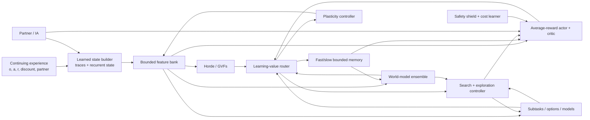

# Implementation Plan for a Continual Experiential Alberta Agent

- **Planning snapshot:** 2026-07-30
- **Status refresh:** 2026-08-01 — the dated implementation-status passages
  below reflect the current working tree
- **Companion review:**
  [CONTINUAL_AGENT_RESEARCH.md](CONTINUAL_AGENT_RESEARCH.md)

## Outcome

Build and validate a bounded, checkpointable, task-agnostic agent that learns
state, predictions, control, models, search priorities, and reusable skills
from one continuing stream. The plan deliberately separates:

- an **API implementation** from an **integrated causal path**;
- an integrated path from a **benchmark result**;
- a benchmark result from a **replicated capability claim**; and
- plasticity, retention, transfer, and safety.

No milestone may use “complete Alberta Plan” as shorthand for module presence.
The final claim requires all acceptance gates in the last section.

## Architectural target



The `LearningValueRouter` is not one universal scalar. It carries typed,
separately calibrated signals:

| Signal | Causal object | Initial use |
|---|---|---|
| Parameter utility, signed \(-wg\) | Parameter/feature | Protect, perturb, replace |
| TD error / advantage | Value or actor sample | Control learning |
| Epistemic surprise | Transition/model hypothesis | Exploration and model-memory priority |
| Aleatoric uncertainty | Environment outcome distribution | Veto noisy-TV and risky imagination |
| Learning progress | Region or model head | Prefer learnable experience |
| Paper-defined delight, \(A[-\log\pi(a\mid s)]\) | Actor sample | Actor-gradient weight and optional Kondo compute gate |
| Prospective exploration delight (separate paper extension) | Candidate exploratory action | Optional host-policy override |
| Safety cost/risk | State/action/trajectory | Shield and full-fidelity safety learning |

The user-facing question “does this gradient spark joy?” names the Kondo
compute decision from the paper: compute actor-sample delight
\(A[-\log\pi(a\mid s)]\) in a forward pass, then decide whether that sample is
selected for a backward pass. It is not a ninth channel and not a sum of the
eight channels.

Terminology is strict: unqualified **delight** means
\(A[-\log\pi(a\mid s)]\), and **sparks joy** means selected by the Kondo gate
for a backward pass. The existing multi-objective, finite-precision
candidate-update safety audit is a separate mechanism. Its historical
`GradientJoy*`, `sparks_joy`, and `joyful_gradient_applied` API names remain
compatibility aliases only; new text uses `candidate_update_audit_passed` and
`audited_candidate_update_applied`.

Conflating these signals would recreate exactly the failure modes found in the
literature.

## Invariants that apply to every work package

1. **One stream first.** Parallel-environment throughput can be a secondary
   lane, but every algorithm must have a single-stream result.
2. **No hidden task oracle.** Task boundaries may be logged for evaluation, not
   supplied to the learner, unless a comparator explicitly studies that
   advantage.
3. **Predict before update.** Online metrics use the action/prediction made
   before the current transition is learned.
4. **Bound the lifetime resources.** Every buffer, feature bank, option set,
   model ensemble, and per-step update count has a fixed configured maximum.
5. **Checkpoint all learning state.** Parameters alone are insufficient:
   optimizer moments, utilities, traces, recurrent state, memory indexes,
   calibrators, RNG keys, ages, and lifecycle metadata must round-trip.
6. **Separate safety learning from paper-specific DG/compute gates.** Rare failures may be
   suppressed by a paper-specific actor gradient; the safety-cost learner and
   incident memory must see all of them.
7. **Ablate every new mechanism.** Additions enter behind explicit config
   modes, with an identical base learner and matched search budgets.
8. **Do not silently change historical semantics.** Existing UPGD-inspired and
   feature-lifecycle behavior gets stable names and migration notes.
9. **Report distributions.** Use enough seeds, confidence intervals, and
   per-seed curves; do not promote best-seed or terminal-window anecdotes.
10. **Keep the runtime boundary.** Heavy learning remains in the Alberta/robot
    Python process. elizaOS consumes an explicit bridge protocol and does not
    import research internals.

## WP0 — Establish an evidence contract

### Purpose

Make every repository claim traceable to an executable protocol and immutable
artifact before changing algorithms.

### Deliverables

- Replace the README's unqualified “all 12 steps are implemented and
  benchmarked” language with a four-level status. A concurrent working-tree
  patch already makes the top-level prose honest; retain it and add:
  `kernel`, `integrated`, `benchmarked`, `validated`.
- Retain the concurrent `RESEARCH_STATUS.md` evidence matrix as the human
  summary, while moving its levels, gates, and artifact checks into a
  machine-readable manifest.
- Add a machine-readable evidence manifest. Each claim records:
  - source commit and dirty-state policy;
  - benchmark protocol/version;
  - command and environment lock;
  - seeds and prespecified metrics;
  - raw-artifact hashes;
  - expected thresholds and whether they passed; and
  - known scope limits.
- Decide how omitted upstream experiment trees are handled:
  - vendor the required protocol drivers;
  - or fetch an exact pinned upstream archive in an explicit research lane;
  - or rewrite the small set of authoritative protocols locally.
- Keep unit/contract tests distinct from scientific evidence tests in pytest
  markers and CI.
- Record negative results and ceiling ties. A completed experiment is evidence
  even when the method loses.

### Verification

- A clean checkout can resolve every “benchmarked” claim to a command and raw
  artifact.
- Missing external data causes a visible `not-run` evidence status, never a
  passing claim.
- Re-running a smoke test cannot upgrade a scientific status.

### Exit gate

No ambiguous `complete`, `production`, or `validated` claims remain, and every
current benchmark claim either has a reproducible artifact or is downgraded.

**Implementation status (2026-08-01):** the mechanism deliverables exist. The
machine-readable registry (`alberta_framework/evaluation/evidence_manifest.py`,
CLI `alberta-evidence-status`) binds five claims to commands, artifact hashes,
registered source hashes, seeds, and scope limits, and is verified fail-closed:
a missing promoted artifact yields `not-run` (exit 1), never a pass.
`RESEARCH_STATUS.md` carries the human evidence matrix with L0–L3 levels. As
of 2026-08-01 the registry reports overall `invalid` (exit 2) with all five
claims source-invalidated, because registered source files were edited after
the artifacts were pinned — designed fail-closed behavior; renewal requires
frozen-protocol reruns to new artifact paths and schema versions. The exit
gate's traceability requirement is met; the registry's current state is a
visible rejection, not a silent pass.

## WP1 — Build the continual evaluation harness

### Purpose

Measure the distinct failures before selecting mechanisms to fix them.

### Core metrics

For every stream, record:

- lifetime/prequential return or loss;
- adaptation area under the curve after each detected or logged change;
- recovery time to a prespecified fraction of a fresh-agent or oracle score;
- per-task/regime final performance;
- peak-to-final forgetting;
- backward transfer and forward transfer;
- stability gap immediately after changes;
- worst-window performance, not only lifetime mean;
- wall-clock latency, forward/backward counts, memory high-water mark, and
  energy proxy where available;
- safety violations, intervention rate, and near-miss cost;
- world-model NLL/MSE, reward and termination calibration, ensemble
  disagreement calibration, and multi-step rollout error;
- dormant units, activation entropy, effective/stable rank, parameter norm,
  gradient norm, sampled NTK rank, and policy/value churn; and
- feature, prediction, option, and model creation/removal survival curves.

### Protocol rules

- Use held-out, non-learning probes for old-regime evaluation.
- Log known task/regime identity only in the evaluator.
- Measure how many observations were processed, delayed, or dropped; a slower
  method does not earn retention credit for ignoring more of the stream.
- Compare against:
  - a fresh learner per regime;
  - a frozen learner;
  - a stationary multitask/oracle-data upper reference where meaningful;
  - an identical learner with no continual mechanism; and
  - matched compute and memory budgets.
- Use at least 10 seeds for promotion experiments and 20–30 where variance or
  prior literature demands it. Three-seed frontier experiments may guide
  direction but cannot promote a default.
- Report stratified bootstrap confidence intervals and paired comparisons when
  seeds and streams are shared.
- Independently vary abrupt versus gradual change, partial observability,
  aleatoric distractors, and sequential confounding rather than collapsing them
  into one “nonstationary” condition.

### Integration

The uncommitted continual-metric utilities observed during this review can
become the calculation layer, but benchmark runners must emit their required
performance matrices and predict-before-update traces. Add invariance tests
using hand-computed matrices and end-to-end tests using a deliberately
forgetting learner.

### Exit gate

The base `PrototypeAgent` and at least two simple baselines produce one
versioned report containing all applicable performance, resource, plasticity,
and component-retention metrics.

**Implementation status (2026-07-31):** the v2 report core and a bounded
learner-neutral scalar streaming executor are implemented. The executor owns
regime scheduling and held-out probes, enforces predict-before-update order,
detects serializer-visible prediction/probe/source-state mutation, rejects
configuration drift and noncanonical checkpoints, counts deadline misses, and
keeps safety and per-metric applicability explicitly unavailable when they are
not measured. Adaptation AUC excludes the initial stationary segment and
stability is measured at immediate change points. A separate strict bound
artifact now hashes the complete evaluator config, including stream/probe
digests and learner snapshots, plus the reconstructing metric core; its loader
also requires cross-object protocol, budget, condition, trace-length, and
latency-method agreement. These are evaluator mechanisms only. There is no
completed `PrototypeAgent` candidate report, the baseline set is incomplete,
and longitudinal component diagnostics and factorial statistics are absent.

A separate strict continuing-control evaluator now owns independent functional
environment copies for the candidate and each baseline, binds every dispatched
action to its exact observation and decision identifier, and rejects dropped,
duplicated, stale, or learner-visible regime metadata. Its v2 protocol freezes
metric direction, exposure checkpoints, recovery/stability references, and
window sizes. Reports reconstruct prequential/lifetime and per-regime return,
post-change adaptation AUC, sustained recovery, immediate stability, final
held-out action scores, forgetting, backward/forward transfer, and worst-window
performance, with explicit applicability when a longitudinal comparison cannot
be formed. A hardened adapter runs `PrototypeAgent` through that boundary, and
checkpoint/report loaders bind the environment, probes, learner state, budget,
condition order, metrics, and reconstructing core by canonical digests. A
separate development-only suite now executes three deliberately privileged
context references outside the ordinary condition list: one independently
initialized learner per evaluator regime identity whose state is retained on
recurrence, a stationary-multitask learner trained on an exactly counted frozen
extra stream, and an exact frozen counterfactual action-outcome upper reference.
The suite discloses regime routing, extra data, action-table callbacks,
initializations, and incompatibility rather than calling these matched
baselines; stochastic expected-action scores are explicitly not accepted as
the exact oracle. This is still development machinery: held-out probes score
one action rather than a control rollout, no realized-resource-matched
candidate/reference comparison or energy measurement exists, and no multi-seed
Prototype report has been run. The WP1 exit gate therefore remains open.

A strict paired campaign companion can now execute one complete evaluator per
declared seed. Explicit seed wrappers bind every learner and environment
configuration, cross-seed normalization requires identical protocol, budget,
probe, environment, condition role/order, and learner identity, and each raw
report remains embedded and reconstructing. It extracts direction-aware scalar
longitudinal metrics, preserves unavailable pairs, and computes deterministic
stratified paired-bootstrap intervals from a frozen counter-hash RNG. Campaign
config, evaluator core, campaign core, reports, comparisons, and intervals are
SHA-bound and atomically saved. The campaign is always `not-assessed`: no
Prototype campaign has been run, its declared development seeds cannot promote
a claim, and intervals add neither a threshold nor matched realized resources.

## WP2 — Create a faithful plasticity laboratory

### Purpose

Resolve the current UPGD identity problem and select plasticity mechanisms from
controlled evidence.

### 2.1 Preserve and rename current behavior

- Freeze the current `UPGDLearner` update in regression fixtures.
- Expose it as an explicitly documented legacy/custom mode such as
  `utility_perturbed_sgd` / `nonprotecting_power`.
- Correct the source attribution and list every departure from canonical UPGD.
- Keep deserialization compatibility for historical checkpoints.

### 2.2 Add canonical UPGD

Implement a small optimizer-level JAX transform with:

- signed first-order utility \(-wg\);
- EMA and bias correction;
- numerically safe global and local normalization;
- sigmoid utility scaling;
- protecting and non-protecting updates;
- UPGD-W decoupled decay;
- optional AdaUPGD only after the SGD form passes;
- parameter masks for trunks, biases, heads, and normalization parameters; and
- explicit handling of missing, masked, and non-finite gradients.

Second-order utility is a later extension. Do not pull the old PyTorch HesScale
stack into JAX before first-order results justify it.

### 2.3 Parity tests

- scalar and two-layer hand calculations;
- fixed-noise update parity with the official PyTorch reference;
- high-utility parameters gate gradient and noise in protecting mode;
- high-utility parameters gate only noise in non-protecting mode;
- negative, zero, equal, and all-zero utility cases;
- global versus local normalization;
- \(\sigma=0\) equivalence;
- deterministic PRNG splitting under JIT and scan;
- optimizer/checkpoint serialization; and
- all-parameter versus trunk-only masks.

**Implementation status (2026-08-01):** 2.1–2.3 are substantially landed.
`alberta_framework/core/canonical_upgd.py` implements first-order protecting
and non-protecting UPGD and UPGD-W as a small JAX PyTree transform with named
source profiles (`paper_global`, `official_readme_global`,
`official_experiment_global`, `official_experiment_local`,
`paper_local_literal`, `safe_extended`) that keep the paper/README/experiment
discrepancies of the pinned MIT reference visible; AdaUPGD and second-order
utility remain future work. The historical `upgd.py` learner keeps its exact
semantics with corrected attribution and documented deviations, so existing
checkpoints and results stay valid. `tests/test_canonical_upgd.py` pins each
profile with supplied fixed perturbations; PyTorch-reference parity rests on
a source audit of the pinned official commit rather than executing the aged
PyTorch stack. The 2.4 baseline comparisons and 2.5 experiment matrix have
not been run as a preregistered campaign, so WP2's exit gate remains open.

### 2.4 Baseline matrix

Start with inexpensive, licensed, mechanistically different comparators:

- SGD/Adam or the current native optimizer;
- L2 and L2-to-initialization;
- weight clipping;
- continual backpropagation;
- self-normalized resets;
- canonical UPGD, UPGD-W, and the local variant.

Then add spectral regularization and carefully reimplemented AdamO/CPR studies.
C-CHAIN, FOGO, and FIRE stay experimental until licensing and independent
evidence are adequate.

### 2.5 Experiments

Reproduce the UPGD distinction between:

- input permutation: mostly plasticity;
- label permutation: plasticity plus forgetting;
- stationary control: detect damage from unnecessary perturbation;
- gradual drift: test a limitation of abrupt-shift studies;
- recurrence/world-model heads: expose parameter-role differences; and
- Alberta's native prediction and average-reward control streams.

Factor the ablation:

`signed vs |wg| × protecting vs non-protecting × sigmoid vs power ×
Gaussian vs Rademacher vs zero noise × decay on/off × parameter mask`.

### Exit gate

Canonical parity passes, historical local results remain reproducible, and a
method becomes a default only if it improves preregistered lifetime metrics
without a significant retention, safety, or stationary-performance regression.

### 2.6 Current replication-diagnostic boundary (2026-07-31)

The UPGD Input-permuted MNIST runner has completed 10 matched one-million-step
development seeds. UPGD-W/AdamW mean online accuracies were
`0.7791470803916454`/`0.7190002817213534`; their paired descriptive mean
difference was `0.06014679867029188`, positive in 10/10 pairs. The canonical
artifact is
`outputs/upgd_ipmnist/results.reconciled_nonpromoting.v2.json`, bound by
the current `outputs/upgd_ipmnist/nonpromoting_receipt.v2.json` addendum; its
`nonpromoting_receipt.v1.json` predecessor is preserved byte-for-byte. The original
`results.v1.json` is preserved and fails strict validation only for its
10-vs-20-seed note; the reconciled artifact is strictly structurally valid.

This run does not close WP2. It is permanently nonpromoting because it used 10
rather than the publication's 20 seeds, made documented stream/logging/numeric
deviations, and lacks execution-time worker-source, full-import-closure,
command, environment, and dataset-byte binding. Its AdamW result is about
`+0.039` above the approximate publication figure read-off. No inferential,
SOTA, default-selection, or Alberta Plan claim follows. Closing the relevant
replication gate requires a fresh source-bound full-20-seed run, not appended
seeds, and the broader retention/safety/stationary experiments in this work
package remain open.

Future execution must use the active namespaced v3 plan/shard/merge contract,
not the legacy direct-aggregate v2 path. V3 issues one immutable plan with the
exact learner pair, exactly 20 fresh operator-reserved seed IDs, configuration, selected
hyperparameters, closed deviations, dataset digest/locator, runtime, commands,
and static transitive local import closure; workers emit one learner/seed
shard, and merge requires the exact planned Cartesian product with byte hashes.
No v3 plan has been issued and no fresh v3 seed has been consumed. The v3
schema remains permanently nonpromoting without external execution
attestation. See `UPGD_IPMNIST_V3_RUNBOOK.md` before any launch.

## WP3 — Make state construction learnable

### Purpose

Replace random temporal features with a state process that learns which history
supports prediction and control.

### 3.1 Fix the observation contract

- Define whether each public method consumes `raw_observation` or
  `agent_state`.
- Cache the state representation produced by `start()` and `update()`.
- Retain and verify the concurrent `act()` fix that runs the encoder without
  advancing recurrent state; then decide whether caching the representation is
  the cleaner public contract.
- Add a GRU-enabled first-action regression test and scan/single-step parity
  test.

### 3.2 Introduce a `StateBuilder` protocol

The minimal interface should support:

- `init(key)`;
- `start(raw_observation, last_action, last_reward)`;
- `encode(raw_observation)` for pure evaluation when valid;
- `update(raw_observation, action, reward, discount, auxiliary_errors)`;
- a fixed output dimension and resource budget; and
- full serialization.

Initial implementations:

1. identity;
2. fixed trace bank over observation, action, and reward;
3. the current echo-state GRU, honestly named;
4. a learnable GRU baseline;
5. a recurrent trace-unit or recurrent generate-and-test state builder.

### 3.3 Learning signals

Train state using a balanced set of online objectives:

- next latent/observation, reward, and termination prediction;
- multiple-timescale GVFs;
- control value and advantage;
- inverse/action-disambiguation where helpful; and
- feature utility measured by held-out prediction/control change.

Use separate heads so one rapidly changing reward does not erase
dynamics-relevant history. Continually rank and recycle state features only
after causal deletion or shadow-feature evidence.

### 3.4 Forager gate

Use Forager/Foragax to test:

- field-of-view reduction;
- hidden reward switches;
- reward/action trace baselines;
- repeated relearning;
- an unending task stream; and
- constant agent memory.

Compare frozen-state, feed-forward, traces, echo-state GRU, learned GRU, and
recurrent generate-and-test under matched parameter and compute budgets.

Treat the in-tree stationary causal-map planner as a task-specific L0
comparator. It learns a relative map, reward means, and respawn timings from
ordinary observations but uses the public 15×15 toroidal movement structure;
it is not a learned recurrent-state result and cannot satisfy this work
package's exit gate. Likewise, the completed five-seed tuning selection and the
incomplete 30-seed evaluation lane are execution status, not performance
evidence until the Alberta and matched-baseline reports and their statistical
comparison are complete.

The later open two-seed CPU development screens also do not close this gate.
Their complete frozen candidate sets rank `DQN_LN-common-control` first among
the feed-forward candidates (mean FOV tail-EMA AUC `1.49084`) and
`PPO-RTU_LN_128_1_relu` first among the stateful candidates (`1.78110`). The
aggregates prohibit promotion, superiority, and SOTA claims; budgets are not
necessarily matched, seeds are consumed development seeds, and the stateful
RTU-PPO route retains an upstream RNG confound. Exact content parity in the
fixed-action direct/wrapper probe remains externally unverified and
nonpromoting. Use these rankings only to choose later open development work,
never as the required matched held-out comparison.

The matched-current Forager campaign contract likewise remains execution
status, not evidence. As of 2026-08-01, `outputs/forager/` contains a
completed executor qualification and a prepared open-tuning campaign with
published manifests but zero executed tuning cells; the sealed held-out
evaluation stage
(`alberta_framework/benchmarks/forager_matched_sealed_evaluation_campaign.py`)
has no console script and has never run; and every authority-bearing path
terminates at an
external trust resolver that does not exist in-tree, so the shipped parity
receipt is recorded as unverified with `promotion_authorized: false`.

### Exit gate

The learned state builder beats raw observation and fixed random recurrence on
prequential average reward and recovery time, retains the gain when learning is
frozen, and stays within its declared memory/latency budget.

**Implementation status (2026-07-31):** the causal contract and Prototype
plumbing are implemented for identity, fixed-trace, and online-gated builders.
Decision caching, single-advance behavior, episode-local reset, transactional
invalid-input handling, scan parity, resource accounting, and checkpoint
configuration binding have contract tests. The online-gated builder has a
source-bound pure proposal and atomic advanced-destination commit. An opt-in
Prototype lane now consumes the bounded ensemble's causal pre-update
representation gradient; an optional decision-bound candidate-update audit
gates the actual finite-precision parameter delta. A successor opt-in mixer now adds
an explicitly weighted, optionally normalized/clipped current control-loss
gradient. Idle primitive transitions use the base-Q one-step semi-gradient;
executing options use the current intra-option semi-gradient, while delayed
semi-MDP credit owned by the option-start representation is excluded. The
mixed candidate feeds both the builder proposal and that safety audit;
real replay gradients never enter it, and valid-range action-owner tampering
fails closed. This is only the first two-source behavior/world mechanism, not
the multiple-timescale GVF, inverse, feature-utility, or empirically balanced
objective set required by 3.3. Its conflict diagnostics and modes are not an
efficacy result. Matched mixer ablations and the Forager comparison remain
open, so the WP3 exit gate is not met.

## WP4 — Build a calibrated continual world-model lane

### Purpose

Turn the current one-step smoke model into a measured foundation for retention,
planning, surprise, and safe imagination.

### 4.1 Repair the transition API

Every real update must receive:

`observation, action, decision_id, reward, discount, terminated/truncated,
bootstrap_observation, next_decision_observation`.

- Do not synthesize a constant discount inside `PrototypeAgent`.
- Propagate predicted discount/termination into imagined value targets.
- Add continuing and episodic/truncation contract tests.
- Keep environment reward separate from subtask cumulants.

**Implementation status (2026-07-31):** this transition boundary is now
implemented as `PrototypeTransition`. A checkpointed lifecycle nonce plus a
64-bit generation prevents within-life ABA replay; caller-owned lifecycle IDs
provide exact cross-run ownership. Runtime-invalid transitions are atomic
no-ops in eager/JIT/scan paths. STOMP/OaK learns and bootstraps on the final
observation but selects on the post-reset observation, while a truncation
interrupts active option execution without treating censored experience as a
successful option-model completion. This closes 4.1's mechanism contract, not
WP4's model/calibration/effectiveness gates.

### 4.2 Maintain two reference models

1. **Shallow online reference:** a linear/kernel Follow-the-Leader-style model
   and MPC/planning baseline inspired by the ICML 2025 result.
2. **Continual latent ensemble:** a stochastic recurrent latent model with
   small ensemble dynamics/reward/continuation heads.

The shallow model provides interpretability and a hard-to-forget baseline. The
latent model earns complexity only when it improves lifetime control or
prediction under equal resources.

**Implementation status (2026-07-31):** the shallow reference is now a bounded
action-indexed affine regularized follow-the-leader/ridge model. It predicts
grounded raw next-observation, reward, and continuation targets before adding
the transition to per-action Gram/cross sufficient statistics, then solves the
selected regularized normal equations atomically. Counts, statistics,
coefficients, numerical bounds, positive-semidefinite Gram structure,
configuration, RNG-free checkpoints, and exact allocated bytes are validated.
A pure diagnostic planner scores every action as predicted reward plus predicted
continuation times a caller-supplied linear successor value. This is L0
mechanism coverage, not the cited paper's theorem or MPC system: it is fully
observed, discrete-action, affine, O(feature_dim³) per selected solve, and has
no uncertainty, replay, recurrence, latency result, or control-benefit result.
An isolated bounded recurrent latent reference is now implemented with one
trainable GRU and grounded mean/heteroscedastic-variance heads per bootstrap
member. Exact observation/action cache ownership, predict-before-update NLL,
one recurrent advance per accepted event, final-target/reset-cache boundary
semantics, atomic rejection, fixed resources, JIT/scan, and checkpoint
continuation are mechanism-tested. An opt-in fourth mutually exclusive
`PrototypeAgent` world-model lane now owns that exact decision cache, advances
the recurrent model and its causal signal estimator as one transaction, and
routes only the accepted real NLL representation gradient to the builder,
mixer, and candidate-update audit boundary. A rejected recurrent transaction
rolls back the whole Prototype transition. This is not a planner, replay lane,
calibrated model, or efficacy result. A fixed two-seed,
18-transition A/B/A development diagnostic now runs the shallow model, the
plain ensemble, and model-only rehearsal on the same raw grounded stream and
reconstructs
prequential channel errors, recurrence/adaptation summaries, replay
composition, and logical resource accounting. It is intentionally tiny,
resource-unmatched, and `not-assessed`; it is not the preregistered
shallow-versus-ensemble efficacy comparison required by the exit gate. Thus
4.2 is not complete.

### 4.3 Calibrate uncertainty

- Train ensemble members with genuinely different bootstrap/masking streams.
- Predict both mean and aleatoric variance where stochasticity matters.
- Measure epistemic disagreement against held-out error and OOD changes.
- Maintain state/action-region calibration rather than a single global error
  EMA.
- Reject dreams for non-finite values, high epistemic uncertainty, poor
  termination calibration, or unsupported rollout depth.

**Implementation status (2026-07-31):** a fixed-size bootstrap ensemble is now
implemented and integrated as a mutually exclusive Prototype model lane. It
persists distinct member initialization, bootstrap RNG/masks, member counters,
the signal estimator, and exact resource accounting; predicts before update;
and exposes typed warm-up availability plus a causal representation gradient.
The present variance channel is an explicitly uncalibrated residual proxy, not
a demonstrated aleatoric model. A strict development evaluator can now freeze
either an ensemble or single-model snapshot and retain raw held-out member/mean
predictions and grounded targets. It reconstructs descriptive
disagreement-versus-error bins, Pearson/Spearman association, coverage-risk,
and ID/OOD plus derived state/action-region summaries; sparse or unavailable
fields remain explicit. Optional mean open-loop traces run only for
caller-declared grounded, exactly reconstructable action sequences. The
evaluator applies no threshold and expressly makes no probabilistic calibration
claim because the currently evaluated model defines no likelihood. The
isolated recurrent latent ensemble in 4.2 defines bounded
heteroscedastic-Gaussian heads and now has a separate strict development
adapter. Starting from a hash-bound frozen snapshot, that adapter scores each
cached distribution before exactly one update of an isolated copy, retains raw
member means/variances/NLLs, and reconstructs ID/OOD plus evaluator-owned
state/action-region summaries. Warm-up exclusions, final isolated-state
counters, sources, resources, reports, and snapshot checkpoints are explicit;
the supplied snapshot remains unchanged. The Gaussian NLL objective and
variance head do not establish calibrated likelihood or coverage. Ensemble
dreaming is still disabled, and external calibration, decision thresholds,
matched comparisons, and the exit-gate result remain open. This does not close
WP4.

### 4.4 Add bounded dual replay

Use a fixed total capacity split between:

- short-term recency FIFO; and
- long-term coverage/distribution memory.

Compare reservoir, clustering/coreset, model-error coverage, ensemble-surprise,
learning-progress, and maximally-interfered retrieval. Never prioritize raw high
error without an aleatoric control. Store old action probabilities/value
targets for CLEAR/DER-style behavioral rehearsal, and record eviction
provenance and representation version.

**Implementation status (2026-07-31):** a fixed-shape `DualReplayMemory`
implements a declared total slot budget split between a recency FIFO and
long-term reservoir or configured calibrated-priority stratum. Prediction and
outcome records are structurally separate; stored fields include old behavior
probability/logit/value availability, uncertainty/progress/safety channels,
representation/source/provenance, and eviction provenance. Sampling has fixed
per-stratum quotas, explicit padding, and stale/future representation filters.
Aleatoric veto/downweight prevents raw-error noisy-TV priority. Exact resource
accounting, deterministic RNG, counter exhaustion, corruption no-ops, and
digest-bound checkpoint/JIT/scan parity have mechanism tests. The configured
priority scales are not empirically calibrated and coverage is raw Euclidean.
An opt-in `ModelReplayRehearsal` composition now performs one atomic causal
transaction: real ensemble update, typed-signal record, fixed-quota stratified
sample, then model-member-only replay updates. Replay has an isolated bootstrap
key/mask/counter lane and cannot advance the real signal estimator, residual
statistics, real counters, actor, critic, or builder. The Prototype exposes
this as a third mutually exclusive world-model lane and routes only the
commit-gated real representation gradient through builder learning and the
candidate-update audit. Exact composition state/resources/checkpoints, padding, stale versions,
rollback, JIT/scan parity, and ensemble v1→v2 migration are tested. Clustering,
maximally interfered retrieval, actor/critic behavior correction, empirical
priority calibration, and realized control comparisons remain open. The small
matched-stream A/B/A diagnostic described in 4.2 now exercises replay
retention and noisy-TV composition, but its two consumed development seeds,
short horizon, unequal realized work, and lack of a decision threshold support
no retention or mechanism-selection claim.

### 4.5 Component retention probes

At every regime checkpoint, test separately:

- encoder/state representation;
- dynamics and observation prediction;
- reward discrimination/calibration;
- termination/discount prediction;
- critic/value;
- actor action margin and return.

This localizes whether forgetting is in memory, representation, value, or the
policy channel.

**Implementation status (2026-07-31):** a development-only evaluator now
freezes learner snapshots and separately probes representation,
dynamics/observation, reward, termination/discount, critic/value, actor margin,
and actor return. Regime IDs and targets remain evaluator-owned; the learner has
no update surface; snapshot round-trips and live/reconstructed nonmutation are
checked; applicability and runtime unavailability are explicit; raw per-case
traces are not retained; and calls, records, snapshots, state bytes, reports,
and checkpoint/resume are bounded and reconstructing. This is pointwise
mechanism coverage, not calibration/discrimination or longitudinal retention
evidence, and it is not yet connected to a Prototype multi-regime report. The
separate world-model A/B/A diagnostic retains raw dynamics, reward, and
continuation errors, but it does not probe the Prototype representation,
critic, actor, or option lifecycle and therefore does not substitute for this
integration gate. A stricter recurrent-only companion now reuses exact ordered
cases after an evaluator-owned intervening context and declared recurrent
resets. It reconstructs per-phase, recurrence-entry, ID/OOD, and within-phase
prequential NLL summaries from one isolated, source-bound snapshot while
proving the supplied snapshot unchanged. This remains descriptive
`not-assessed` mechanism coverage: it does not establish recurrent-model
retention and does not measure the Prototype representation, critic, actor, or
option lifecycle.

A separate ordinary-policy-gradient actor/critic companion now runs one fixed
continuing A/B/A schedule with phase identities, reward tables, preferred
actions, and value targets kept evaluator-only. It retains the exact cached
target/epsilon-mixture behavior policy, raw target/behavior probability ratio,
behavior-score chain-rule scale, critic error, actor margin, policy churn,
realized return/recovery, plasticity, and action activity. The supplied
snapshot is unchanged and the successor action is sampled only after the
current update commits. This is still one source-bound development seed with
no threshold, matched comparator, retention conclusion, or Prototype
component integration.

### 4.6 Imagination and rehearsal

Progress in this order:

1. one-step real-state-anchored Dyna;
2. policy/uncertainty-directed short rollouts;
3. multi-step returns that honor termination;
4. bounded replay of real transitions;
5. experimental graded dream self-imitation for actor retention.

Before imagined trajectories train the actor, an offline selection gauge must
measure realized success, termination correctness, top-quantile purity, and
real-environment validity. Compare dream imitation with the simpler baseline of
behavior cloning competent real episodes.

**Implementation status (2026-07-31):** item 4 now has a bounded model-only
real-transition rehearsal mechanism through the atomic composition in 4.4.
Items 1–3 and 5 remain absent on the ensemble lane: it performs no imagined
rollout and replay never updates a policy, critic, state builder, or signal
calibrator. The matched-stream development diagnostic now makes the model-only
rehearsal trace and replay strata inspectable, but is not assessed and does not
establish that replay retains a world model or improves control.

### Exit gate

The model is calibrated, memory-bounded, and better than the shallow reference
on at least one preregistered complex stream without worse lifetime control.
Imagined updates improve real return and retention under a held-out transition
audit; otherwise dreaming remains disabled.

## WP5 — Implement typed surprise, delight/Kondo, candidate auditing, and routing

### Purpose

Allocate memory, updates, exploration, and plasticity with signals appropriate
to each decision.

### 5.1 New typed result

Add a JAX-friendly structure similar to:

```python
LearningValue(
    advantage,
    action_surprisal,
    delight,  # historical field name: paper-specific actor-sample DG delight
    epistemic_surprise,
    aleatoric_uncertainty,
    learning_progress,
    change_probability,
    safety_cost,
)
```

Each field has units, normalization state, calibration diagnostics, and a
documented producer. Consumers request fields explicitly; there is no default
sum.

### 5.2 Surprise path

- Epistemic signal: ensemble disagreement or approximate information gain.
- Aleatoric signal: predicted outcome variance.
- Learning progress: reduction in calibrated predictive loss over a local
  window or model version.
- Change signal: sustained calibrated residual after accounting for both
  uncertainties.

Use:

- epistemic surprise plus progress for exploration/search;
- surprise plus coverage for bounded memory writes;
- change probability to adjust adaptation rate;
- aleatoric uncertainty to suppress noisy-TV attraction; and
- raw error only for diagnostics and model training.

**Implementation status (2026-07-31):** a fixed-state `LearningValueRouter`
now validates and causally normalizes the eight named channels independently.
Every channel has explicit producer, causal-object, units, domain, bounds, and
scale-floor metadata; normalization uses only pre-update Welford state. Six
typed routes serve the paper-defined-delight actor, exploration, model
memory/replay, adaptation/change, safety, and the complete evidence input for
the separate candidate-update safety audit. Inactive or invalid fields are exact
zero and unavailable, a failure in another channel cannot suppress a valid
safety cost, and delight is accepted only when it is the
exact float32 product of valid declared advantage and action surprisal. The
router performs neither Kondo selection nor an update audit and never forms a
universal score. Fixed
resource accounting, counter-capacity disclosure, canonical checkpoints, and
eager/JIT/scan parity are mechanism-tested. No Prototype/search/memory consumer
has yet shown an outcome benefit from these routes, and producer-declared
uncertainty/change values have not thereby become calibrated. Thus 5.1 and
5.2 have a bounded L0 mechanism, not an exit-gate result.

### 5.3 Candidate-update safety audit (historical gradient-joy API)

For a candidate gradient \(g\), the plain-gradient mode defines
\(u_c=-\alpha g\). Callers using momentum, preconditioning, clipping, or any
other optimizer transform must instead provide the already formed candidate
update \(u_c\). Given caller-supplied gradients of an objective probe, protected
retention loss, and safety cost under an explicit independence contract that
the caller must attest:

\[
\Delta_o=\langle g_o,u_c\rangle,\quad
\Delta_r=\langle g_r,u_c\rangle,\quad
\Delta_s=\langle g_s,u_c\rangle,\quad
a_k=-\frac{\langle g_k,u_c\rangle}
{\lVert g_k\rVert\lVert u_c\rVert}.
\]

Alignment uses scale-safe global norms and a normalized-coordinate dot reduced
through a fixed balanced tree. Conservative float32 accumulated-roundoff
intervals cover norms, normalization, products, and reduction. A non-finite
derived dot/norm, an unresolved norm of a nonzero input, a nonzero sign
disagreement, or a cancellation interval that crosses zero invalidates the
evidence rather than becoming a pass. The trust bound uses the norm upper
endpoint and the nonzero floor uses its lower endpoint. Positive magnitude
gates compare against the conservative dot-interval edge. At an exact zero
threshold, both the raw dot and certified normalized direction must permit
decrease/preservation; an underflowed exact-zero raw dot can still pass when
the normalized sign remains resolved. The reported cosine is clipped to
\([-1,1]\), and alignment gates and factors consume its certified lower
endpoint. An exact \(1.0\) threshold applies a four-machine-epsilon float32
tolerance to that lower endpoint; other alignment thresholds are compared
exactly. Negative \(\Delta\) predicts a local decrease in the
corresponding minimized quantity, while higher \(a_k\) means better descent
alignment. The candidate factors first define a
non-circular tentative scale and update:

\[
s=\min\left\{
\sigma((a_o-t_o)/\tau_a),
\sigma((a_r-t_r)/\tau_a),
\sigma((a_s-t_s)/\tau_a),
\sigma((U_{\max}-\lVert u_c\rVert)/\tau_u)
\right\},\qquad \tilde u=s u_c.
\]

The implementation cannot infer independence from arrays, so a false or
missing `probe_independence_attested` caller attestation fails closed. Accept
only when all three probes and all eight named learning-value channels have
explicit valid availability, both \(u_c\) and \(\tilde u\) predict the required
strict objective decrease and remain within declared retention/safety
tolerances, candidate directions meet their alignment thresholds, and
\(\lVert u_c\rVert\) is inside the trust bound. The tentative update must also
clear the update-norm resolution floor. The returned weight and intended
applied update are \(w=\mathbf 1_{\mathrm{accept}}s\) and
\(u_{\mathrm{apply}}=w u_c\). Checking both stages prevents soft scaling from
violating a positive improvement floor or rescuing a raw harmful candidate.
The elementwise float32 \(\tilde u\) receives fresh norm and dot certificates;
the implementation does not substitute scalar-scaled candidate diagnostics for
the actually rounded update tree.

This is deliberately a first-order local audit, not a guarantee of realized
improvement. Inputs, diagnostics, the decision, and the returned weighted
update are stop-gradient optimizer-control values; differentiating through the
assessment would define an unimplemented meta-objective. Missing, non-finite,
structurally mismatched, or non-scalar evidence fails closed. The eight typed
channels remain separately reported and are never aggregated into \(w\).
Numeric controls are float32; booleans, overflow, and nonzero subnormal controls
are rejected before tracing.

`apply_gradient_joy_update` is the parameter-application boundary. It performs
the assessment internally, requires exact nonempty PyTree structure, leaf
shape agreement, and real floating dtypes, casts each assessed weighted-update
leaf to the corresponding parameter dtype, derives the effective stored delta
after parameter addition by promoting both stored endpoints to at least float32
before subtraction, and conservatively re-audits that delta with update
semantics under the same evidence and thresholds. This prevents low-precision
subtraction rounding from hiding an out-of-bound stored change. Its typed result deliberately
separates the formed-candidate `assessment`, `effective_assessment`, and
`applied`. The last is true only when both audits accept, parameters, cast
updates, and proposed parameters are all finite, and at least one stored
parameter value actually changes. Overflow, a pre-existing non-finite
parameter, an update wholly lost to finite-precision addition, or quantization
that changes the update's magnitude or probe verdicts therefore produces an
auditable atomic no-op. This still does not certify realized post-update
objective, retention, or safety outcomes.

**Implementation status (2026-07-31):** the standalone assessment and atomic
application boundary are implemented, and the Prototype's opt-in learned-state
lane is their first real consumer. Caller evidence is bound to the dispatched
decision ID; all eight channel availabilities are explicit; the standalone
audit accepts the historical `LearningValue.delight` evidence field only when
its float32 bits exactly equal valid declared advantage times action surprisal;
the Prototype derives that paper-defined delight internally; and missing,
stale, incomplete, or non-finite evidence
answers `candidate_update_audit_passed=False` without dropping the environment
transition. The candidate is stored only after both candidate audits and the
finite-precision effective-delta audit pass. On `PrototypeUpdateResult`,
`candidate_update_audit_passed` is the formed-candidate verdict, while
`audited_candidate_update_applied` says that the audited stored delta was
actually committed. `sparks_joy` and `joyful_gradient_applied` are historical
compatibility aliases and do not carry the paper's Kondo meaning. These are mechanism contracts,
not evidence that the accepted updates improve realized objectives or control.

### 5.4 Paper-specific Delightful Policy Gradient experiment

For stochastic actor samples:

```python
surprisal = -log_prob
delight = stop_gradient(advantage * surprisal)
weight = sigmoid(delight / temperature)
actor_loss = -mean(stop_gradient(weight * advantage) * log_prob)
```

Requirements:

- preserve an ordinary-PG mode with the identical actor/critic;
- start with actor trace \(\lambda=0\); a current-sample gate must not multiply
  an eligibility trace containing historical score gradients;
- defer continuous control until exact transformed-policy log probabilities
  replace any clipped-action Gaussian mismatch;
- report effective sample size and positive/negative gate rates;
- compute advantages with a baseline not trained through the gate;
- do not gate critic, world-model, safety-cost, or representation losses;
- stratify results by common success, rare success, common failure, rare
  failure; and
- construct an explicit heteroskedastic gambling test.

Interpret the theory narrowly. DG changes expected direction in general and
across heterogeneous contexts, but in the paper's symmetric single-context
bandit it preserves expected direction while reducing perpendicular variance.
Tabular corner-escape guarantees do not transfer automatically to shared
function approximation; the published counterexample admits a suboptimal
interior fixed point under parameter coupling.

**Implementation status (2026-07-31):** an isolated categorical, continuing,
on-policy actor-critic now implements the ordinary and Delightful Policy
Gradient modes with matched state, critic, differential reward-rate baseline,
typed RNG, and action sampler. The actor trace is fixed to zero; the paper-defined delight
coefficient is detached; critic/baseline and explicitly available external
safety, model, and representation routes are never gated. Exact action-record
validation, atomic rejection, JIT/scan/checkpoint parity, effective sample size,
gate stratification, and logical resource accounting have mechanism tests. A
strict development-only harness now runs matched ordinary/DG lives on a
contextual heteroskedastic gamble and uninterrupted six-state RiverSwim A/B/A.
It pairs initialization and action/environment random-number schedules while
allowing realized trajectories to diverge, and reconstructs the learner,
environment, full trace, DG equations, strata, metrics, and logical accounting.
Its seeds and diagnostic thresholds are not preregistered promotion inputs; it
has no uncertainty intervals, wall-clock/FLOP/energy accounting, continuous or
off-policy lane, or higher-benchmark result. Therefore the DG exit gate remains
open. This paper-specific actor experiment is separate from the
candidate-update safety audit in 5.3.

### 5.5 Kondo compute gate

The mechanism can be tested before a DG reproduction, but no compute/quality
claim advances until DG itself reproduces:

- use `sigmoid((delight - price) / temperature)` or a target-rate quantile,
  where `delight` is exactly advantage times action surprisal;
- require a nonzero random/full-update reserve for continual-learning
  deployment; allow zero only for an explicitly labeled paper-equation lane;
- distinguish the paper's finite-temperature Bernoulli gate from deterministic
  top-\(k\) screening;
- count actual compiled backward work and wall clock, not only logical masks;
- compare quality per environment step, backward, FLOP proxy, and second; and
- maintain full learning for safety incidents and model-change events.

JAX batching may make per-sample skipped backwards nontrivial. The paper's
backward counts are logical selections, and its compute curve assumes a
forward/backward cost ratio rather than measuring wall clock. Separately, the
inspected released small-experiment path masks losses inside a full graph; that
source observation is not a demonstrated kernel-level saving. Use a detached
screening pass, static `top_k`, gather, forward recomputation, and
differentiation over survivors only when compiled wall-clock and memory
measurements show a real saving. Expect little value for the normal online
batch-size-one path; place Kondo first in replay/dream microbatches.

**Implementation status (2026-07-31):** `KondoGate` now implements a bounded,
typed forward/sparse-gather boundary. It derives float32 delight internally
from advantage and selected-action log probability, supports the paper's
finite-temperature Bernoulli price gate and a deterministic fixed-rate top-k
screen whose dynamic target uses `max(1, round(rate * valid_count))`. Alberta
uses a stable lowest-index tie break to keep exact capacity rather than the
released token reference's threshold-based over-selection. The boundary
preserves caller-declared forced samples and reports a flag requiring caller-managed
full-shape fallback instead of truncating an over-capacity selection. The
optional uniform reserve is diagnosed separately from the paper gate. When
configured capacity is below batch size, the fixed-capacity host gather makes
the downstream autodiff input genuinely smaller; tests inspect that backward
JAXPR rather than treating a masked full-batch loss as saved work. The screen
has eager/JIT/scan coverage; the config-bound gather is intentionally a
validated host orchestration boundary. Checkpoint, resource, and invalid-input
contracts are also covered. No actor/replay/dream consumer, measured
wall-clock or memory saving, DG reproduction, or learning/safety benefit has
been established, so the WP5 exit gate remains open. Two adjacent boundaries
are deliberately fail-closed rather than functional: the DG development
core's `kondo_enabled` config flag is reserved and raises when set, because
the helper cannot actually skip compiled backward work, and the separate
development benchmark lane
(`alberta_framework/benchmarks/delightful_policy_gradient_development.py`)
hard-codes `KONDO_IMPLEMENTED = False`, is exercised only by tests, and has
produced no run artifacts under `outputs/`.

### 5.6 Delightful exploration

Keep this after calibrated epistemic planning. An optional host/override policy
may score:

`prospective delight = expected improvement × capped host-relative surprisal`.

The Pandora equivalence is exact only in the paper's revealed-value search
model. In noisy independent-arm bandits, expected improvement is a
value-of-perfect-information proxy that upper-bounds one-step knowledge
gradient; it is not the exact sequential value of information.

It must be compared to random, epsilon-greedy, ensemble disagreement,
information gain, and learning progress. Safety shielding runs after candidate
generation and before action execution.

### Exit gate

No signal is promoted unless its intended consumer improves under matched
resources. DG must improve actor learning without a safety or retention
regression. Kondo gating must reduce measured wall-clock/backward cost, not just
mask loss terms. Exploration must survive stochastic-trap and long-horizon
tests.

## WP6 — Close the continual control path

### Purpose

Provide a reliable average-reward actor/critic path for both discrete and
continuous control before attaching more architecture.

### Deliverables

- Define a canonical average-reward actor-critic with:
  - separate actor and critic parameters/optimizers;
  - stable reward centering or differential return;
  - correct eligibility/credit assignment;
  - action-probability logging;
  - continuous and discrete policies; and
  - explicit behavior/target policy semantics.
- Finish nonlinear shared-trunk trace support and independent off-policy
  correction as separate configurations.
- Never use paper-defined delight as a substitute for importance sampling where a corrected
  off-policy objective is required.
- Let the world model, actor, critic, and shared trunk use different plasticity
  policies and utility states.
- Add policy churn and actor-channel recovery probes.

**Implementation status (2026-07-31):** the discrete nonlinear Horde-backed
path has separate actor/critic parameters and optimizer state, a differential
critic and learned reward-rate baseline, exact target and epsilon-mixture
behavior-policy records, and ordinary behavior-policy score gradients. Its
transition boundary now consumes the previously cached decision, atomically
commits actor/critic/baseline updates, and samples the successor from those
committed parameters using one RNG draw. The strict development probe described
in 4.5 makes actor/critic recurrence and plasticity inspectable while keeping
all regime supervision outside the learner. The raw `pi / b` value is only a
diagnostic; `(1 - epsilon) pi / b` is the exact chain-rule multiplier for the
epsilon-mixture behavior objective, not off-policy target-policy correction.
An isolated bounded continuous companion now uses a direct affine-`tanh`
diagonal Gaussian with the exact cached pre-`tanh` draw, stable transformed
target/behavior log densities including the Jacobian, and no Gaussian clipping
or post-transform endpoint adjustment. The analytically cancelling latent-
density ratio supplies the exact per-decision action correction
`rho_t * (lambda * e_(t-1) + score_t)`; it is not a behavior-state-
distribution correction. Actor, critic, traces, LMS states, reward-rate
baseline, typed RNG, and counters are separate and bounded. Updates are atomic,
and the sole successor draw occurs after commit. Strict config/checkpoint,
resource, saturation, finite-difference, eager/JIT/scan, and causal-cache tests
provide L0 mechanism coverage only. A strict continuous companion evaluator
now runs a fixed 12-event, one-action-dimensional A/B/A stream from an
immutable source-bound snapshot. It keeps preferred centers, reward fixtures,
phase/case labels, and reference values evaluator-owned; reconstructs cached
actions, latent/transformed densities, the exact latent action ratio, rewards,
successor ownership, critic error, actor error/churn, trace/plasticity/activity,
counters, and resources; and supports exact live replay plus no-overwrite
reports/checkpoints under absolute byte/scalar ceilings. Same-state four-case
centering removes only the differential-value additive gauge. Transformed
diagnostic density reconstruction permits a documented symmetric eight-float32-
ULP backend bound, while the policy-defining latent ratio remains bit-exact and
tampering beyond the bound fails. The report is development-only and
`not-assessed`, with no threshold or retention/control claim. Independent
nonlinear off-policy correction, component-specific plasticity policies,
matched SARSA comparisons, continuous efficacy evidence, and all benchmark
exit gates remain open.

### Benchmark order

1. bandits and contextual bandits;
2. six-state/RiverSwim continuing controls;
3. Forager;
4. Continual MinAtar;
5. Continual World / Meta-World;
6. Procgen and DeepMind Control sequences;
7. robot simulation.

### Exit gate

Actor-critic matches or beats the discrete SARSA reference where both apply,
remains trainable over long streams, and has independently measured actor,
critic, and representation retention.

## WP7 — Close the feature → subtask → option → model → planning loop

### Purpose

Turn the extensive lifecycle modules into the causal loop required by Steps
8–11.

### 7.1 Shared bounded feature bank

- Route state-builder outputs, discovered features, and compositional
  candidates through one resource manager.
- Collect utility from Horde prediction, world-model error reduction, control
  loss/return, and planning influence.
- Estimate deletion impact with shadow candidates or periodic causal masks.
- Prevent one head with large target scale from owning the feature budget.
- Version feature semantics so replay and model memories can detect stale
  encodings.

**Implementation status (2026-08-01):** one narrow opt-in Prototype lane now
maps a fixed builder base through bounded pair products into the linear OaK
loop. A single owner-bound behavior TD target trains the bank (base-Q while
idle, current intra-option target while executing), and builder gradients are
pulled back against the exact pre-route generation and full descriptor bank.
That identity travels with the enabled OaK subtree and rejects stale or forked
consumer state. At a safe idle/cached-base boundary, descriptor routing is
atomic; otherwise the
curation proposal is rolled back and deferred rather than queued. Allocation
ceilings, exact resource declarations, and versioned checkpoints bound the
lane.

This is L0 mechanism integration, not completion of 7.1 or 7.2. Compatibility
deliberately excludes world models, Horde, replay, dreaming, IA, partner
fusion, experiential memory, and GRU perception. It provides no multi-consumer
utility or causal deletion result, automatic cumulant/subtask or option
discovery, benefit result, promotion authority, WP7 completion, or L3 claim.

### 7.2 Cumulant and subtask discovery

- Generate candidate cumulants from controllable events, feature changes,
  reward-relevant transitions, and prediction bottlenecks.
- Require learnability, controllability, novelty, and contribution to the
  external reward/model before promotion.
- Compare discovered candidates with random and hand-authored subtasks under
  the same option budget.

### 7.3 Option lifecycle

Track separately:

- initiation coverage;
- completion/termination reliability;
- external and pseudo-return;
- marginal improvement over primitive control;
- model prediction error;
- planning usage;
- redundancy with other options; and
- compute/memory cost.

Curation must be JAX-compatible or occur at a declared bounded maintenance
budget. Replacement should transfer only compatible knowledge and reset all
optimizer/model/trace state for genuinely new semantics.

### 7.4 Use option models

- Add a planner that actually reads learned option reward, duration/discount,
  and state-outcome predictions.
- Compare model-free extended-action Q-learning with:
  - one-step primitive planning;
  - option-model planning;
  - combined primitive/option search.
- Prioritize backups using calibrated value change, reachability, uncertainty,
  and model support.
- Integrate the option keyboard as an actual policy proposal, not only a
  callable helper.

**Implementation status (2026-07-31):** OaK now exposes a strict deterministic
keyboard proposal from the exact current chord Q-values and an opt-in dispatch
boundary. A dispatched primitive replacement updates `last_primitive_action`
and the actual credit owner—either the base primitive head or the active
option's intra-option head—so the next real transition cannot train the
counterfactual action. Exact float32 decision-observation identity, full fixed
STOMP/OaK state validity, typed RNG preservation, and a caller-owned hard
action mask are audited. An unsafe proposal uses the already-selected action
only when that base is independently safe; an unsafe base or invalid state
fails closed as an exact no-op. This closes the ownership-level keyboard
proposal/dispatch mechanism, not automatic chord discovery, calibrated search
control, or the option-lifecycle exit gate. The default OaK loop still uses its
ordinary policy unless an explicit consumer invokes the new dispatch surface.

An additional opt-in Prototype-only `OptionSearchControl` now reads completed
option environment-return, baseline-mass, discount, and next-state models and
allocates a fixed backup budget by recomputed absolute differential semi-MDP
Bellman residual. Completion count is only an observed-support gate; it is not
calibrated uncertainty or reachability. Each accepted backup commits only the
base value learner, preserves real traces, normalizer, action/lifecycle caches,
OaK counters, policy RNG, option policies, and option models, and is anchored
to the exact post-transition decision representation. The controller runs
after OaK has already cached that representation's action, so it deliberately
does not rewrite the current dispatch; its value effect is first eligible at
the next extended-action selection boundary. This closes a narrow
support-aware option-model-to-value edge. It does not supply a shared
primitive/option search budget, learned or calibrated search control,
immediate action reselection, or outcome evidence.

### Exit gate

Discovered options improve lifetime reward or adaptation AUC beyond primitive
control, their learned models improve planning beyond model-free option
execution, and automated curation outperforms random replacement under the same
budget.

## WP8 — Add bounded experiential memory and real IA

### Purpose

Connect low-level grounded learning to long-lived semantic/procedural
experience and partner collaboration without breaking the runtime boundary.

### Memory tiers

1. **Working state:** recurrent activations and short traces.
2. **Episodic memory:** bounded transition/trajectory exemplars with outcome,
   uncertainty, safety, and representation-version metadata.
3. **Semantic memory:** consolidated GVFs, world facts, affordances, and
   calibrated confidence.
4. **Procedural memory:** option/skill specifications, success conditions,
   failure modes, and provenance.

Retrieval is part of the continual problem. Evaluate interference, retrieval
precision, negative transfer, stale-memory detection, and eviction—not only
write throughput.

**Implementation status (2026-07-31):** `ExperientialMemory` provides bounded
typed query-before-write exemplars with representation-version, similarity,
reliability, staleness, uncertainty, and safety gates plus deterministic
utility/recency eviction. A strict development evaluator now runs one fixed
evaluator-owned recurring A/B/A trace from an immutable empty snapshot against
a stateless no-memory fallback on the same query/write opportunities. Its raw
trace reconstructs retrieval precision and error, abstention causes, harmful
recall, first/return descriptions, action/output variation, eviction
provenance, exact allocation, and eager/compiled parity; config, protocol,
sources, snapshots, reports, and checkpoints are hash-bound and fail closed.
It applies no threshold and establishes no transfer, retention, capacity-
matched efficacy, or WP8 completion result. `ExperientialMemoryPolicy` now
interprets retrieved action vectors only as categorical score mass and chooses
the lowest-index safe positive-mass argmax without mutation or RNG. An opt-in
`PrototypeAgent` composition queries that policy on the next decision
representation before writing the grounded current exemplar, records a one-hot
of the primitive action that actually executed plus bootstrap representation
and reward, and then passes the memory-modified dispatch and safety mask to
partner fusion. Full four-word decision identities bind both lifecycle ends;
unsafe/corrupt required retrieval or write causes whole-Prototype rollback.
The outer memory wrapper leaves every no-memory state shape unchanged, and
checkpoint, curation, eager/JIT/scan, and exact logical resource contracts are
tested. The declared per-event work includes both deterministic pre-state
queries—the policy proposal and the causal query-before-write step—and zero
random draws. This is online L0 integration, not a transfer or control-benefit
result; semantic/procedural consolidation remains open.

### IA action path

- Define a typed partner message: observation, suggestion, confidence,
  rationale/provenance reference, cost, and validity horizon.
- Learn when a partner is reliable by context.
- Fuse partner proposals through an auditable constrained policy:
  - ignore;
  - query;
  - accept within the safety shield;
  - blend with an option/keyboard proposal; or
  - request clarification.
- Log the counterfactual base action and the partner-influenced action.
- Train on realized assistance value, not agreement with the partner.
- Test multiple partners with changing reliability and communication cost.

**Implementation status (2026-07-31):** the bounded `PartnerPolicyFusion` L0
core defines a fixed-capacity typed message batch, five explicit routes,
discrete score-based blending, and an inviolable caller-supplied action mask.
An opt-in `PrototypeAgent` path now applies exact prior-decision feedback before
fusing the next decision, binds both surfaces to the full four-word Prototype
lifecycle identity, derives the real OaK counterfactual score internally, and
can consume the current OaK keyboard proposal. A selected primitive rewrites
the exact base-or-option credit owner; the recurrent model cache records that
effective action. Unsafe base dispatch or corrupt post-state rolls back the
whole Prototype transition, while stale, duplicate, and misattributed feedback
is an atomic no-op. Start remains base-only and missing or invalid sidecars
fall back safely. Cold-start accepts are explicitly uncalibrated development
exploration, not trusted confidence. Checkpoints, eager/JIT/scan behavior, and
logical resources are mechanism-tested. There is still no reliability-
calibration, partner-benefit, or multi-partner continual result; the exit gate
remains open.

### elizaOS boundary

Expose grounded summaries and skill outcomes through the robot bridge protocol.
The elizaOS plugin/runtime may store, retrieve, explain, and propose high-level
experience. It must not import JAX learner internals or mutate online weights
without an explicit research protocol.

### Exit gate

Memory improves forward transfer without unacceptable retrieval-induced
forgetting. Partner input causes measurable, beneficial, and inspectable action
changes under reliability shifts, with a safe fallback when communication
fails.

## WP9 — Embodied validation and deployment safeguards

### Purpose

Progress from cheap falsification to physical experience without using hardware
as the first debugger.

### Benchmark ladder

| Lane | Environment | Capability tested | Promotion requirement |
|---|---|---|---|
| 0 | Hand-derived scalar/tabular tests | Equation and update correctness | Numerical parity |
| 1 | Synthetic drifting prediction streams | Plasticity, forgetting, scaling | Multi-seed preregistered win |
| 2 | Bandits, six-state, RiverSwim | Average reward, traces, candidate-update audit / paper DG | Baseline parity plus mechanism-specific win |
| 3 | Forager/Foragax | Partial observability, state, unending change | Learned-state and bounded-resource gates |
| 4 | MinAtar, Continual World, ContinualBench, Procgen, DMC | Retention, transfer, control breadth | No regression across task orders |
| 4b | AgarCL and sequential-confounder streams | Naturalistic non-episodic change, throughput, shortcut resistance | Improvement while processing the same experience stream |
| 5 | Robot simulation with sensor/dynamics drift | Embodiment, latency, safety | Shadow-mode and rollback gates |
| 6 | Physical robot canary | Real nonstationarity and partner loop | Human-supervised limited envelope |

### Safety architecture

- A non-learning hard envelope enforces joint, velocity, torque, workspace,
  collision, and emergency-stop constraints.
- A cost critic learns softer risk but never replaces the hard envelope.
- Maintain a known-safe fallback policy and shadow-evaluate candidate updates.
- Gate deployment on recent lower-confidence-bound performance, calibration,
  and constraint rate.
- Log every model/optimizer/lifecycle version with each physical action.
- Support atomic checkpoint rollback, but do not use rollback to hide negative
  learning results.
- Treat reward changes and partner suggestions as untrusted inputs.

### Sim-to-real protocol

- randomize observations, latency, dynamics, wear, reward delays, and sensor
  failure;
- keep a held-out change family for final evaluation;
- test continuing recovery without resetting learner state;
- count real wall-clock adaptation and unsafe interventions; and
- validate bridge disconnect/reconnect and full learner checkpoint recovery.

### Exit gate

The agent runs inside a declared real-time budget, recovers from held-out
changes without task signals or state reset, preserves prior safe skills, and
never exceeds the hard safety envelope in the promotion trials.

## Experiment registry and decision rules

Every promoted experiment should declare:

- hypothesis and causal mechanism;
- primary and guardrail metrics;
- environment/task-order distribution;
- seed count and stopping rule;
- hyperparameter search budget shared across methods;
- compute and memory budget;
- artifact paths and hashes;
- promotion threshold;
- kill criteria; and
- interpretation table for all combinations of primary/guardrail outcomes.

Examples of mandatory kill criteria:

- **Plasticity method:** stop if fresh-task learning improves but old-skill
  retention or stationary performance crosses the regression bound.
- **Replay/world model:** stop if imagined-update benefit disappears under a
  held-out real-transition audit.
- **Surprise exploration:** stop if the policy fixates on aleatoric traps.
- **DG/Kondo:** stop if rare safety failures receive less safety learning, if
  effective actor sample size collapses, or if logical masking gives no real
  compute reduction.
- **Feature/option curation:** stop if random replacement performs equally under
  the same resource budget.
- **IA:** stop if partner influence cannot be causally logged or safe fallback
  cannot be guaranteed.

## Critical path and milestone sequence

### Milestone A — Truthful baseline

Complete WP0 and WP1. Verify and commit the candidate GRU `act()` correction.
Produce the first full committed evidence report for the unmodified base
agent.

### Milestone B — Trustworthy learning substrate

Complete canonical UPGD parity and the core plasticity baseline matrix in WP2.
Promote no default yet; select mechanisms by stream and parameter role.

### Milestone C — Big-world state

Complete WP3 and pass Forager. This is the first substantive capability gate,
because a plastic but memoryless agent is not an Alberta agent.

### Milestone D — Remembering model and actor

Complete WP4's shallow reference, calibrated ensemble, bounded dual replay, and
component probes. Add dream actor rehearsal only as a controlled reproduction.

### Milestone E — Learning-value allocation

Complete WP5. Surprise/progress should first improve memory/search. DG and the
Kondo gate remain optional actor experiments until they pass gambling, safety,
and actual-compute gates.

### Milestone F — Closed control and abstraction loop

Complete WP6 and WP7. The agent must demonstrate that discovered abstractions
are modeled and used in planning, not merely stored.

### Milestone G — Experiential partnership

Complete WP8 in simulation, then WP9's robot ladder. Only at this point is a
“complete continual experiential prototype” claim eligible for review.

## Final acceptance scorecard

All rows are required for the complete-prototype claim:

| Property | Required evidence |
|---|---|
| Continuing operation | No learner resets/task IDs/boundaries across the held-out lifetime |
| Temporal/resource bounds | Fixed memory; bounded planned updates; latency distribution below the control deadline |
| Plasticity | Later-regime adaptation does not trend toward a shallow/fresh-baseline failure |
| Retention | Prespecified forgetting and worst-task lower bounds pass |
| Transfer | Positive paired forward-transfer result on held-out task families |
| State construction | Learned state beats raw/fixed recurrence in partially observable Forager and robot simulation |
| Prediction | Horde/GVF calibration and usefulness gates pass at multiple timescales |
| World model | Retention, uncertainty calibration, and real rollout-validation gates pass |
| Planning | Model-based primitive/option search beats matched model-free control |
| Exploration | Better coverage/return than random and epsilon baselines without noisy-TV fixation |
| Feature lifecycle | Automated bounded discovery/curation beats random replacement |
| Skill lifecycle | Discovered options improve control and are composed/retired without task labels |
| Candidate-update audit / optional paper DG and Kondo | Audited updates improve realized outcomes; if DG/Kondo is enabled, it improves actor learning and measured compute without a guardrail regression |
| Experiential memory | Retrieval improves transfer and survives negative-transfer tests under fixed capacity |
| IA | Partner signals causally improve decisions under changing reliability and communication cost |
| Checkpointing | Bitwise or tolerance-defined resume parity for all learner/memory/lifecycle state |
| Safety | Zero hard-envelope violations in promotion trials; fallback and rollback drills pass |
| Reproducibility | Clean-checkout commands, raw artifacts, hashes, seeds, CIs, and negative results published |

Passing this scorecard would establish a strong prototype, not a proof of
general intelligence. The scientifically valuable outcome is a system whose
remaining failures are localized and reproducible rather than hidden behind a
large integration claim.
